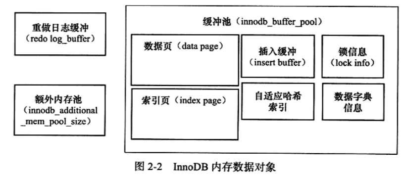
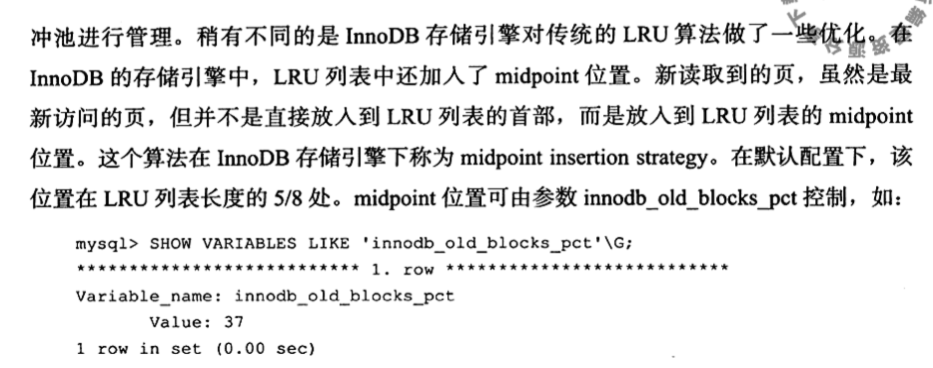
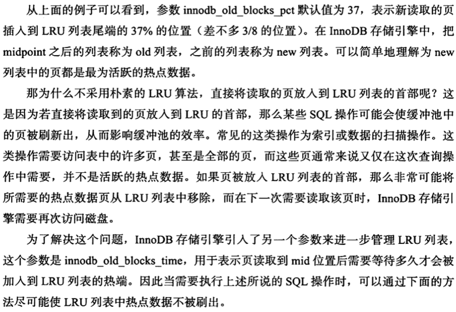
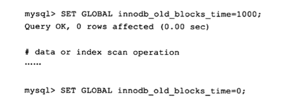
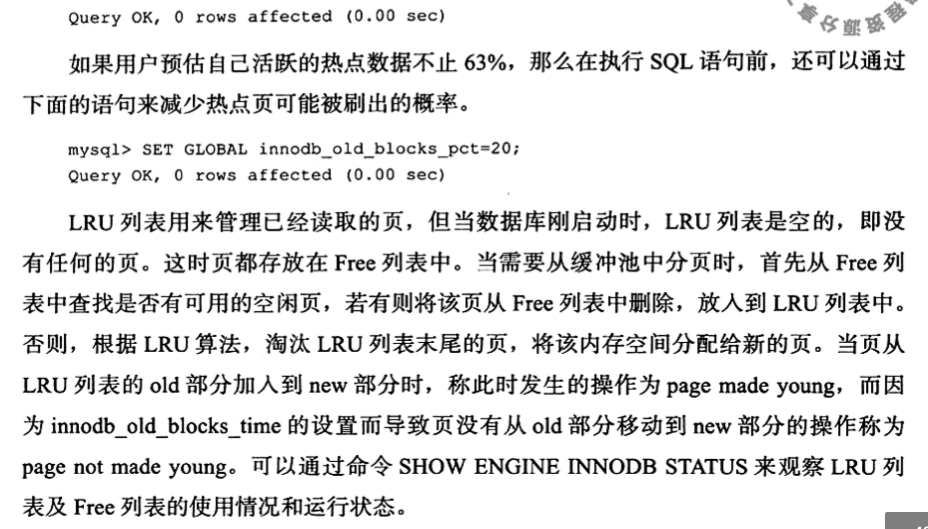
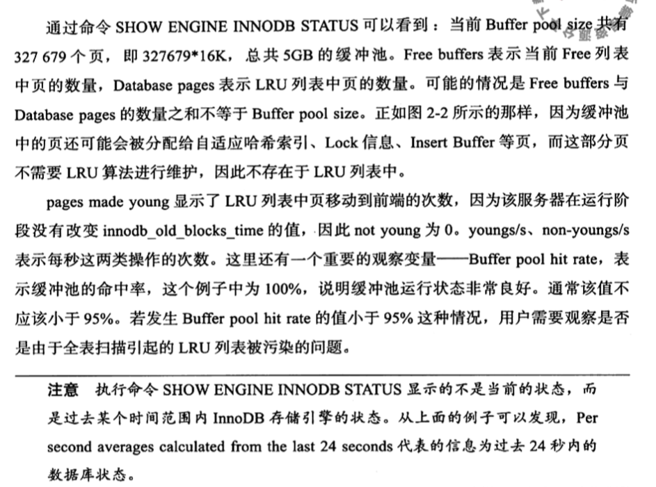

# 缓冲池 BufferPool

## 目录

- [为什么要有缓冲池](#为什么要有缓冲池)
- [什么是缓冲池](#什么是缓冲池)
- [InnoDB内存结构和磁盘结构](#InnoDB内存结构和磁盘结构)
- [设置buffer_pool的大小](#设置buffer_pool的大小)
- [缓冲池淘汰策略](#缓冲池淘汰策略)

## 为什么要有缓冲池

InnoDB 存储引擎时基于磁盘存储的,其中的记录按照页的方式来进行管理

**基于内存的缓冲池是用来解决 CPU速度和磁盘速度之间的速度差异的** 

## 什么是缓冲池

一块内存空间

当数据库进行页的读取的操作的时候

#### 什么时候写入缓冲池:

- 首先从磁盘读到的**页**(索引页和数据页)。 ,放在缓冲池中
- 下次再读的时候会判断页是不是在缓冲池中
  - 如果命中,直接读取该页
  - 否则从磁盘读取


#### 什么时候更新缓冲池:

- 首先修改在缓冲池中的页,然后再以一定的频率刷新到磁盘

**并不是每次页发生更改时都会触发刷脏,而是通过一种 CheckPoint 的机制刷脏 ,为的是提高数据库的整体性能**

## InnoDB内存结构和磁盘结构


## BufferPool的组成

缓冲池中的缓存的数据页类型有: 索引页, 数据页, undo 页, ChangeBuffer, 自适应哈希索引,InnoDB 存储的锁信息,数据字典页



- 内存内结构
  - [Buffer-Pool ](08-缓冲池-buffer-pool.md) 
    - [Adaptive-Hash-Index](../07-存储引擎/010-InnoDB/04-自适应哈希.md) 
    - [Change-Buffer](11-写缓冲-ChangeBuffer.md) 
    -  [Log-Buffer](12-Redolog-LogBuffer.md)  实际上是 redolog的内存部分
- 磁盘上结构
  - 表空间 
    - [系统表空间 (ibdata1) ](../06-磁盘结构/020-系统表空间.md) 
    - [独立表空间 ](../06-磁盘结构/030-独占表空间.md) 
    -  [通用表空间](../06-磁盘结构/040-通用表空间.md) 
    -  [Undo表空间](../06-磁盘结构/060-UndoLog.md) 
    -  [临时表空间](../06-磁盘结构/050-临时表空间.md) 
  -  [RedoLog](12-Redolog-LogBuffer.md) 重做日志缓冲

> LogBuffer 在内存中, Redo Log 在磁盘中

## 设置buffer_pool的大小

```sql
show variables like 'innodb_buffer_pool_size'
```

| Variable\_name             | Value     |
| :------------------------- | :-------- |
| innodb\_buffer\_pool\_size | 134217728 |

## 查看有多少个实例

```sql
show variables like 'innodb_buffer_pool_instances'
```

| Variable\_name                  | Value |
| :------------------------------ | :---- |
| innodb\_buffer\_pool\_instances | 1     |

## 查看InnoDB存储引擎状态

```
show engine innodb status
```

## 缓冲池淘汰策略

##### 内存的缓冲池写满了怎么办?(Redis 设置的内存满了怎么办?)

InnoDB 用 LRU 算法来管理缓冲池(链表实现，不是传统的 LRU，分成了 young 和 old)，经过淘汰的数据就是热点数据。









