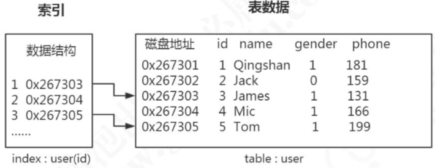

# 02-索引

## 目录

[TOC]

## 索引是什么

> 索引是存储引擎用于快速找到记录的一种数据结构

**记住它是一种数据结构,B+树只是一种实现方式**

索引是应用程序设计和开发的重要方面

- 若索引太多,应用程序的性能可能会受到影响
- 若索引太少,对查询性能又会产生影响

要找到一个合适的平衡点,这对应用程序的性能至关重要



## InnoDB存储引擎索引

- [B+树索引](04-B+树(加强版多路平衡查找树).md)

  > 无论是聚集索引还是辅助索引,内部都是 B+树,即高度平衡,叶子节点存储数据

  -  聚集索引
  -  辅助索引

- [全文索引](19-全文索引.md)

- [哈希索引](05-Hash索引.md) 

  > InnoDB 存储引擎会根据表的使用情况自动为表生成哈希索引,不能人工创建哈希索引

## 索引类型

#### 索引类型

- [普通索引(Normal) ](10-聚集索引和普通索引.md) 

  > 最普通的索引,没有任何限制

-  [唯一索引(Unique)](11-主键索引和唯一索引.md)

  > 要求建值不能重复,另外需要注意的是,主键是一种特殊的唯一索引,它还多了一个限制条件,键值不能为空.主键索引用 primay key 创建。

-  [全文(FullText)](19-全文索引.md)

  > 针对比较大的数据，比如我们存放的是消息内容，有几 KB 的数 据的这种情况，如果要解决 like 查询效率低的问题，可以创建全文索引。只有文本类型 的字段才可以创建全文索引，比如 char、varchar、text。

## 索引的优点

- 提高数据检索效率
- 提高聚合函数效率
- 提高排序效率
- 使用覆盖索引可以避免回表,减少 IO 次数

## 索引创建四不要

1. 离散度低的字段不要创建索引, 例如 性别 gender
2. 很少查询的列不要创建索引
3. 大数据类型字段不要创建索引
4. 尽量避免不要使用 NULL , 应该制定列为 not null ,在 MySQL 中,含有空值的列很难进行查询优化,他们会使用索引,索引的统计信息以及比较运算更加复杂,可以使用空字符串替换空值

## 使用不到索引的情况

- 通过索引扫描的行记录数超过全表的 30% , 优化器就不会走索引 ,而变成全表扫描

- 联合索引中,第一个查询条件不是最左索引列

- 联合索引中,第一个索引列使用范围查询,只能使用到部分索引,有 ICP 的出现

  >  范围查询指的 <   >   <=  between and

- 联合索引中,第一个查询条件不是最左前缀列

- 模糊查询条件最左以通配符 %开始(可以考虑放到子查询中)

- 两个单列索引,一个用于检索,一个用于排序,这种情况下只能使用到一个索引,因为查询语句中最多只能使用一个索引,考虑建立联合索引

- 查询字段上面有索引,但是使用函数运算

## 查看数据和索引的大小

```sql
select
CONCAT(ROUND(SUM(DATA_LENGTH/1024/1024),2),'MB') AS data_len,
CONCAT(ROUND(SUM(INDEX_LENGTH/1024/1024),2),'MB') as index_len 
from
information_schema.TABLES
where table_schema='notes' and table_name='user_innodb';
```


## 以B+树作为索引

 [04-B+树(加强版多路平衡查找树).md](04-B+树(加强版多路平衡查找树).md) 

## 以哈希作为索引

 [14-哈希索引.md](14-哈希索引.md) 