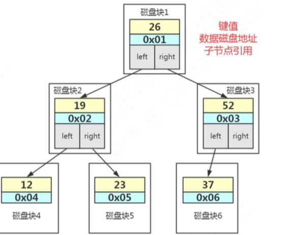
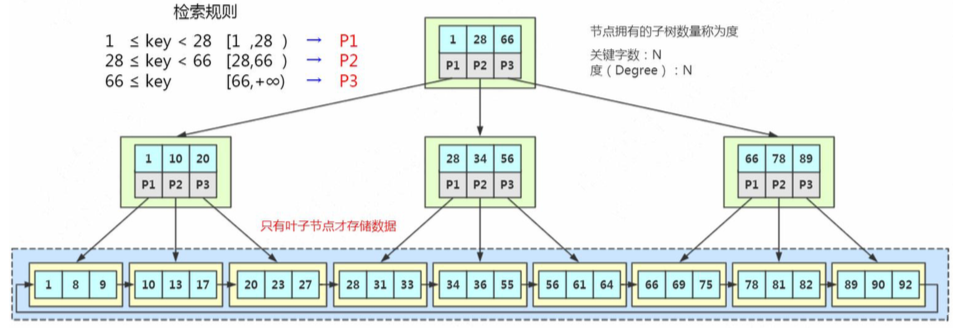

# B+树(加强版多路平衡查找树)

- [B+树索引简介](#B+树索引简介)

- [为什么使用B+树作为索引数据结构](#为什么使用B+树作为索引数据结构)
- [InnoDB中的B+Tree的特点](#InnoDB中的B+Tree的特点)
- [为什么不用红黑树](#为什么不用红黑树)

## B+树索引简介

B+树索引 就是传统意义上的索引,这是目前关系型数据库系统中查找最为常用和最为有效的索引, 根据 key->value 快速找到数据

我们根据 B+树索引只能找到查找数据行所在的页,然后数据库通过把页读到内存,再在内存中进行查找,最后得到要查找的数据

## 为什么使用B+树作为索引数据结构

- [充分利用页存储空间](#充分利用页存储空间)
- 稳定检索IO次数 ,基本上 2000w 以内的数据量只需要三次 IO

#### 充分利用页存储空间

- **InnoDB 操作磁盘的最小的单位是一页(或者叫一个磁盘块)，大小是 16K(16384 字节)。**

所以一个树的节点就是 16K 的大小。当我们用树的结构来存储索引的时候，访问一个节点就要跟磁盘之间发生一次 IO。

#### 如何充分利用这16K页的大小,我们需要一个矮胖子而不是高瘦子

如果我们一个节点只存一个键值+数据+引用，例如整形的字段，可能只用了十几个或者几十个字节，它远远达不到 16K 的容量，所以访问一个树节点，进行一次 IO 的时候， 浪费了大量的空间。

所以如果每个节点存储的数据太少，从索引中找到我们需要的数据，就要访问更多的节点，意味着跟磁盘交互次数就会过多。

如果是机械硬盘时代，每次从磁盘读取数据需要 10ms 左右的寻址时间，交互次数 越多，消耗的时间就越多。

比如上面这张图，我们一张表里面有 6 条数据，当我们查询 id=37 的时候，要查询两个子节点，就需要跟磁盘交互 3 次，如果我们有几百万的数据呢?这个时间更加难以估计。

- **让每个节点存储更多的数据。**
- 节点上的关键字的数量越多，我们的指针数也越多，也就是意味着可以有更多的分叉(我们把它叫做“路数”)。

**所以 B+树要让每个节点存放更多的数据**

因为分叉数越多，树的深度就会减少(根节点是 0),这样，我们的树是不是从原来的高瘦高瘦的样子，变成了矮胖矮胖的样子?

**这个时候，我们的树就不再是二叉了，而是多叉，或者叫做多路。**

## 为什么使用B+树作为索引数据结构

我们来看一下 InnoDB 里面的 B+树的存储结构:

MySQL 中的 B+Tree 有几个特点:

1. **它的关键字的数量是跟路数相等的**;
2. B+Tree 的根节点和枝节点中都不会存储数据，只有叶子节点才存储数据。搜索到关键字不会直接返回，会到最后一层的叶子节点。比如我们搜索 id=28，虽然在第一 层直接命中了，但是全部的数据在叶子节点上面，所以我还要继续往下搜索，一直到叶子节点。
3. B+Tree 的每个叶子节点增加了一个指向相邻叶子节点的指针，它的最后一个数 据会指向下一个叶子节点的第一个数据，形成了一个有序链表的结构。
4. 它是根据**左闭右开**的区间 [ )来检索数据。

举个例子:假设一条记录是 1K，一个叶子节点(一页)可以存储 16 条记录。非叶 子节点可以存储多少个指针?

假设索引字段是 bigint 类型，长度为 8 字节。指针大小在 InnoDB 源码中设置为 6 字节，这样一共 14 字节。非叶子节点(一页)可以存储 16384/14=1170 个这样的 单元(键值+指针)，代表有 1170 个指针。

树深度为 2 的时候，有 1170^2 个叶子节点，可以存储的数据为 1170*1170*16=21902400。

在查找数据时一次页的查找代表一次 IO，也就是说，一张 2000 万左右的表，查询 数据最多需要访问 3 次磁盘。

所以在 InnoDB 中 B+ 树深度一般为 1-3 层，它就能满足千万级的数据存储。

我们来看一下 B+Tree 的数据搜寻过程:

- 比如我们要查找 28，在根节点就找到了键值，但是因为它不是页子节点，所以 会继续往下搜寻，28 是[28,66)的左闭右开的区间的临界值，所以会走中间的子节点，然 后继续搜索，它又是[28,34)的左闭右开的区间的临界值，所以会走左边的子节点，最后 在叶子节点上找到了需要的数据。

- 第二个，如果是范围查询，比如要查询从 22 到 60 的数据，当找到 22 之后，只 需要顺着节点和指针顺序遍历就可以一次性访问到所有的数据节点，这样就极大地提高,了区间查询效率(不需要返回上层父节点重复遍历查找)。

### InnoDB中的B+Tree的特点

- 它是 B Tree 的变种，B Tree 能解决的问题，它都能解决。B Tree 解决的两大问题是什么?(每个节点存储更多关键字;路数更多)
- 扫库、扫表能力更强(如果我们要对表进行全表扫描，只需要遍历叶子节点就可以 了，不需要遍历整棵 B+Tree 拿到所有的数据)
- B+Tree 的磁盘读写能力相对于 B Tree 来说更强(根节点和枝节点不保存数据区， 所以一个节点可以保存更多的关键字，一次磁盘加载的关键字更多)
- 排序能力更强(因为叶子节点上有下一个数据区的指针，数据形成了链表)
- 效率更加稳定(B+Tree 永远是在叶子节点拿到数据，所以 IO 次数是稳定的)

## 为什么不用红黑树

[050-红黑树.md](../../../11-data-structures-algorithms/01-数据结构/030-树/050-红黑树.md) 

红黑树也是 BST 树，但是不是严格平衡的。 必须满足 5 个约束: 

1. 节点分为红色或者黑色。
2. 根节点必须是黑色的。
3. 叶子节点都是黑色的 NULL 节点。 
4. 红色节点的两个子节点都是黑色(不允许两个相邻的红色节点)。
5. 从任意节点出发，到其每个叶子节点的路径中包含相同数量的黑色节点。

插入:60、56、68、45、64、58、72、43、49

基于以上规则，可以推导出:

> **从根节点到叶子节点的最长路径(红黑相间的路径)不大于最短路径(全部是黑色 节点)的 2 倍。**

#### 为什么不用红黑树?

1、只有两路

2、不够平衡。 红黑树一般只放在内存里面用。例如 Java 的 TreeMap

