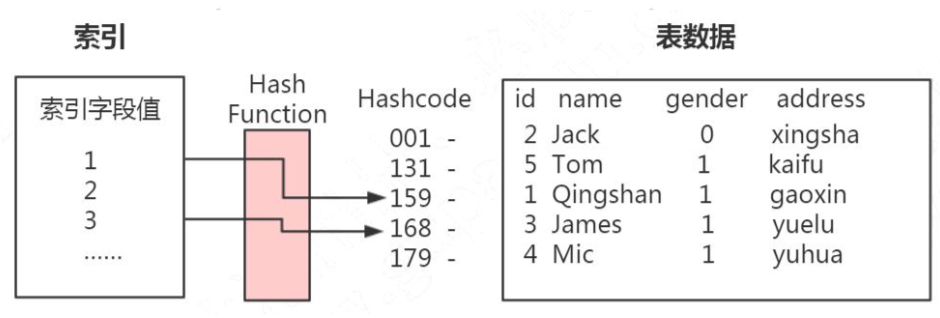

# Hash索引

在 Navicat 的工具中，创建索引，索引方式有两种，Hash 和 B Tree。
HASH:以 KV 的形式检索数据，也就是说，它会根据索引字段生成哈希码和指针， 指针指向数据。



哈希索引有什么特点呢?

- 它的时间复杂度是 O(1)，查询速度比较快。因为哈希索引里面的数据不是 按顺序存储的，所以不能用于排序。
- 我们在查询数据的时候要根据键值计算哈希码，所以它只能支持等值查询 (= IN)，不支持范围查询(> < >= <= between and)。

另外一个就是如果字段重复值很多的时候，会出现大量的哈希冲突(采用拉链法解 决)，效率会降低。

**问题: InnoDB 可以在客户端创建一个索引，使用哈希索引吗?**

https://dev.mysql.com/doc/refman/5.7/en/innodb-introduction.html

```
InnoDB utilizes hash indexes internally for its Adaptive Hash Index feature
```

直接翻译过来就是:InnoDB 内部使用哈希索引来实现自适应哈希索引特性。

这句话的意思是 InnoDB 只支持显式创建 B+Tree 索引，**对于一些热点的数据页**， InnoDB 会自动建立自适应 Hash 索引，也就是在 B+Tree 索引基础上建立 Hash 索引， 这个过程对于客户端是不可控制的，隐式的。

我们在 Navicat 工具里面选择索引方法是哈希，但是它创建的还是 B+Tree 索引，这 个不是我们可以手动控制的。

buffer pool 里面有一块区域是 `Adaptive Hash Index` 自适应哈希 索引，就是这个。

这个开关默认是 ON:

```sql
show variables like 'innodb_adaptive_hash_index';
```

从存储引擎的运行信息中可以看到:

```sql
show engine innodb status \G
```

因为 B Tree 和 B+Tree 的特性，它们广泛地用在文件系统和数据库中，例如 Windows 的 HPFS 文件系统，Oracel、MySQL、SQLServer 数据库。

