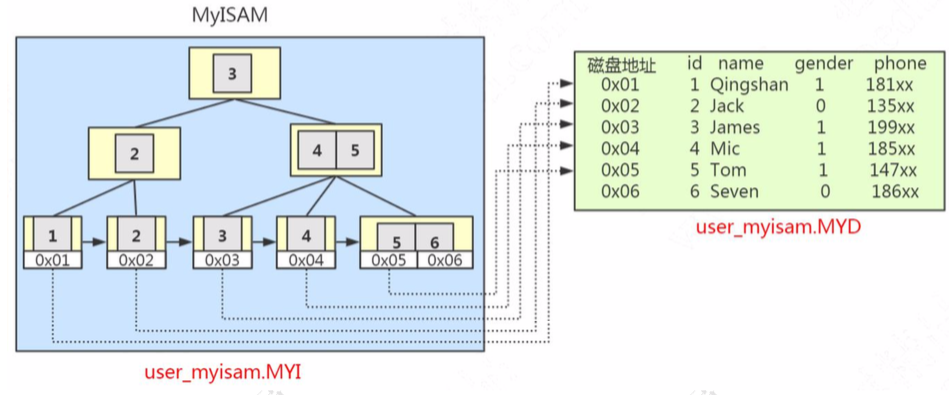

# B+树的落地形式

MySQL 的数据都是文件的形式存放在磁盘中的，我们可以找到这个数据目录 的地址。在 MySQL 中有这么一个参数

```sql
mysql> show VARIABLES LIKE 'datadir';
+---------------+------------------------+
| Variable_name | Value                  |
+---------------+------------------------+
| datadir       | /usr/local/mysql/data/ |
+---------------+------------------------+
1 row in set (0.00 sec)
```

在这里我们能看到，每张

-  InnoDB 的表有两个文件**(.frm 和.ibd)**

- MyISAM 的表 有三个文件**(.frm、.MYD、.MYI)**

有一个是相同的文件，.frm。 .frm 是 MySQL 里面表结构定义的文件，不管你建表 的时候选用任何一个存储引擎都会生成。

## MyISAM

- **.MYD 文件**，D 代表 Data，是 MyISAM 的数据文件，存放数据记录，比如我 们的 user_myisam 表的所有的表数据。
- **.MYI 文件**，I 代表 Index，是 MyISAM 的索引文件，存放索引，比如我们在 id 字段上面创建了一个主键索引，那么主键索引就是在这个索引文件里面。

也就是说，在 MyISAM 里面，索引和数据是两个独立的文件。

那我们怎么根据索引找到数据呢?

MyISAM 的 B+Tree 里面，叶子节点存储的是数据文件对应的磁盘地址。所以从索引文件.MYI 中找到键值后，会到数据文件.MYD 中获取相应的数据记录。



这里是主键索引，如果是辅助索引，有什么不一样呢?

在 MyISAM 里面，辅助索引也在这个.MYI 文件里面。 辅助索引跟主键索引存储和检索数据的方式是没有任何区别的，一样是在索引文件
里面找到磁盘地址，然后到数据文件里面获取数据。


## InnoDB

InnoDB 只有一个文件(.ibd 文件)，那索引放在哪里呢?

在 InnoDB 里面，它是以主键为索引来组织数据的存储的，所以索引文件和数据文 件是同一个文件，都在.ibd 文件里面。
在 InnoDB 的主键索引的叶子节点上，它直接存储了我们的数据。


**什么叫做聚集索引(聚簇索引)?**

就是索引键值的逻辑顺序跟表数据行的物理存储顺序是一致的。(比如字典的目录 是按拼音排序的，内容也是按拼音排序的，按拼音排序的这种目录就叫聚集索引)。

在 InnoDB 里面，它组织数据的方式叫做叫做(聚集)索引组织表(clustered index organize table)，所以主键索引是聚集索引，非主键都是非聚集索引。

如果 InnoDB 里面主键是这样存储的，那主键之外的索引，比如我们在 name 字段 上面建的普通索引，又是怎么存储和检索数据的呢?


InnoDB 中，主键索引和辅助索引是有一个主次之分的

辅助索引存储的是辅助索引和主键值。如果使用辅助索引查询，会根据主键值在主 键索引中查询，最终取得数据。

比如我们用 name 索引查询 name= '青山'，它会在叶子节点找到主键值，也就是 id=1，然后再到主键索引的叶子节点拿到数据。

**为什么在辅助索引里面存储的是主键值而不是主键的磁盘地址呢?如果主键的数据 类型比较大，是不是比存地址更消耗空间呢?**

我们前面说到 B Tree 是怎么实现一个节点存储多个关键字，还保持平衡的呢?
是因为有分叉和合并的操作，这个时候键值的地址会发生变化，所以在辅助索引里 面不能存储地址。

**另一个问题，如果一张表没有主键怎么办?**

1. 如果我们定义了主键(PRIMARY KEY)，那么 InnoDB 会选择主键作为聚集索引
2. 如果没有显式定义主键，则 InnoDB 会选择第一个不包含有 NULL 值的唯一索引作为主键索引。
3. 如果也没有这样的唯一索引，则 InnoDB 会选择内置 6 字节长的 ROWID 作为隐藏的聚集索引，它会随着行记录的写入而主键递增。

```
select _rowid name from t2;
```

