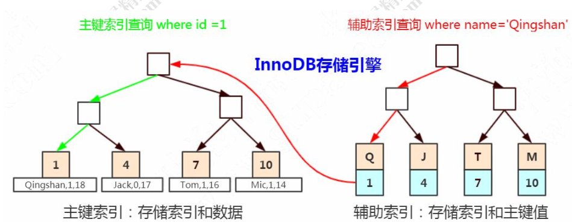

# 聚集索引和普通索引

在 InnoDB 中, 主键索引是聚集索引，非主键都是非聚集索引。

MySQL 数据库的 B+ tree 索引其实可分为两大类

- [聚集索引](#聚集索引)

- [辅助索引(普通索引)](#普通索引)

  > 辅助索引里面存储的是主键值而不是主键的磁盘地址呢

我们都知道,InnoDB 存储引擎表是索引组织表,聚集索引其实就是一种索引组织形式,索引键值逻辑顺序决定了表数据行的物理存储顺序

聚集索引叶子节点存放表中所有行数据结构的信息 , 所以经常会说**数据即索引 , 索引即数据** , 这是针对聚集索引来说的

## 聚集索引

聚集索引就是按照每张表的主键构造一棵B+树, 同时叶子节点中存放的即为整张表记录的数据,也将聚集索引的叶子节点成为数据页




所以,聚集索引中数据页是索引的一部分, 每个数据页都通过一个双向链表进行连接

## 主键

我们在创建一张表时,要显式地为表创建一个主键(聚集索引),如果不主动创建主键,那么 InnoDB 会选择第一个不包含有 null 值的唯一索引作为主键

如果连一个索引都没有, InnoDB 就会为该表生成一个 6 字节的 rowid 作为主键

> select _rowid name from t2;

## 普通索引

普通索引在叶子节点并不包含所有行的数据记录,只是会在叶子节点存有自己本身的键值和主键的值,在检索数据的时候,通过普通索引叶子节点上的主键获取到想要查找的行记录


普通索引的创建语法

```
alter table {table_name} add index {index_name}(索引字段)
```

或者

```
create index {index_name} on {table_name} (索引字段)
```

**为什么在辅助索引里面存储的是主键值而不是主键的磁盘地址呢?如果主键的数据 类型比较大，是不是比存地址更消耗空间呢?**

> 我们前面说到 B Tree 是怎么实现一个节点存储多个关键字，还保持平衡的呢?
> 是因为有分叉和合并的操作，这个时候键值的地址会发生变化，所以在辅助索引里 面不能存储地址。

