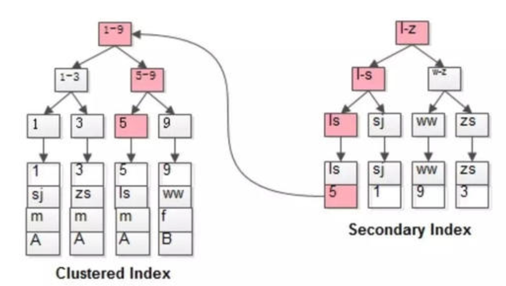

# 聚集索引和普通索引

在 InnoDB 中, 主键索引是聚集索引，非主键都是非聚集索引。

MySQL 数据库的 B+ tree 索引其实可分为两大类

- [聚集索引](#聚集索引)

- [辅助索引(普通索引)](#普通索引)

  > 辅助索引里面存储的是主键值而不是主键的磁盘地址呢

我们都知道,InnoDB 存储引擎表是索引组织表,聚集索引其实就是一种索引组织形式,索引键值逻辑顺序决定了表数据行的物理存储顺序

聚集索引叶子节点存放表中所有行数据结构的信息 , 所以经常会说**数据即索引 , 索引即数据** , 这是针对聚集索引来说的

## 聚集索引

聚集索引(clustered index) 就是按照每张表的主键构造一棵B+树, 同时叶子节点中存放的即为整张表记录的数据,也将聚集索引的叶子节点成为数据页 , 聚集索引中数据页是索引的一部分, 每个数据页都通过一个双向链表进行连接(逻辑上连续的)


聚集索引的一个好处:

- **对于主键的排序查找  和 范围查找非常快, 叶子节点的数据就是用户所要查询的数据**

#### 排序查找示例

例如用户需要查询一张注册用户的表,查询最后注册的 10 位用户, 由于 B + 树索引是双向链表的,用户可以快速找到最后一个数据页,并取出 10 条数据, 

```sql
explain select * from user_innodb order by id limit 10


```

运行结果

```json
[
  {
    "id": 1,
    "select_type": "SIMPLE",
    "table": "user_innodb",
    "partitions": null,
    "type": "index",
    "possible_keys": null,
    "key": "PRIMARY",
    "key_len": "4",
    "ref": null,
    "rows": 10,
    "filtered": 100,
    "Extra": null
  }
]
```

我们可以看到 虽然使用了 order by 对记录进行排序, 但是实际过程中并没有进行所谓的 filesort 操作, 这就是聚集索引的特点

#### 范围查询(range query)

范围查询 range query  , 即如果要查找某一范围内的数据,通过叶子节点的上层中间节点就可以得到页的范围,之后直接读取数据页即可

```sql
explain select * from user_innodb where id > 10 and id < 1000

> 9989 rows retrieved starting from 1 in 65 ms (execution: 4 ms, fetching: 61 ms)
```

```json
[
  {
    "id": 1,
    "select_type": "SIMPLE",
    "table": "user_innodb",
    "partitions": null,
    "type": "range",
    "possible_keys": "PRIMARY",
    "key": "PRIMARY", // 使用了主键索引
    "key_len": "4",
    "ref": null,
    "rows": 989,
    "filtered": 100,
    "Extra": "Using where"
  }
]
```

rows 是一个预估返回值, 不是确切的值


## 主键

我们在创建一张表时,要显式地为表创建一个主键(聚集索引),如果不主动创建主键,那么 InnoDB 会选择第一个不包含有 null 值的唯一索引作为主键

如果连一个索引都没有, InnoDB 就会为该表生成一个 6 字节的 rowid 作为主键

> select _rowid name from t2;

## 普通索引

**普通索引在叶子节点并不包含所有行的数据记录**,只是会在叶子节点存有自己本身的键值和主键的值,在检索数据的时候,**通过普通索引叶子节点上的主键获取到想要查找的行记录**

> 辅助索引的存在并不影响在聚集索引中的组织,因此每张表上可以有多个辅助索引
>
> 当通过辅助索引来寻找数据时, 
>
> - InnoDB 存储引擎会遍历辅助索引并通过叶级别的指针获取到主键索引的主键
> - 然后通过主键索引来找到完整的行记录




普通索引的创建语法

```
alter table {table_name} add index {index_name}(索引字段)
```

或者

```
create index {index_name} on {table_name} (索引字段)
```

**为什么在辅助索引里面存储的是主键值而不是主键的磁盘地址呢?如果主键的数据 类型比较大，是不是比存地址更消耗空间呢?**

> 我们前面说到 B Tree 是怎么实现一个节点存储多个关键字，还保持平衡的呢?
> 是因为有分叉和合并的操作，这个时候键值的地址会发生变化，所以在辅助索引里 面不能存储地址。

## 实战普通索引

创建普通索引

```sql
ALTER TABLE user_innodb ADD INDEX idx_user_name (name);
```

获取执行计划

```sql
explain select * from user_innodb where  name = '欧阳穹';
```

```json
[
  {
    "id": 1,
    "select_type": "SIMPLE",
    "table": "user_innodb",
    "partitions": null,
    "type": "ref",  //查询用到了非唯一性索引，或者关联操作只使用了索引的最左前缀。
    "possible_keys": "idx_user_name",
    "key": "idx_user_name",
    "key_len": "1023",
    "ref": "const",
    "rows": 17,
    "filtered": 100,
    "Extra": null
  }
]
```

