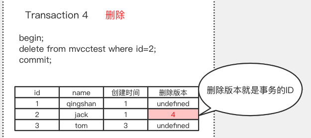

# MVCC多版本并发控制

[TOC]

## MVCC是什么

**MVCC，多版本的并发控制，Multi-Version Concurrency Control。**

使用版本来控制并发情况下的数据问题，在B事务开始修改账户且事务未提交时，当A事务需要读取账户余额时，此时会读取到B事务修改操作之前的账户余额的副本数据，但是如果A事务需要修改账户余额数据就**必须要等待B事务提交事务**。

|      | 隔离级别                    | 读     | 写                                                           |
| ---- | --------------------------- | ------ | ------------------------------------------------------------ |
| 1    | 读未提交（read uncommitted) | 不加锁 | 不加锁                                                       |
| 2    | 读已提交（read committed)   | MVCC   | 记录锁                                                       |
| 3    | 可重复读（repeatable read)  | MVCC   | 记录锁/间隙锁/临键锁                                         |
| 4    | 串行化 (serializable)       | 共享锁 | 所有 select 隐式转换成 共享锁(in share mode)会和 update 和 delete 互斥 |

**MVCC使得数据库读不会对数据加锁，普通的SELECT请求不会加锁，提高了数据库的并发处理能力**。借助MVCC，数据库可以实现READ COMMITTED，REPEATABLE READ等隔离级别，用户可以查看当前数据的前一个或者前几个历史版本，保证了ACID中的I特性（隔离性)。

## 核心思想

MVCC 的核心思想是: 

- 我可以查到在我这个事务开始之前已经存在的数据，即使它在后面被修改或者删除了, 我依然可以查到原数据
- 在我这个事务之后新增的数据，我是查不到的。

## MVCC核心原理

**InnoDB 为每行记录都实现了3 个隐藏字段:**

- DB_ROW_ID : 当表没有定义主键的时候,InnoDB 会使用 DB_ROW_ID 当做主键
- **DB_TRX_ID，6 字节:插入或更新行的最后一个事务的事务 ID，事务编号是自动递 增的(我们把它理解为创建版本号，在数据新增或者修改为新数据的时候，记录当前事 务 ID)。**
- **DB_ROLL_PTR，7 字节:回滚指针(我们把它理解为删除版本号，数据被删除或记录为旧数据的时候，记录当前事务 ID)。**

**MVCC 的查找规则:**

- **能查找创建时间小于等于当前事务 ID 的数据，**
- **能查出删除时间大于当前事务 ID 的行(或未删除)。**

## 图示

- [初始化数据](#初始化数据)

- [插入时的变化](#插入时的变化)
- [删除时的变化](#删除时的变化)
- [更新时的变化](#更新时的变化)

https://www.processon.com/view/link/5d29999ee4b07917e2e09298 

#### 初始化数据

## 一步一步分析

第一个事务，初始化数据(检查初始数据), 并提交

可以看到初始化完成之后 没数据库有两条数据

- 由于是新插入的, 所以插入版本是 1 
- 由于未删除, 所以删除版本未定义

当我们使用事务 2 去查询时,可以查询到上图的数据

## 插入时的变化

第三个事务，插入数据:

- 由于是插入操作, 创建版本是当前事务版本 3 , 删除未定义

此时再次使用事务 2 启动的查询

依然是两条数据,这是因为 MVCC 第一条规则

- **只能查找创建时间小于等于当前事务 ID 的数据，**

也就是不能查到在我的事务开始之后插入的数据，tom 的创建 ID 大于 2，所以还是 只能查到两条数据。

## 删除时的变化

第四个事务，删除数据，删除了 id=2 jack 这条记录:

- 此时的数据，jack 的删除版本被记录为当前事务 ID，4，其他数据不变:

在第二个事务中，执行第 3 次查询:

由于第二条规则:所以我们可以查出的还是 2 条数据

- **能查出删除时间大于当前事务 ID 的行(或未删除)。**

## 更新时的变化

第五个事务，执行更新操作，这个事务事务 ID 是 5:

实际上更新操作分为两步

- 旧数据的删除版本更新为当前版本
- 新数据的创建版本更新为当前版本

MVCC 查询规则

- 能查找创建时间小于等于当前事务 ID 的数据，

- 能查出删除时间大于当前事务 ID 的行(或未删除)。

因为更新后的数据 penyuyan 创建版本大于 2，代表是在事务之后增加的，查不出 来。而旧数据 qingshan 的删除版本大于 2，代表是在事务之后删除的，可以查出来。

**通过以上演示我们能看到，通过版本号的控制，无论其他事务是插入、修改、删除， 第一个事务查询到的数据都没有变化。**''

## 总结

#### 查询SELECT

InnoDB 会根据以下两个条件检查每行记录：

1. InnoDB只查找版本早于当前事务版本的数据行（也就是，行的事务编号小于或等于当前事务的事务编号），这样可以确保事务读取的行，要么是在事务开始前已经存在的，要么是事务自身插入或者修改过的。
2. 删除的行要事务ID判断，读取到事务开始之前状态的版本，只有符合上述两个条件的记录，才能返回作为查询结果。

#### 插入INSERT

InnoDB为新插入的每一行保存当前事务编号作为行版本号。

#### **删除DELETE**

InnoDB为删除的每一行保存当前事务编号作为行删除标识。

#### 更新UPDATE

InnoDB为插入一行新记录，保存当前事务编号作为行版本号，同时保存当前事务编号到原来的行作为行删除标识。

保存这两个额外事务编号，使大多数读操作都可以不用加锁。这样设计使得读数据操作很简单，性能很好，并且也能保证只会读取到符合标准的行。不足之处是每行记录都需要额外的存储空间，需要做更多的行检查工作，以及一些额外的维护工作。

> MVCC只在REPEATABLE READ和READ COMMITIED两个隔离级别下工作。其他两个隔离级别都和 MVCC不兼容 ，因为READ UNCOMMITIED总是读取最新的数据行，而不是符合当前事务版本的数据行。而SERIALIZABLE则会对所有读取的行都加锁。

**MVCC 在mysql 中的实现依赖的是 undo log 与 read view 。**

https://mp.weixin.qq.com/s/CZHuGT4sKs_QHD_bv3BfAQ

## MySQL 是如何实现 UndoLog 的

Oracle、Postgres 等等其他数据库都有 MVCC 的实现。

**需要注意，在 InnoDB 中，MVCC 和锁是协同使用的，这两种方案并不是互斥的。** 

