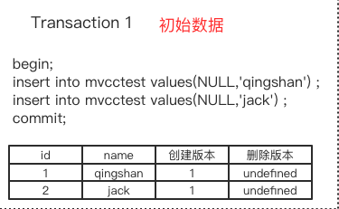
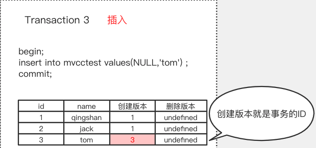
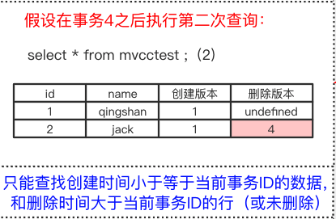

# MVCC 多版本并发控制

## 是什么

MVCC (Multi Version Concurrency control) 通过生成一个请求数据时间点的一致性数据快照 Snapshot ,并用这个快照来提供一定级别(语句集或者事务级) 的一致性读取

## 核心思想

MVCC 的核心思想是: 

- 我可以查到在我这个事务开始之前已经存在的数据，即使它在后面被修改或者删除了,我依然可以查到。
- 在我这个事务之后新增的数据，我是查不到的。

## MVCC核心原理

**InnoDB 为每行记录都实现了3 个隐藏字段:**

- DB_ROW_ID : 当表没有定义主键的时候,InnoDB 会使用 DB_ROW_ID 当做主键
- **DB_TRX_ID，6 字节:插入或更新行的最后一个事务的事务 ID，事务编号是自动递 增的(我们把它理解为创建版本号，在数据新增或者修改为新数据的时候，记录当前事 务 ID)。**
- **DB_ROLL_PTR，7 字节:回滚指针(我们把它理解为删除版本号，数据被删除或记 录为旧数据的时候，记录当前事务 ID)。**

**MVCC 的查找规则:**

- **能查找创建时间小于等于当前事务 ID 的数据，**
- **能查出删除时间大于当前事务 ID 的行(或未删除)。**

## 图示

- [初始化数据](#初始化数据)

- [插入时的变化](#插入时的变化)
- [删除时的变化](#删除时的变化)
- [更新时的变化](#更新时的变化)

https://www.processon.com/view/link/5d29999ee4b07917e2e09298 

# 初始化数据

第一个事务，初始化数据(检查初始数据), 并提交

可以看到初始化完成之后 没数据库有两条数据

- 由于是新插入的, 所以插入版本是 1 
- 由于未删除, 所以删除版本未定义

当我们使用事务 2 去查询时,可以查询到上图的数据

## 插入时的变化

第三个事务，插入数据:

- 由于是插入操作, 创建版本是当前事务版本 3 , 删除未定义

此时再次使用事务 2 启动的查询

依然是两条数据,这是因为 MVCC 第一条规则

- **只能查找创建时间小于等于当前事务 ID 的数据，**

也就是不能查到在我的事务开始之后插入的数据，tom 的创建 ID 大于 2，所以还是 只能查到两条数据。

## 删除时的变化

第四个事务，删除数据，删除了 id=2 jack 这条记录:

- 此时的数据，jack 的删除版本被记录为当前事务 ID，4，其他数据不变:

在第二个事务中，执行第 3 次查询:

由于第二条规则:所以我们可以查出的还是 2 条数据

- **能查出删除时间大于当前事务 ID 的行(或未删除)。**

## 更新时的变化

第五个事务，执行更新操作，这个事务事务 ID 是 5:

实际上更新操作分为两步

- 旧数据的删除版本更新为当前版本
- 新数据的创建版本更新为当前版本

> MVCC 查询规则
>
> - **能查找创建时间小于等于当前事务 ID 的数据，**
> - **能查出删除时间大于当前事务 ID 的行(或未删除)。**

因为更新后的数据 penyuyan 创建版本大于 2，代表是在事务之后增加的，查不出 来。而旧数据 qingshan 的删除版本大于 2，代表是在事务之后删除的，可以查出来。

**通过以上演示我们能看到，通过版本号的控制，无论其他事务是插入、修改、删除， 第一个事务查询到的数据都没有变化。**

## MySQL 是如何实现 UndoLog 的

Oracle、Postgres 等等其他数据库都有 MVCC 的实现。

**需要注意，在 InnoDB 中，MVCC 和锁是协同使用的，这两种方案并不是互斥的。** 

