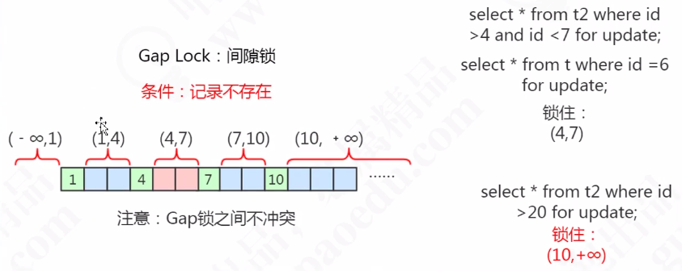

# MySQL间隙锁

[TOC]

## MySQL三种锁算法图示

>  字符依然可以排序, 使用 ASCII 

## 什么是间隙锁

**当查询的记录不存在的时候，使用间隙锁。**

根据主键，这些存在的 Record 隔开的数据不存在的区间，我们把它叫做 Gap，间隙，它是一个左开右开的区间。

当我们查询的记录不存在，没有命中任何一个 record，无论是用等值 查询还是范围查询的时候，它使用的都是间隙锁。
举个例子，where id >4 and id <7 where id = 6

## 为什么有间隙锁

**解决幻读**

在 RR 事务隔离界别上, 为了避免幻读现象, 引入了 Gap Lock , 但是它只锁定了记录数据的范围,不包含记录本身, 即不允许在此范围内插入任何数据

当出现 n 个 record  就有 n+1 个 gap

Gap Lock 只在 RR 中存在。如果要关闭间隙锁，就是把事务隔离级别设置成 RC， 并且把 **innodb_locks_unsafe_for_binlog** 设置为 ON。
这种情况下除了外键约束和唯一性检查会加间隙锁，其他情况都不会用间隙锁。

