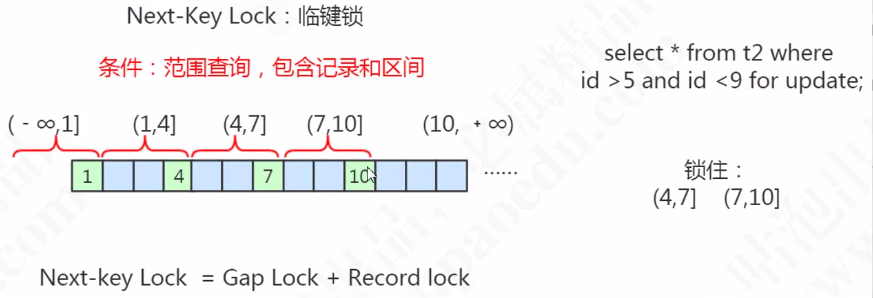

# 04-MySQL临键锁

[TOC]

## MySQL三种锁算法图示


>  字符依然可以排序, 使用 ASCII 

## 临键锁

InnoDB默认锁算法

当我们使用了范围查询，不仅仅命中了 Record 记录，还包含了 Gap 间隙，在这种情况下我们使用的就是临键锁，它是 MySQL 里面默认的行锁算法，相当于 记录锁加上间隙锁。

唯一性索引，等值查询匹配到一条记录的时候，退化成记录锁。没有匹配到任何记录的时候，退化成间隙锁。

间隙(Gap)连同它左边的记录(Record)，我们把它叫做临键的区间， 它是一个左开右闭的区间。


临键锁，锁住最后一个 key 的下一个左开右闭的区间。



```sql
select * from t2 where id >5 and id <=7 for update; -- 锁住(4,7]和(7,10] 
select * from t2 where id >8 and id <=10 for update; -- 锁住 (7,10]，(10,+∞)
```

## 为什么要有间隙锁

为了解决幻读的问题, RR 事务级别

当我把数据不存在的空间锁住以后,一定是不能插入数据的,所以解决了幻读的问题

## 锁的退化

临键锁是默认的算法

- 当查询不到任何记录,会退化成 [间隙锁](03-MySQL间隙锁.md) 

-  当你用等值查询,刚好命中一个唯一索引的时候,退化成[记录锁](05-MySQL记录锁.md) 