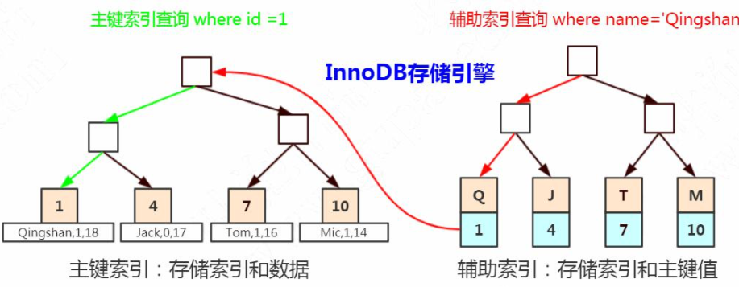
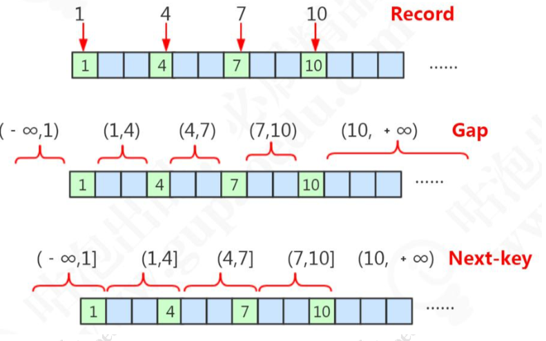
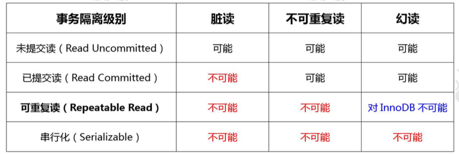

# 行锁

InnoDB 的行锁，就是通过锁住索引 来实现的。

## 没有索引的表(假设锁住记录)

首先我们有三张表，一张没有索引的 t1，一张有主键索引的 t2，一张有唯一索引的 t3。

我们先假设 InnoDB 的锁锁住了是一行数据或者一条记录。

我们先来看一下 t1 的表结构，它有两个字段，int 类型的 id 和 varchar 类型的 name。 里面有 4 条数据，1、2、3、4。


现在我们在两个会话里面手工开启两个事务。

在第一个事务里面，我们通过 where id =1 锁住第一行数据。 在第二个事务里面，我们尝试给 id=3 

加锁的操作被阻塞了

InnoDB 的锁锁住的应该不是 Record

## 有主键索引的表

我们看一下 t2 的表结构。字段是一样的，不同的地方是 id 上创建了一个主键索引。 里面的数据是 1、4、7、10。


第一种情况，使用相同的 id 值去加锁，冲突;使用不同的 id 加锁，可以加锁成功。 那么，既然不是锁定一行数据，有没有可能是锁住了 id 的这个字段呢?

## 唯一索引(假设锁住字段)

我们看一下 t3 的表结构。字段还是一样的， id 上创建了一个主键索引，name 上 创建了一个唯一索引。里面的数据是 1、4、7、10。


在第一个事务里面，我们通过 name 字段去锁定值是 4 的这行数据。 在第二个事务里面，尝试获取一样的排它锁，肯定是失败的，这个不用怀疑。 在这里我们怀疑 InnoDB 锁住的是字段，所以这次我换一个字段，用 id=4 去给这行数据加锁

很遗憾，又被阻塞了，说明锁住的是字段的这个推测也是错的，否则就不会出现第 一个事务锁住了 name，第二个字段锁住 id 失败的情况。

既然锁住的不是 record，也不是 column，InnoDB 里面锁住的到底是什么呢?在这 三个案例里面，我们要去分析一下他们的差异在哪里，也就是这三张表的结构，是什么 区别导致了加锁的行为的差异?其实答案就是索引。

InnoDB 的行锁，就是通过锁住索引 来实现的。

## 疑问

那么我们还有两个问题没有解决: 

#### 为什么表里面没有索引的时候，锁住一行数据会导致锁表? 或者说，如果锁住的是索引，一张表没有索引怎么办? 所以，一张表有没有可能没有索引?

- 如果我们定义了主键(PRIMARY KEY)，那么 InnoDB 会选择主键作为聚集索引。 2)如果没有显式定义主键，则 InnoDB 会选择第一个不包含有 NULL 值的唯一索引作为主键索引。
- 如果也没有这样的唯一索引，则 InnoDB 会选择内置 6 字节长的 ROWID 作为隐藏的聚集索引，它会随着行记录的写入而主键递增。 所以，为什么锁表，是因为查询没有使用索引，会进行全表扫描，然后把每一个隐藏的聚集索引都锁住了。

#### 为什么通过唯一索引给数据行加锁，主键索引也会被锁住?

大家还记得在 InnoDB 里面，当我们使用辅助索引的时候，它是怎么检索数据的吗? 辅助索引的叶子节点存储的是什么内容?

在辅助索引里面，索引存储的是二级索引和主键的值。比如 name=4，存储的是 name 的索引和主键 id 的值 4。

而主键索引里面除了索引之外，还存储了完整的数据。所以我们通过辅助索引锁定 一行数据的时候，它跟我们检索数据的步骤是一样的，会通过主键值找到主键索引，然后也锁定。



现在我们已经搞清楚 4 个锁的基本类型和锁的原理了，在官网上，还有 3 种锁，我 们把它理解为锁的算法。我们也来看下 InnoDB 在什么时候分别锁住什么范围。

## 锁的算法

我们先来看一下我们测试用的表，t2，这张表有一个主键索引。
我们插入了 4 行数据，主键值分别是 1、4、7、10。 为了让大家真正理解这三种行锁算法的区别，我们需要了解一下三种范围的概念。 因为我们用主键索引加锁，我们这里的划分标准就是主键索引的值。



- Record 锁 , 数据库里面存在的主键值,把它叫做 Record，记录，那么这里我们就有 4 个 Record。
- GAP 锁 , 根据主键，这些存在的 Record 隔开的数据不存在的区间，我们把它叫做 Gap，间 隙 ,它是一个左开右开的区间。
- Next-key 锁 , 间隙(Gap)连同它左边的记录(Record)，我们把它叫做临键的区间， 它是一个左开右闭的区间。

t2 的主键索引，它是整型的，可以排序，所以才有这种区间。如果我的主键索引不 是整形，是字符怎么办呢?字符可以排序吗? 用 ASCII 码来排序。
我们已经弄清楚了三个范围的概念，下面我们就来看一下在不同的范围下，行锁是 怎么表现的。

### 记录锁(Record)

第一种情况，当我们对于唯一性的索引(包括唯一索引和主键索引)使用等值查询，精准匹配到一条记录的时候，这个时候使用的就是记录锁。

比如where id=1 4 7 10 。

这个演示我们在前面已经看过了。我们使用不同的 key 去加锁，不会冲突，它只锁住这个 record。

### 间隙锁(GAP)

第二种情况，当我们查询的记录不存在，没有命中任何一个 record，无论是用等值 查询还是范围查询的时候，它使用的都是间隙锁。

举个例子，`where id >4 and id <7，where id = 6。`


重复一遍，当查询的记录不存在的时候，使用间隙锁。

注意，间隙锁主要是阻塞插入 insert。相同的间隙锁之间不冲突。

Gap Lock 只在 RR 中存在。如果要关闭间隙锁，就是把事务隔离级别设置成 RC， 并且把 `innodb_locks_unsafe_for_binlog `设置为 ON。

这种情况下除了外键约束和唯一性检查会加间隙锁，其他情况都不会用间隙锁。

### 临键锁

第三种情况，当我们使用了范围查询，不仅仅命中了 Record 记录，还包含了 Gap 间隙，在这种情况下我们使用的就是临键锁，它是 MySQL 里面默认的行锁算法，相当于 记录锁加上间隙锁。

其他两种退化的情况:

- 唯一性索引，等值查询匹配到一条记录的时候，退化成记录锁。
- 没有匹配到任何记录的时候，退化成间隙锁。
- 当我们使用了范围查询，不仅仅命中了 Record 记录，还包含了 Gap 间隙，在这种情况下我们使用的就是临键锁

比如我们使用>5 <9， 它包含了记录不存在的区间，也包含了一个 Record 7。


临键锁，锁住最后一个 key 的下一个左开右闭的区间。

```
select * from t2 where id >5 and id <=7 for update; -- 锁住(4,7]和(7,10] 
select * from t2 where id >8 and id <=10 for update; -- 锁住 (7,10]，(10,+∞)
```


###  小结:隔离级别的实现

为什么 InnoDB 的 RR 级别能够解决幻读的 问题，就是用临键锁实现的。



最后我们来总结一下四个事务隔离级别的实现:

-  Read Uncommited  , RU 隔离级别:不加锁。
- Serializable ,Serializable 所有的 select 语句都会被隐式的转化为 select ... in share mode，会 和 update、delete 互斥。
- Repeatable Read ,

RR 隔离级别下，普通的 select 使用快照读(snapshot read)，底层使用 MVCC 来实 现。

加锁的 select(select ... in share mode / select ... for update)以及更新操作 update, delete 等语句使用当前读(current read)，底层使用记录锁、或者间隙锁、 临键锁。

- Read Commited

RC 隔离级别下，普通的 select 都是快照读，使用 MVCC 实现。

加锁的 select 都使用记录锁，因为没有 Gap Lock。

除了两种特殊情况——外键约束检查(foreign-key constraint checking)以及重复 键检查(duplicate-key checking)时会使用间隙锁封锁区间。

所以 RC 会出现幻读的问题。