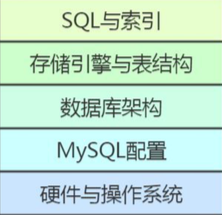

# 调优

性能调优，大部分时候想要实现的目标是让我们的查询更快。一个查询的 动作又是由很多个环节组成的，每个环节都会消耗时间， 执行流程的分析

我们要减少查询所消耗的时间，就要从每一个环节入手。

#### 第一个环节:

优化连接数和其他配置

-  [02-优化连接-配置优化.md](02-优化连接-配置优化.md) 

#### 第二个环节:架构优化

可以用缓存，主从，分库分表。

-  [03-缓存-架构优化.md](03-缓存-架构优化.md) 

#### 第三个环节:解析器

解析器，词法和语法分析，主要保证语句的正确性，语句不出错就没问题。由 Sever 自己处理，跳过。

#### 第四步:优化器

优化器就是对我们的 SQL 语句进行分析，生成执行计划。

 [04-优化器-SQL语句优化.md](04-优化器-SQL语句优化.md) 

#### 第五步:存储引擎

-  [05-存储引擎.md](05-存储引擎.md) 

## 总结

除了对于代码、SQL 语句、表定义、架构、配置优化之外，业务层面的优化也不能 忽视。举几个例子

#### 在某一年的双十一，为什么会做一个充值到余额宝和余额有奖金的活动(充 300 送 50)?

因为使用余额或者余额宝付款是记录本地或者内部数据库，而使用银行卡付款，需 要调用接口，操作内部数据库肯定更快。

#### 在去年的双十一，为什么在凌晨禁止查询今天之外的账单?

这是一种降级措施，用来保证当前最核心的业务。

#### 最近几年的双十一，为什么提前一个多星期就已经有双十一当天的价格了?

预售分流。

在应用层面同样有很多其他的方案来优化，达到尽量减轻数据库的压力的目的，比 如限流，或者引入 MQ 削峰，等等等等。

为什么同样用 MySQL，有的公司可以扛住百万千万级别的并发，而有的公司几百个 并发都扛不住，关键在于怎么用。所以，用数据库慢，不代表数据库本身慢，有的时候 还要往上层去优化。

当然，如果关系型数据库解决不了的问题，我们可能需要用到搜索引擎或者大数据 的方案了，并不是所有的数据都要放到关系型数据库存储。