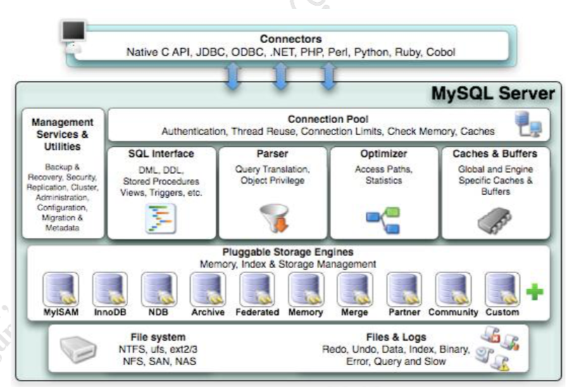
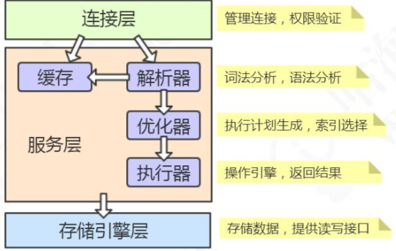

# MySQL 体系结构

##  模块详解

- Connector:用来支持各种语言和 SQL 的交互，比如 PHP，Python，Java 的 JDBC;
- Management Serveices & Utilities:系统管理和控制工具，包括备份恢复,MySQL 复制、集群等等;
- Connection Pool:连接池，管理需要缓冲的资源，包括用户密码权限线程等
- SQL Interface:用来接收用户的 SQL 命令，返回用户需要的查询结果
- Parser:用来解析 SQL 语句;
- Optimizer:查询优化器;
- Cache and Buffer:查询缓存，除了行记录的缓存之外，还有表缓存，Key 缓存，权限缓存等等;
-  Pluggable Storage Engines:插件式存储引擎，它提供 API 给服务层使用，跟具体的文件打交道。

## 架构分层

总体上，我们可以把 MySQL 分成三层，跟客户端对接的连接层，真正执行操作的服 务层，和跟硬件打交道的存储引擎层(参考 MyBatis:接口、核心、基础)

## 连接层

我们的客户端要连接到 MySQL 服务器 3306 端口，必须要跟服务端建立连接，那么 管理所有的连接，验证客户端的身份和权限，这些功能就在连接层完成。

## 服务层

连接层会把 SQL 语句交给服务层，这里面又包含一系列的流程:
比如查询缓存的判断、根据 SQL 调用相应的接口，对我们的 SQL 语句进行词法和语 法的解析(比如关键字怎么识别，别名怎么识别，语法有没有错误等等)。
然后就是优化器，MySQL 底层会根据一定的规则对我们的 SQL 语句进行优化，最 后再交给执行器去执行。

## 存储引擎

存储引擎就是我们的数据真正存放的地方，在 MySQL 里面支持不同的存储引擎。 再往下就是内存或者磁盘。