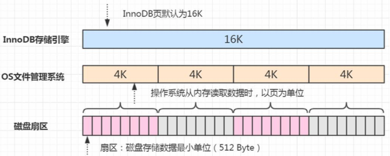

## 系统表空间

在默认情况下 InnoDB 存储引擎有一个**共享表空间** (对应文件/var/lib/mysql/ ibdata1)，也叫系统表空间。

## 存储的是什么

- InnoDB 数据字典

##### (InnoDB 的一大特性)

- 双写缓冲区  DoubleWrite
- Change Buffer
- Undo Logs

如果没有指定 file-per-table，也包含用户创建的表和索引数据。

存储数据库初始化数据时创建的, 以 ibdata1 来安装,在安装数据库初始化数据时就是在系统创建一个 ibdata1 表空间文件

#### 相关属性

默认大小是 10M,不建议使用,在遇到高并发事务的时候会受到不小的影响,建议调节成 1G

```sql
show variables like '%innodb_data%'
```


- undo 表空间的位置可以独立设置,从 ibdata1 中独立出来,属性为 Innodb_data_file_path 负责定义系统表空间的路径,初始化大小自动化策略默认多占大小为 6MB
- 数据库默认的ibdata1的大小为 10M, 这里建议把 ibdata1 的初始数值大小调整为 1GB

#### InnoDB 的页

InnoDB 的页和操作系统的页大小不一致，InnoDB 页大小一般为 16K，操作系统页 大小为 4K，InnoDB 的页写入到磁盘时，一个页需要分 4 次写。



#### 双写缓冲区 

如果存储引擎正在写入页的数据到磁盘时发生了宕机，可能出现页只写了一部分的情况，比如只写了 4K，就宕机了，这种情况叫做部分写失效(partial page write)，可 能会导致数据丢失。

```
show variables like 'innodb_doublewrite';
```

我们不是有 redo log 吗?但是有个问题，如果这个页本身已经损坏了，用它来做崩 溃恢复是没有意义的。所以在对于应用 redo log 之前，需要一个页的副本。如果出现了 写入失效，就用页的副本来还原这个页，然后再应用 redo log。

这个页的副本就是 double write，InnoDB 的双写技术。通过它实现了数据页的可靠性。

跟 redo log 一样，double write 由两部分组成，

- 一部分是内存的 double write
- 一个部分是磁盘上的 double write

因为 double write 是顺序写入的，不会带来很大的 开销。

在默认情况下，所有的表共享一个系统表空间，这个文件会越来越大，而且它的空 间不会收缩。


