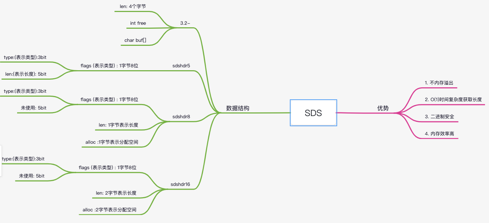
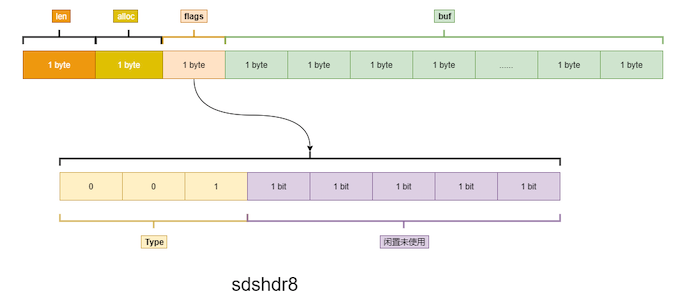

# 020-Redis-String-SDS简介

[TOC]

## 什么是SDS

Simple Dynamic String , 带长度信息的字节数组

## SDS特点

https://processon.com/mindmap/60520627e401fd11ed1ecbfa



- 不内存溢出 , 不用担心内存溢出问题，如果需要会对 SDS 进行扩容。

- O(1)获取长度 , 获取字符串长度时间复杂度为 O(1)，因为定义了 len 属性。
- 二进制安全 , 判断是否结束的标志是 len 属性(它同样以 '\0' 结尾是因为这样就可以使用 C语言中函数库操作字符串的函数了)，可以包含 '\0'。
- 内存效率高, 通过“空间预分配 ”( sdsMakeRoomFor) 和“惰性空间释放”，防止多次重分配内存。

| 描述                                  | C 字符串                                    | SDS                                |
| ------------------------------------- | ------------------------------------------- | ---------------------------------- |
| [时间复杂度](#时间复杂度)             | 获取字符串长度的复杂度是 O(n)               | 获取字符串长度的复杂度是O(1)       |
| [缓冲区溢出](#缓冲区溢出)             | API 是不安全的,可能会造成缓冲区溢出         | API是安全的,不会造成缓冲区溢出     |
| [减少内存分配次数](#减少内存分配次数) | 修改字符串长度 N 次必然需要执行 N次内存分配 | 最多需要 N次                       |
| [二进制安全](#二进制安全)             | 只能保存文本数据                            | 可以保存文本数据或者二进制数据     |
| 库函数                                | 可以使用所有<string.h>库中的函数            | 可以使用一部分<String.h>库中的函数 |

## 1.SDS数据结构

字符串最大 512M

SDS , 一个带长度信息的字节数组, 

- 3.2 之前, 用 int 的 len 和 free 分别表示数组长度和未使用的字节数量,
- 3.2 之后 引入五种sdshdr类型 , **目的是为了满足不同长度字符串可以使用不同大小的Header ** ，从而节省内存，每次在创建一个sds时根据sds的实际长度判断应该选择什么类型的sdshdr，不同类型的 sdshdr 占用的内存空 间不同。

**长度 + 数组容量 + 标志位 + 数组**

|          |                                                              |
| -------- | ------------------------------------------------------------ |
| sdshdr5  | 长度和分配空间使用的是标志位来表示的, 低三位表示类型,高 5 位表示长度 |
| sdshdr8  | 长度用 8 位,分配空间也用 8 位 ,占用 4 个字节                 |
| sdshdr16 | 长度用 16 位,分配空间也用 16 位来标识                        |
| sdshdr32 | 长度用 32位,分配空间也用 32 位来标识                         |
| sdshdr64 | 长度用 64位,分配空间也用 64 位来标识                         |


### 1.1 SDS数据结构-3.2之前


- int len  : 4个字节 32 位
- int free : 4个字节 32 位
- char buf[] : 存储字符串

### 1.2 SDS数据结构-3.2之后

可以看到上面 3.2 之前, 不装任何的字符, 就消耗掉 8 个字节 (2^63-1的表示范围) 这显然是浪费的

```c
typedef char *sds;

/* 表示 0-31  2^5-1*/
/* Note: sdshdr5 is never used, we just access the flags byte directly.
 * However is here to document the layout of type 5 SDS strings. */
struct __attribute__ ((__packed__)) sdshdr5 { 
    unsigned char flags; /* 3 lsb of type, and 5 msb of string length 1 byte */ 
    char buf[];
};
```


- flags 用来表示类型和长度 ,低 3 位用来表示 type , 后 5 位用来表示数组的长度

我们在看一下 sdshdr8 实际上有

```c
struct __attribute__ ((__packed__)) sdshdr8 {
    uint8_t len; /* used */
    uint8_t alloc; /* excluding the header and null terminator */
    unsigned char flags; /* 3 lsb of type, 5 unused bits */
    char buf[];
};
```



- uint8_t len; 占一个字节
- uint8_t alloc 占一个字节, 用来表示分配的空间
- unsigned char flags; 一个字节,表示类型

同理,sdshdr16

```c
struct __attribute__ ((__packed__)) sdshdr16 {
    uint16_t len; /* used */
    uint16_t alloc; /* excluding the header and null terminator */
    unsigned char flags; /* 3 lsb of type, 5 unused bits */
    char buf[]; 
};
```


- uint8_t len; 占2个字节
- uint8_t alloc;  占2个字节, 用来表示分配的空间
- unsigned char flags ;  一个字节,表示类型

剩下还设有 **sdshdr32** 和 **sdshdr64**

```java
struct __attribute__ ((__packed__)) sdshdr32 {
    uint32_t len; /* used */
    uint32_t alloc; /* excluding the header and null terminator */
    unsigned char flags; /* 3 lsb of type, 5 unused bits */
    char buf[];
};
struct __attribute__ ((__packed__)) sdshdr64 {
    uint64_t len; /* used */
    uint64_t alloc; /* excluding the header and null terminator */
    unsigned char flags; /* 3 lsb of type, 5 unused bits */
    char buf[];
};
```

