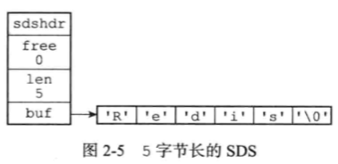

# 030-Redis-String-SDS特点

[TOC]

## 为什么要设计 SDS ,不直接用 C语言里面的字符串?

我们知道，C 语言本身没有字符串类型(只能用字符数组 char[]实现)。 

- **杜绝缓冲区溢出** , 使用字符数组必须先给目标变量分配足够的空间，否则可能会溢出。 
- **常数时间复杂度获取字符串长度** ,  如果要获取字符长度，必须遍历字符数组，时间复杂度是 O(n)。
- **减少修改字符串时带来的内存重新分配次数** , C 字符串长度的变更会对字符数组做内存重分配。
- **二进制安全** , 通过从字符串开始到结尾碰到的第一个'\0'来标记字符串的结束，因此不能保存图片、音频、视频、压缩文件等二进制(bytes)保存的内容，二进制不安全。

## 1.时间复杂度

通过使用 SDS 而不是 C 字符串, Redis 将获取字符串长度所需要的复杂度从 O(N) 降到了 O(1) 确保了获取字符串长度不会成为 Redis 的性能瓶颈

### 1.1 C语言中的获取字符串长度

C 语言使用长度为 N+1 的字符数组来标识长度为 N 的字符串 , 并且字符数组的最后一个元素总是空字符 `\0`

因为要获取以 NULL (`0x\0` ) 结尾的字符数组的长度使用的是 **strlen** 标准库函数, 这个函数的算法复杂度是 **O(n)** . 它需要对字节数组进行遍历扫描 , 效率低, 单线程的 Redis 受不起

### 1.2 SDS 中获取字符串长度

对于SDS来说,长须只要访问 SDS 的 len 属性,就可以立即知道 SDS 的长度为 11 字节

## 2.缓冲区溢出

C 字符串自身不记录长度,分配了以后需要手动去扩容.如果程序员忘记扩容,就会溢出

SDS 在修改是,会先检查空间是否满足修改要求,如果不满足,API 会扩容

## 3.减少内存分配次数

C 字符串增长和缩短字符串都需要对字符数组进行扩容或者缩容,

- 如果忘记扩容,会缓冲区溢出
- 如果忘记缩容,会产生内存泄漏

SDS 会使用空间预分配策略

- 如果小于 1M 则 双倍
- 如果大于等于 1M 则每次扩容 1M

## 4.二进制安全

C 字符串不能在中间包含空字符,否则会被任务是结束符,不能保存图片音频等二进制文件

SDS 会以处理二进制的方式来处理 SDS存放, 不会做任何限制 , 数据写入是什么样,读取时就是什么样

