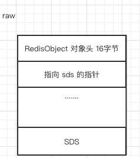

# 040-Redis-String-字符串存储方式

[TOC]

### 一句话总结

- 小于 44 字节, 使用 embstr
- 超过 44 字节,使用 raw

分配内存 64 字节, 16 字节是对象头,剩下 48 字节存储 SDS , SDS **sdshdr8** 占用 4 个字节 

分配内存 64 字节 = 对象头 16 字节 + SDS 头 **sdshdr8** 的4 个字节 + **44 个字节内容**

所以分界线是 44 个字节


## 为什么分界线是44字节

- 根据缓存局部性原则
- 其实也是防止伪共享

一次分配 64 个字节的内存,CPU 一次性读取 64 字节,所以尽可能存到这一个缓存行中,减少伪共享,减少内存寻址时间

## embstr和raw的区别

- embstr 

将 RedisObject 对象头结构和 SDS 对象连续存一起

- raw

RedisObject 对象头结构 和 SDS 分开, 两次分配空间


将 RedisObject 对象头结构和 SDS 对象连续存一起


#### 详细


## raw

 RedisObject 对象头结构 和 SDS 分开, 两次分配空间



#### embstr和raw的区别

embstr 的使用只分配一次内存空间(因为 RedisObject 和 SDS 是连续的)，而 raw 需要分配两次内存空间(分别为 RedisObject 和 SDS 分配空间)。

因此与 raw 相比，embstr 的好处在于创建时少分配一次空间，删除时少释放一次 空间，以及对象的所有数据连在一起，寻找方便。

而 embstr 的坏处也很明显，如果字符串的长度增加需要重新分配内存时，整个 RedisObject 和 SDS 都需要重新分配空间，因此 Redis 中的 embstr 实现为只读。

#### 当长度小于阈值时会还原吗

关于 Redis 内部编码的转换，都符合以下规律:编码转换在 Redis 写入数据时完 成，且转换过程**不可逆**，只能从小内存编码向大内存编码转换(但是不包括重新 set)。

#### 为什么要对底层的数据结构进行一层包装呢

通过封装，可以根据对象的类型动态地选择存储结构和可以使用的命令，实现节省空间和优化查询速度。

#### 明明没有超过阈值为什么变成 raw了

```
127.0.0.1:6379> set k2 a
OK
127.0.0.1:6379> object encoding k2
"embstr"
127.0.0.1:6379> append k2 b (integer) 2
127.0.0.1:6379> object encoding k2 "raw"
```

对于 **embstr，由于其实现是只读的**，因此在对 embstr 对象进行修改时，都会先转化为raw 再进行修改。
因此，只要是修改 embstr 对象，修改后的对象一定是 raw 的，无论是否达到了 44 个字节。

