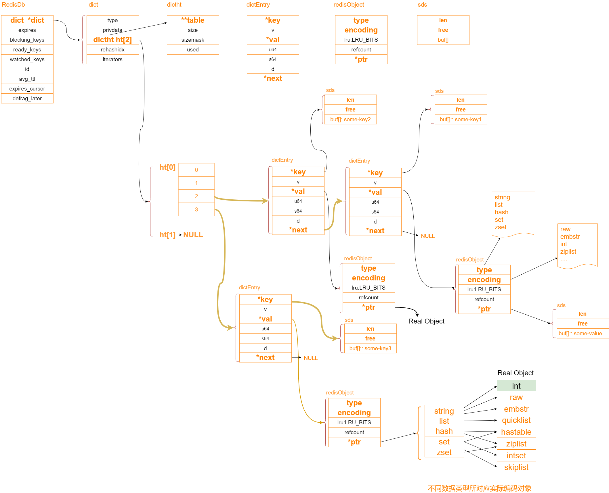
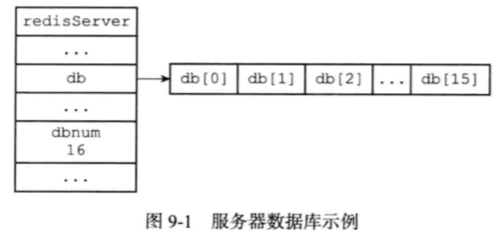
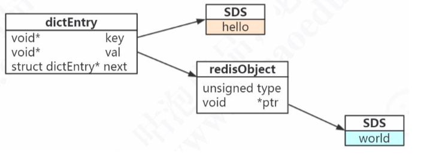

# Redis底层如何存储

[TOC]

## 一句话总结

底层采用两个 hash表存储, 因为要扩容要渐进式 rehash, key 是SDS ,最大 512M ,value 是 redisObject, 和 hashmap 很像, 数组+链表+头插法

关于存储值得讨论的问题

-  [Redis扩容与缩容](../06-模式以及常见问题/06-Redis扩容与缩容.md) 
-  [什么时候使用hash什么时候使用String](#什么时候使用hash什么时候使用String)

## 图示



## 详细介绍

### Redis最底层的 RedisServer 结构

Redis服务器将所有数据库都保存在服务器状态 redis.h/redisServer 结构的 db 数组中:

```java
struct redisServer{
  //...
  //一个数组,保存着服务器中的所有数据库
  redisDb *db;
  //...
  //服务器的数据库数量
  int dbnum;
};
```

db 数组的每个项都是一个 redis.h/redisDb 结构, 每个 redisDb 结构代表一个数据库

**dbnum** 

dbnum 属性的值由服务器配置的 database 选项决定的,默认是 16, 所以 Redis 服务器默认会创建 16 个数据库



### 切换数据库

每个Redis 客户端都有自己的目标数据库, 每当客户端执行数据库写命令或者数据库读命令的时候, 目标数据库就会成为这些命令的操作对象

当我们使用 select db 命令的时候,实际上就是将 客户端结构的 db 属性指向 redisDb 结构的指针

```c
typeof struct redisClient{
  // 记录客户端当前正阿紫使用的数据库
	redisDb *db;
}
```


> EC: 可以看出 RedisServer 指向和 redisClient 指向的是同一个数组

## 存储

Redis 是一个键值对 (key-value) 数据库服务器

Redis 数据库的所有 key 和 value 组成了一个字典, 内部维护了两个 hashtable 

通常情况下只有一个 hashTable 有值,但是在字典扩容的时候

- 从第一个 hashtable **渐进式**搬迁到 第二个 hashtbale
- 搬迁后 第一个被删除

hashTable 的结构和 Java 的 1.8 之前的 hashMap几乎一样

- 数组+链表
- 头插法

数组中的每个元素叫 dictEntry 


dictEntry 中包含指向具体类型的指针



- 我们都知道 key 是 String 类型的,所以指向的是一个 sds 对象
- value 指向的是一个叫做 redisObject 的对象\,实际上五种常用的数据类型的任何一种，都是通过 redisObject 来存储 的。

```c
typedef struct redisObject {
	unsigned type:4; /* 对象的类型，包括:OBJ_STRING、OBJ_LIST、OBJ_HASH、OBJ_SET、OBJ_ZSET */ 		   		unsigned encoding:4; /* 具体的数据结构 */
   unsigned lru:LRU_BITS; /* 24 位，对象最后一次被命令程序访问的时间，与内存回收有关 */
    int refcount; /* 引用计数。当 refcount 为 0 的时候，表示该对象已经不被任何对象引用，则可以进行垃圾回收了
*/
void *ptr; /* 指向对象实际的数据结构 */
} robj;
```

- type  4bit

- encoding 4bit  实际使用的编码

  > 12.7.0.0.1 6379 > object encoidng 

- lru 24bit  内存回收有关

- refcount 4 字节 32 bit , 

  >  引用计数。当 refcount 为 0 的时候，表示该对象已经不被任何对象引用，则可以进行垃圾回收了

- ptr 8 字节,64bit

**一共是对象头就占用 16 个字节**

我们可以使用 type查看 redisObject 的类型

```java
127.0.0.1:6379> type key
string
```

可以使用 object encoding 查看 redisObject的编码

```java
127.0.0.1:6379> object encoding key
"embstr"
```

对象类型的存储方式看笔记

- [字符串存储方式.md](030-字符串存储方式.md) 

## 什么时候使用hash什么时候使用String

Redis 底层存储是 k,v 形式存储, k 是一个 sds, v 是一个 dict 对象,维护了两个 hashtable 数组,

如果直接使用 String 类型存储, hashtable 数组势必会进行扩容进行 rehash, 造成性能浪费

而如果使用 hash 呢,实际上存储在 entry 指向的 redisObject 里面,扩容不会影响到最外层的 hash 数组

- hash 里的 value 没有办法单独设置过期时间
- 扩容

## 数据结构总结

| 对象         | 对象 type 属性值 | type 命令输出 | 底层可能的存储结构                                    | object encoding           |
| ------------ | ---------------- | ------------- | ----------------------------------------------------- | ------------------------- |
| 字符串对象   | OBJ_STRING       | "string"      | OBJ_ENCODING_INT OBJ_ENCODING_EMBSTR OBJ_ENCODING_RAW | int embstr raw            |
| 列表对象     | OBJ_LIST         | "list"        | OBJ_ENCODING_QUICKLIST                                | quicklist                 |
| 哈希对象     | OBJ_HASH         | "hash"        | OBJ_ENCODING_ZIPLIST OBJ_ENCODING_HT                  | ziplist hashtable         |
| 集合对象     | OBJ_SET          | "set"         | OBJ_ENCODING_INTSET OBJ_ENCODING_HT                   | intset hashtable          |
| 有序集合对象 | OBJ_ZSET         | "zset"        | OBJ_ENCODING_ZIPLIST OBJ_ENCODING_SKIPLIST            | ziplist skiplist(包含 ht) |

## 编码转换总结


