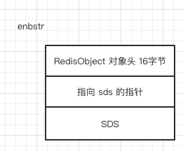

# Redis 字符串两种存放方式

- 小于 44 字节, 使用 embstr
- 超过 44 字节,使用 raw

### 一句话总结

分配内存 64 字节, 16 字节是对象头,剩下 48 字节存储 SDS , SDS **sdshdr8** 占用 4 个字节 

分配内存 64 字节 = 对象头 16 字节 + SDS 头 **sdshdr8** 的4 个字节 + **44 个字节内容**

所以分界线是 44 个字节

#### 问题

- [为什么分界线是44字节](#为什么分界线是44字节)

## 为什么分界线是44字节

根据缓存局部性原则

 [101-局部性原理.md](../../../04-java/03-concurrency/05-Java内存模型/101-局部性原理.md) 

一次分配 64 个字节的内存,CPU 一次性读取 64 字节

所以尽可能存到这一个缓存行中,减少伪共享,减少内存寻址时间

 [011-Redis如何存储.md](011-Redis如何存储.md) 

上面笔记告诉我们 对象头占用 16 个字节. SDS 使用的 **sdshdr8**  占用4 个字节

- embstr 

> 将 RedisObject 对象头结构和 SDS 对象连续存一起

- raw

>  RedisObject 对象头结构 和 SDS 分开, 两次分配空间

## embstr

将 RedisObject 对象头结构和 SDS 对象连续存一起

#### 详细

## raw

 RedisObject 对象头结构 和 SDS 分开, 两次分配空间

