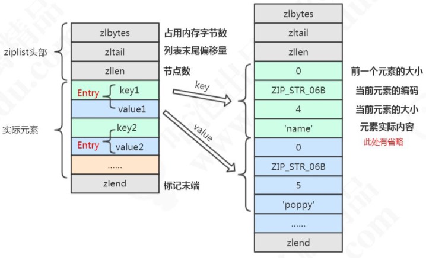

# List

Redis列表是简单的字符串列表，按照插入顺序排序。你可以添加一个元素到列表的头部（左边）或者尾部（右边）

一个列表最多可以包含 232 - 1 个元素 (4294967295, 每个列表超过40亿个元素)。

### 实例

```
redis 127.0.0.1:6379> LPUSH runoobkey redis
(integer) 1
redis 127.0.0.1:6379> LPUSH runoobkey mongodb
(integer) 2
redis 127.0.0.1:6379> LPUSH runoobkey mysql
(integer) 3
redis 127.0.0.1:6379> LRANGE runoobkey 0 10

1) "mysql"
2) "mongodb"
3) "redis"
```

在以上实例中我们使用了 **LPUSH** 将三个值插入了名为 **runoobkey** 的列表当中。


模式: 安全的队列

值得注意的是,它可以提供一个**安全的队列**

Redis 中的列表经常被用作队列(queue),用于不同程序之间有序的交换消息:

- 客户端 A lpush 命令 将消息放入队列
- 客户端 B rpop 或者 brpop 命令去除队列中等待的最长消息

但是上面的队列方法**并不安全**,因为在这个过程中, 一个客户端可能在去除一个消息之后崩溃,从而未处理完的消息也就会因此丢失

#### 解决方案
使用 RPOPLPUSH 命令(或者它的阻塞版本 BRPOPLPUSH source destination timeout )可以解决这个问题：因为它不仅返回一个消息，同时还将这个消息添加到另一个备份列表当中，如果一切正常的话，当一个客户端完成某个消息的处理之后，可以用 LREM key count value 命令将这个消息从备份表删除。
最后，还可以添加一个客户端专门用于监视备份表，它自动地将超过一定处理时限的消息重新放入队列中去(负责处理该消息的客户端可能已经崩溃)，这样就不会丢失任何消息了。

## 模式: 循环列表

通过使用相同 key 作为 `rpoplpush` 命令的参数,客户端可以一个接一个地获取列表元使用相同的 key 作为 rpoplpush 命令的参数, 客户端可以用一个接一个地获取列表元素的方式,取得列表的所有元素,而不必像 `lrange` 一样一次性获取所有元素,两种方式的复杂度都是 O(n)

以上的模式可以应用在下面两种情况

- 有多个客户端同时对同一个列表进行旋转(rotating).它们获得不同的元素,直到所有元素被读取完,又重新开始
- 有客户端在向列表尾部(右边) 添加新元素

这个模式使得我们可以很容易实现这样一类系统：有 N 个客户端，需要连续不断地对一些元素进行处理，而且处理的过程必须尽可能地快。一个典型的例子就是服务器的监控程序：它们需要在尽可能短的时间内，并行地检查一组网站，确保它们的可访问性。

注意，使用这个模式的客户端是易于扩展(scala)且安全(reliable)的，因为就算接收到元素的客户端失败，元素还是保存在列表里面，不会丢失，等到下个迭代来临的时候，别的客户端又可以继续处理这些元素了。


#### 存储类型

  存储有序的字符串(从左到右)，元素可以重复。可以充当队列和栈的角色。在早期的版本中，数据量较小时用 ziplist 存储，达到临界值时转换为 linkedlist 进 行存储，分别对应 OBJ_ENCODING_ZIPLIST 和 OBJ_ENCODING_LINKEDLIST 

  3.2 版本之后，统一用 quicklist 来存储。quicklist 存储了一个双向链表，每个节点 都是一个 ziplist。

```
127.0.0.1:6379> object encoding queue "quicklist"
```

#### quicklist


```
typedef struct quicklist {
quicklistNode *head; /* 指向双向列表的表头 */ quicklistNode *tail; /* 指向双向列表的表尾 */
unsigned long count;
unsigned long len;
int fill : 16;
unsigned int compress : 16; /* 压缩深度，0:不压缩; */
/* 所有的 ziplist 中一共存了多少个元素 */ /* 双向链表的长度，node 的数量 */
/* fill factor for individual nodes */
} quicklist;
```


````

````

## 快速列表

Redis 底层不是一个简单的 LinkedList,而是称之为"快速链表" quick list 的一个结构

- 首先在列表元素比较少的情况下,列表的存储结构叫做 **ziplist**, 会使用一块连续的内存存储 , 即压缩列表。它将所有的元素彼此紧挨着一起存储,分配的一块连续的内存。
- 当数据量比较多的时候,会变成 quicklist ,因为普通的链表需要的附加指针空间太大,会浪费空间,还会加重内存的碎片化

比如某普通链表里的存储的只是 int 类型的数据,结构上还需要加上额外的指针 prev 和 next,所以 Redis 将链表和 zipList 结合起来组成了 quickList, 也是将多个 ziplist 使用指针串联起来

**quicklist既满足了快速的插入删除性能,又不会出现太大的内存冗余**

## 存储结构

quicklist(快速列表)是 ziplist 和 linkedlist 的结合体。 quicklist.h，head 和 tail 指向双向列表的表头和表尾

```c++
typedef struct quicklist {
  quicklistNode *head; /* 指向双向列表的表头 */ quicklistNode *tail; /* 指向双向列表的表尾 */
  unsigned long count;
  unsigned long len;
  int fill : 16;
  unsigned int compress : 16; /* 压缩深度，0:不压缩; */
  /* 所有的 ziplist 中一共存了多少个元素 */ /* 双向链表的长度，node 的数量 */
  /* fill factor for individual nodes */
} quicklist;
```

redis.conf 相关参数:

```java
list-max-ziplist-size(fill)
正数表示单个 ziplist 最多所包含的 entry 个数。 负数代表单个 ziplist 的大小，默认 8k。 -1:4KB;-2:8KB;-3:16KB;-4:32KB;-5:64KB
list-compress-depth(compress)
压缩深度，默认是 0。
1:首尾的 ziplist 不压缩;2:首尾第一第二个 ziplist 不压缩，以此类推
```

### ziplist 压缩列表

#### ziplist 压缩列表是什么?

ziplist 是一个经过特殊编码的双向链表，它不存储指向上一个链表节点和指向下一 个链表节点的指针，而是存储上一个节点长度和当前节点长度，通过牺牲部分读写性能， 来换取高效的内存空间利用率，是一种**时间换空间**的思想。只用在字段个数少，字段值小的场景里面。

#### ziplist 的内部结构?

```java
typedef struct zlentry {
unsigned int prevrawlensize; /* 上一个链表节点占用的长度 */
unsigned int prevrawlen;/* 存储上一个链表节点的长度数值所需要的字节数 */
  unsigned int lensize;/* 存储当前链表节点长度数值所需要的字节数 */
  unsigned int len;/* 当前链表节点占用的长度 */
  unsigned int headersize;/* 当前链表节点的头部大小(prevrawlensize + lensize)，即非数据域的大小 */
  unsigned char encoding;/* 编码方式 */
  unsigned char *p;/* 压缩链表以字符串的形式保存，该指针指向当前节点起始位置 */
} zlentry;
```




#### 问题:什么时候使用 ziplist 存储?

当 hash 对象同时满足以下两个条件的时候，使用 ziplist 编码: 

- 所有的键值对的健和值的字符串长度都小于等于 64byte(一个英文字母一个字节
- 哈希对象保存的键值对数量小于 512 个。

```java
/* src/redis.conf 配置 */
hash-max-ziplist-value 64 // ziplist 中最大能存放的值长度 hash-max-ziplist-entries 512 // ziplist 中最多能存放的 entry 节点数量
```

/* src/redis.conf 配置 */

```java
hash-max-ziplist-value 64 // ziplist 中最大能存放的值长度 hash-max-ziplist-entries 512 // ziplist 中最多能存放的 entry 节点数量
```


```
/* 源码位置:t_hash.c ，当达字段个数超过阈值，使用 HT 作为编码 */ if (hashTypeLength(o) > server.hash_max_ziplist_entries)
hashTypeConvert(o, OBJ_ENCODING_HT); /*源码位置: t_hash.c，当字段值长度过大，转为 HT */
for (i = start; i <= end; i++) {
if (sdsEncodedObject(argv[i]) &&
sdslen(argv[i]->ptr) > server.hash_max_ziplist_value) {
hashTypeConvert(o, OBJ_ENCODING_HT); break;
} }
```

一个哈希对象超过配置的阈值(键和值的长度有>64byte，键值对个数>512 个)时， 会转换成哈希表(hashtable)。