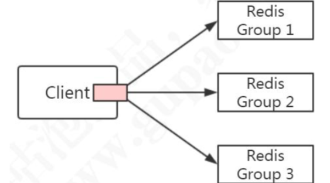
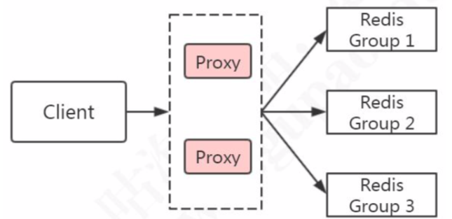
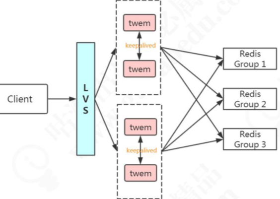
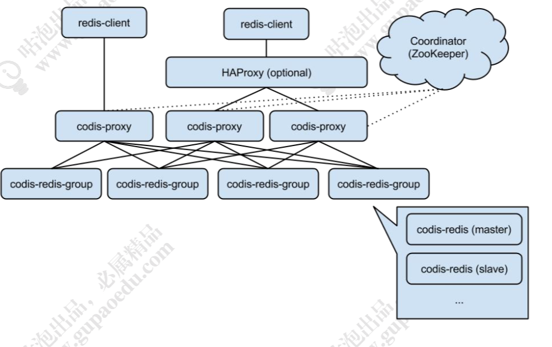

## Redis 分布式方案

数据怎么分片?分片之后，怎么实现路由?

- 在客户端实现相关的逻 辑，例如用取模或者一致性哈希对 key 进行分片
- 把做分片处理的逻辑抽取出来，运行一个独立的代理服务，客户端连接到 这个代理服务，代理服务做请求的转发。

- 基于服务端实现

### 客户端 Sharding 分片

使用 ShardedJedis 之类的客户端分片代码的优势是配置简单，不依赖于其他中间 件，分区的逻辑可以自定义，比较灵活。但是基于客户端的方案，不能实现动态的服务 增减，每个客户端需要自行维护分片策略，存在重复代码。

### 代理方式 Proxy

|                           | Codis | Tewmproxy | Redis Cluster             |
| ------------------------- | ----- | --------- | ------------------------- |
| 重新分片不需要重启        | 是    | 否        | 是                        |
| pipeline                  | 是    | 是        |                           |
| 多 key 操作的 hash tags{} | 是    | 是        | 是                        |
| 重新分片时的多 key 操作   | 是    | -         | 否                        |
| 客户端支持                | 所有  | 所有      | 支持 cluster 协议的客户端 |

典型的代理分区方案有 Twitter 开源的 Twemproxy 和国内的豌豆荚开源的 Codis。

#### Twemproxy

Twemproxy 的优点:比较稳定，可用性高。

不足:

-  出现故障不能自动转移，架构复杂，需要借助其他组件(LVS/HAProxy +
  Keepalived)实现 HA 
- 扩缩容需要修改配置，不能实现平滑地扩缩容(需要重新分布数据)。

#### Codis

Codis 是一个代理中间件，用 Go 语言开发的。

功能:客户端连接 Codis 跟连接 Redis 没有区别。

分片原理:Codis 把所有的 key 分成了 N 个槽(例如 1024)，每个槽对应一个分组， 一个分组对应于一个或者一组 Redis 实例。Codis 对 key 进行 CRC32 运算，得到一个 32 位的数字，然后模以 N(槽的个数)，得到余数，这个就是 key 对应的槽，槽后面就 是 Redis 的实例。比如 4 个槽:

Codis 的槽位映射关系是保存在 Proxy 中的，如果要解决单点的问题，Codis 也要 做集群部署，多个Codis节点怎么同步槽和实例的关系呢?需要运行一个Zookeepe(r 或者 etcd/本地文件)。

在新增节点的时候，可以为节点指定特定的槽位。Codis 也提供了自动均衡策略。

Codis 不支持事务，其他的一些命令也不支持。

不支持的命令
https://github.com/CodisLabs/codis/blob/release3.2/doc/unsupported_cmds.md

获取数据原理(mget):在 Redis 中的各个实例里获取到符合的 key，然后再汇总 到 Codis 中。

Codis 是第三方提供的分布式解决方案，在官方的集群功能稳定之前，Codis 也得到 了大量的应用。