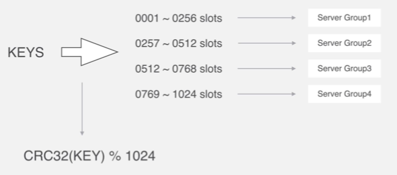

# Codis

|                           | Codis | Tewmproxy | Redis Cluster             |
| ------------------------- | ----- | --------- | ------------------------- |
| 重新分片不需要重启        | 是    | 否        | 是                        |
| pipeline                  | 是    | 是        |                           |
| 多 key 操作的 hash tags{} | 是    | 是        | 是                        |
| 重新分片时的多 key 操作   | 是    | -         | 否                        |
| 客户端支持                | 所有  | 所有      | 支持 cluster 协议的客户端 |

## 是什么

Codis 是一个代理中间件，用 Go 语言开发的。使用客户端连接 Codis 跟连接 Redis 没有区别。

## 工作原理

Codis上挂接者所有Redis实例构建成一个Redis集群，当集群空间不足时，可以通过动态增加Redis实例来实现扩容操作

客户端操作Codis和操作Redis几乎没有任何区别，还可以使用相同的客户端SDK,不需要任何变化

因为Codis是无状态的，它只是一个转发代理中间件，所以我们可以启动多个Codis节点

## 分片原理

Codis 把所有的 key 分成了 N 个槽(例如 1024)，每个槽对应一个分组， 一个分组对应于一个或者一组 Redis 实例。

Codis 对 key 进行 CRC32 运算，得到一个 32 位的数字，然后模以 N(槽的个数)，得到余数，这个就是 key 对应的槽，槽后面就 是 Redis 的实例。比如 4 个槽:

Codis 的槽位映射关系是保存在 Proxy 中的，如果要解决单点的问题，Codis 也要 做集群部署，多个Codis节点怎么同步槽和实例的关系呢?

**需要运行一个Zookeeper( 或者 etcd/本地文件)。**

> Codis 将槽位关系存储到zookeeper 中，并且提供一个Dashboard 可以观察和修改槽位关系，当槽位关系变化时，Codis proxy 会监听到变化并重新同步槽位关系，从而实现多个Codis  Proxy 之间共享槽位关系的配置

在新增节点的时候，可以为节点指定特定的槽位。Codis 也提供了自动均衡策略。

Codis 不支持事务，其他的一些命令也不支持。

不支持的命令
https://github.com/CodisLabs/codis/blob/release3.2/doc/unsupported_cmds.md

获取数据原理(mget):在 Redis 中的各个实例里获取到符合的 key，然后再汇总 到 Codis 中。

Codis 是第三方提供的分布式解决方案，在官方的集群功能稳定之前，Codis 也得到 了大量的应用。

## 总结

Codis 在设计上比cluster 简单很多，因为它将分布式的问题交给了第三方（zookeeper 或者 edtd）去负责，自己就省去了复杂的分布式一致性代码编写工作，而与之相比，Redis cluster，的内部实现非常复杂，它为了实现去中心化，混合使用了复杂的Raft 和 Gossip协议，还有大量的需要调优的配置

- 因为不同的key分散在不同的实例，所以不支持事务
- rename 也不支持