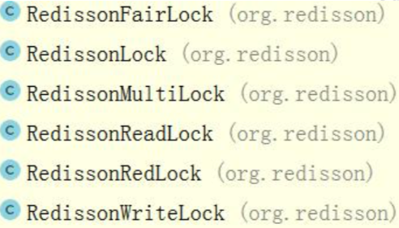

# Redisson

Redisson 是一个在 Redis 的基础上实现的 Java 驻内存数据网格(In-Memory Data Grid)，提供了分布式和可扩展的 Java 数据结构。

## 特点

- 基于 Netty 实现，采用非阻塞 IO，性能高
- 支持异步请求
- 支持连接池、pipeline、LUA Scripting、Redis Sentinel、Redis Cluster 不支持事务，官方建议以 LUA Scripting
- 代替事务 主从、哨兵、集群都支持。Spring 也可以配置和注入 RedissonClient。

## 实现分布式锁

在 Redisson 里面提供了更加简单的分布式锁的实现。

 

```java
public static void main(String[] args) throws InterruptedException { RLock rLock=redissonClient.getLock("updateAccount");
	// 最多等待 100 秒、上锁 10s 以后自动解锁 if(rLock.tryLock(100,10, TimeUnit.SECONDS)){
	System.out.println("获取锁成功"); }
	// do something
rLock.unlock(); }
```

在获得 RLock 之后，只需要一个 tryLock 方法，里面有 3 个参数: 1、watiTime:获取锁的最大等待时间，超过这个时间不再尝试获取锁 2、leaseTime:如果没有调用 unlock，超过了这个时间会自动释放锁 3、TimeUnit:释放时间的单位

## Redisson 的分布式锁是怎么实现的呢?

在加锁的时候，在 Redis 写入了一个 HASH，key 是锁名称，field 是线程名称，value 是 1(表示锁的重入次数)。

最终也是调用了一段 Lua 脚本。里面有一个参数，两个参数的值。

| 站位    | 填充                  | 含义              |
| ------- | --------------------- | ----------------- |
| KEYS[1] | getName               | 锁的名称          |
| ARGV[1] | internalLockLeaseTime | 锁的释放时间,毫秒 |
| ARGV[2] | getLockName(threadID) | 线程名称          |

```java
// KEYS[1] 锁名称 updateAccount // ARGV[1] key 过期时间 10000ms // ARGV[2] 线程名称
// 锁名称不存在
if (redis.call('exists', KEYS[1]) == 0) then
// 创建一个 hash，key=锁名称，field=线程名，value=1 redis.call('hset', KEYS[1], ARGV[2], 1);
// 设置 hash 的过期时间
redis.call('pexpire', KEYS[1], ARGV[1]);
return nil;
end;
// 锁名称存在，判断是否当前线程持有的锁
if (redis.call('hexists', KEYS[1], ARGV[2]) == 1) then
// 如果是，value+1，代表重入次数+1 redis.call('hincrby', KEYS[1], ARGV[2], 1);
// 重新获得锁，需要重新设置 Key 的过期时间 redis.call('pexpire', KEYS[1], ARGV[1]);
return nil;
end;
// 锁存在，但是不是当前线程持有，返回过期时间(毫秒) return redis.call('pttl', KEYS[1]);
```

#### 释放锁，源码:

unlock——unlockInnerAsync

| 占位    | 填充                     | 含义         |
| ------- | ------------------------ | ------------ |
| KEYS[1] | getName()                | 锁名称       |
| KEY[2]  | getChannelName()         | 频道名称     |
| ARGV[1] | LockPubSub.unlockMessage | 解锁时的消息 |
| ARGV[2] | internalLockLeaseTime    | 释放锁的时间 |
| ARGV[3] | getLockName(threadId)    | 线程名称     |


```lua
// KEYS[1] 锁的名称 updateAccount
// KEYS[2] 频道名称 redisson_lock__channel:{updateAccount} // ARGV[1] 释放锁的消息 0
// ARGV[2] 锁释放时间 10000
// ARGV[3] 线程名称
// 锁不存在(过期或者已经释放了)
if (redis.call('exists', KEYS[1]) == 0) then
// 发布锁已经释放的消息 redis.call('publish', KEYS[2], ARGV[1]); return 1;
end;
// 锁存在，但是不是当前线程加的锁
if (redis.call('hexists', KEYS[1], ARGV[3]) == 0) then
return nil; end;
​
// 锁存在，是当前线程加的锁
// 重入次数-1
local counter = redis.call('hincrby', KEYS[1], ARGV[3], -1);
// -1 后大于 0，说明这个线程持有这把锁还有其他的任务需要执行 if (counter > 0) then
// 重新设置锁的过期时间 redis.call('pexpire', KEYS[1], ARGV[2]); return 0;
else
// -1 之后等于 0，现在可以删除锁了 redis.call('del', KEYS[1]);
// 删除之后发布释放锁的消息 redis.call('publish', KEYS[2], ARGV[1]); return 1;
end; ​
// 其他情况返回 nil return nil;
```

这个是 Redisson 里面分布式锁的实现，我们在调用的时候非常简单。
Redisson 跟 Jedis 定位不同，它不是一个单纯的 Redis 客户端，而是基于 Redis 实 现的分布式的服务，如果有需要用到一些分布式的数据结构，比如我们还可以基于 Redisson 的分布式队列实现分布式事务，就可以引入 Redisson 的依赖实现。