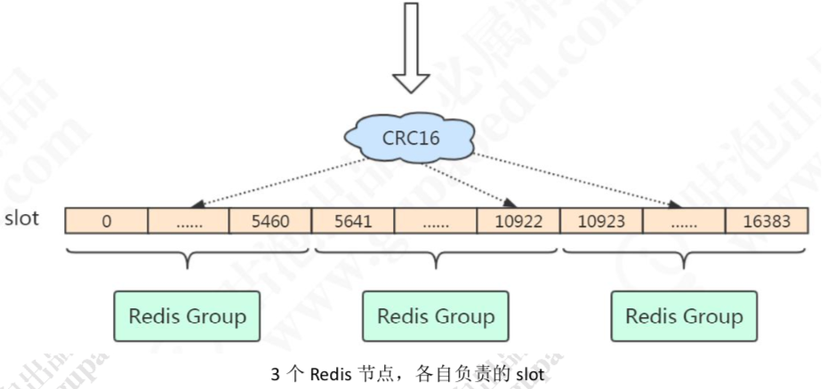
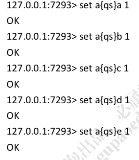

# 043-Redis分布式方案-RedisCluster-槽指派

[TOC]

## Cluster如何分片

Redis Cluster 将所有数据划分为16384个槽位，它比Codis 的1024个槽位划分得更为精细，每个节点负责其中一部分操作。槽位的信息存储于每个节点中，它不像Codis ，不需要另外的分布式存储空间来存储节点槽位信息

## Cluster节点如何定位

当Redis Cluster 客户端来链接集群时， 会得到一份集群的槽位配置信息，这样客户端想要查找各个key时，可以直接定位到目标节点，这一点不同于Codis,Codis需要通过Proxy来定位目标节点，Redis Cluster则直接定位

## 槽位定位算法

Redis Cluster 默认会对key值使用 crc16 算法进行hash, 得到一个整数值，然后用这个整数值对16384 进行取模来得到具体的槽位

支持用户强制把某个key挂载特定的槽位上，通过在key的字符串里嵌入特定的tag标志

 [050-Redis-一致性哈希.md](050-Redis-一致性哈希.md) 

## Redis虚拟槽分区

**Redis 既没有用哈希取模，也没有用一致性哈希，而是用虚拟槽来实现的。**

Redis 创建了 16384 个槽(slot)，每个节点负责一定区间的 slot。比如 Node1 负 责 0-5460，Node2 负责 5461-10922，Node3 负责 10923-16383。



Redis 的每个 master 节点维护一个 **16384** 位 **(2048bytes=2KB)** 的位序列，比如:
序列的第 0 位是 1，就代表第一个 slot 是它负责;序列的第 1 位是 0，代表第二个 slot 不归它负责。

对象分布到 Redis 节点上时，对 key 用 CRC16 算法计算再%16384，得到一个 slot 的值，数据落到负责这个 slot 的 Redis 节点上。
查看 key 属于哪个 slot:

```
redis> cluster keyslot qingshan
```

注意:key 与 slot 的关系是永远不会变的，会变的只有 slot 和 Redis 节点的关系。

**怎么让相关的数据落到同一个节点上?**

比如有些 multi key 操作是不能跨节点的，如果要让某些数据分布到一个节点上，例 如用户 2673 的基本信息和金融信息，怎么办?

在 key 里面加入{hash tag}即可。Redis 在计算槽编号的时候只会获取{}之间的字符 串进行槽编号计算，这样由于上面两个不同的键，{}里面的字符串是相同的，因此他们可 以被计算出相同的槽。

user{2673}base=... user{2673}fin=...



**客户端连接到哪一台服务器?访问的数据不在当前节点上，怎么办?**


## 网络抖动

Redis Cluster 提供一个选项 cluster-node-timeout 表示某个节点持续timeout的时间失联时，才可以认定该节点出现故障，需要进行主从切换

还有一个选项 cluster-slave-validity-factory 作为背书系数放大这个超时时间来宽松容错的紧急程度，如果这个系数为零，那么主从切换是不会抗拒网络抖动的

## 可能下线和确定下线

Redis是去中心化的， 节点采用Gossip 协议来广播自己的状态以及改变对整个集群的认知，比如一个节点发现某个节点失联了，（pFail ， passibly fail） 它将这条信息向整个集群广播，其他节点就可以收到这点失联信息，如果收到了某个节点失联的节点数量，已经达到集群的大多数(Pfail count)，就可以标记为确定下线（Fail）,然后向整个集群广播，强迫其他节点接受该节点已经下线的事实，强制进行主从切换

##  高可用和主从切换原理

当 slave 发现自己的 master 变为 FAIL 状态时，便尝试进行 Failover，以期成为新 的 master。由于挂掉的 master 可能会有多个 slave，从而存在多个 slave 竞争成为 master 节点的过程， 其过程如下:

- slave 发现自己的 master 变为 FAIL
- 将自己记录的集群 currentEpoch 加 1，并广播 FAILOVER_AUTH_REQUEST 信息
- 其他节点收到该信息，只有 master 响应，判断请求者的合法性，并发送`FAILOVER_AUTH_ACK`，对每一个 epoch 只发送一次 ack
- 尝试 failover 的 slave 收集 FAILOVER_AUTH_ACK
- 超过半数后变成新 Master
- 广播 Pong 通知其他集群节点。
- Redis Cluster 既能够实现主从的角色分配，又能够实现主从切换，相当于集成了 Replication 和 Sentinal 的功能。

## 总结:

优势

1. 无中心架构。
2. 数据按照 slot 存储分布在多个节点，节点间数据共享，可动态调整数据分布。 
3. 可扩展性，可线性扩展到 1000 个节点(官方推荐不超过 1000 个)，节点可动态添加或删除。
4. 高可用性，部分节点不可用时，集群仍可用。通过增加 Slave 做 standby 数据副
   本，能够实现故障自动 failover，节点之间通过 gossip 协议交换状态信息，用投票机制 完成 Slave 到 Master 的角色提升。
5. 降低运维成本，提高系统的扩展性和可用性。

不足

1. Client 实现复杂，驱动要求实现 Smart Client，缓存 slots mapping 信息并及时 更新，提高了开发难度，客户端的不成熟影响业务的稳定性。
2. 节点会因为某些原因发生阻塞(阻塞时间大于 clutser-node-timeout)，被判断 下线，这种 failover 是没有必要的。
3. 数据通过异步复制，不保证数据的强一致性。
4. 多个业务使用同一套集群时，无法根据统计区分冷热数据，资源隔离性较差，容 易出现相互影响的情况。

## 重点

- 节点直接通过握手来将其他节点添加到自己所处的集群当中
- **集群中的18384 个槽可以分别指派给集群的各个节点,每个节点都会记录 槽位和节点的映射关系**
- 节点在接到一个命令请求时,会先检查这个命令请求要处理的键所在的槽是否由自己负责,如果不是的话,节点将会向客户端返回一个MOVED错误,MOVED错误携带的信息可以指引客户端转向正在负责的槽的节点
- 对Redis集群的重新分片工作是由redis-trib负责执行的, 重新分片的关键是将属于某个槽的所有键值从一个节点转移到另一个节点
- 如果节点A正在迁移槽i至节点B,那么当节点A没能在自己的数据库中找到命令时,节点A会向客户端返回一个ASK错误,指引客户端到节点B继续寻找指定的key
- MOVED错误表示槽的负责权利已经从一个节点转移到了另外一个节点,而ASK错误只是两个节点在迁移槽的过程中使用的一种临时措施
- 集群中的从节点用于复制主节点,并在主节点下线时,代替主节点继续处理命令请求
- 集群中的节点通过发送和接受消息来进行通讯,常见的消息包括MEET,PING,PONG,PUBLISH FAIL五种

