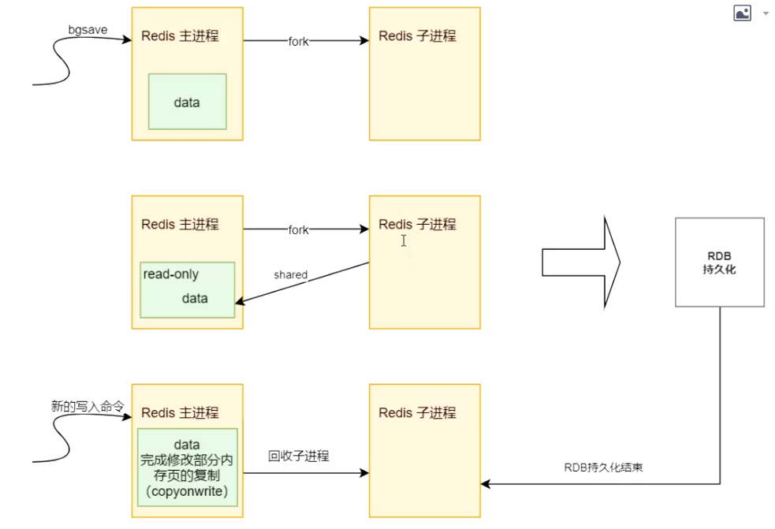

# RDB持久化

**RDB (Redis DataBase) 快照 , 全量备份,是内存数据的二进制序列化存储,恢复速度快 ,多进程COW 机制**,生成一个快照文件 **dump.rdb**。

Redis 重启会通过加载 dump.rdb 文件恢复数据。

## 什么时候触发

- 自动触发机制
- 手动触发机制



- 主进程 fork 一个子进程
- 主进程的数据进入 readonly 状态,因为子进程会有指针指向这块内存
- 主进程修改的部分用 COW 机制

#### 自动触发

- redis.conf 配置文件可以配置触发频率

  > 修改配置文件
  >
  > 如果不需要 RDB 方案，注释 save 或者配置成空字符串""。
  >
  > ```
  > save 900 1 # 900 秒内至少有一个 key 被修改(包括添加) 
  > save 300 10 # 400 秒内至少有 10 个 key 被修改
  > save 60 10000 # 60 秒内至少有 10000 个 key 被修改
  > 
  > # 文件路径，
  > dir ./
  > # 文件名称
  > dbfilename dump.rdb
  > # 是否是LZF压缩rdb文件 rdbcompression yes
  > # 开启数据校验 rdbchecksum yes
  > ```
  >
  > | 参数            | 说明                                                         |
  > | --------------- | ------------------------------------------------------------ |
  > | dir             | rdb 文件默认在启动目录下(相对路径)                           |
  > | dbfilename      | 文件名称                                                     |
  > | rdbcompiression | 开启压缩可以节省存储空间，但是会消耗一些 CPU 的计算时间，默认开启 |
  > | rdbchecksum     | 使用 CRC64 算法来进行数据校验，但是这样做会增加大约 10%的性能消耗，如果希望获取到最 大的性能提升，可以关闭此功能 |

- shutdown 触发,保证服务正常关闭
- flushall，RDB 文件是空的，没什么意义

#### 手动触发机制

-  [save](01-save.md) 

  > save 在生成快照的时候会阻塞当前 Redis 服务器， Redis 不能处理其他命令。如果 内存中的数据比较多，会造成 Redis 长时间的阻塞。生产环境不建议使用这个命令。

-  [bgsave](02-bgsave.md) 

  > 执行 bgsave 时，Redis 会在后台异步进行快照操作，快照同时还可以响应客户端请求。
  >
  > 具体操作是 Redis 进程执行 fork 操作创建子进程(copy-on-write)，RDB 持久化 过程由子进程负责，完成后自动结束。它不会记录 fork 之后后续的命令。阻塞只发生在 fork 阶段，一般时间很短。
  >
  > 用 lastsave 命令可以查看最近一次成功生成快照的时间。

## 实例

- shutdown 持久化

  > 添加键值
  >
  > ```
  > redis> set k1 1 
  > redis> set k2 2 
  > redis> set k3 3 
  > redis> set k4 4 
  > redis> set k5 5
  > ```
  >
  > 停服务器，触发 save
  >
  > ```
  > redis> shutdown
  > ```
  >
  > 备份 dump.rdb 文件
  >
  > ```
  > /usr/local/soft/redis-5.0.5/src/redis-server /usr/local/soft/redis-5.0.5/redis.conf
  > ```
  >
  > 数据都在:
  >
  > ```
  > redis> keys *
  > ```

- 模拟数据丢失

  > 模拟数据丢失，触发 save
  >
  > ```
  > redis> flushall
  > ```
  >
  > 停服务器
  >
  > ```
  > redis> shutdown
  > ```
  >
  > 启动服务器
  >
  > ```
  > /usr/local/soft/redis-5.0.5/src/redis-server /usr/local/soft/redis-5.0.5/redis.conf
  > ```
  >
  > 啥都没有:
  >
  > ```
  > redis> keys *
  > ```

- 通过备份文件恢复数据

  > 停服务器
  >
  > ```
  > redis> shutdown
  > ```
  >
  > 重命名备份文件
  >
  > ```
  > mv dump.rdb.bak dump.rdb
  > ```
  >
  > 启动服务器
  >
  > ```
  > /usr/local/soft/redis-5.0.5/src/redis-server /usr/local/soft/redis-5.0.5/redis.conf
  > ```
  >
  > 查看数据
  >
  > ```
  > redis> keys *
  > ```

## RDB 文件的优势和劣势

#### 优势

1. RDB 是一个非常紧凑(compact)的文件，它保存了 redis 在某个时间点上的数据
   集。这种文件非常适合用于进行备份和灾难恢复。

2. 生成 RDB 文件的时候，redis 主进程会 fork()一个子进程来处理所有保存工作，主
   进程不需要进行任何磁盘 IO 操作。

3. RDB 在恢复大数据集时的速度比 AOF 的恢复速度要快。

#### 劣势

1. RDB 方式数据没办法做到实时持久化/秒级持久化。因为 bgsave 每次运行都要执行 fork 操作创建子进程，频繁执行成本过高。 

2. 在一定间隔时间做一次备份，所以如果 redis 意外 down 掉的话，就会丢失最后一次快照之后的所有修改(数据有丢失)。

如果数据相对来说比较重要，希望将损失降到最小，则可以使用 AOF 方式进行持久化。

- Linux fork 之后, kernal 会把父进程的内存页的权限设置为 read-only ,然后子进程的地址空间指向父进程
  - 当父子进程都只读内存时,相安无事
  - 当其中某个进程写内存时,CPU 硬件检测到内存页是 readonly 的,于是会触发页异常中断(page-fault) ,陷入 kernel 的一个中断例程,中断例程中,kernel 的 COW 机制会把触发的异常页复制一份,则父子进程各持有一份,如果这个时候有大量写入操作,会产生大量的分页错误,页异常中断 page-fault ,耗费性能该在复制上

