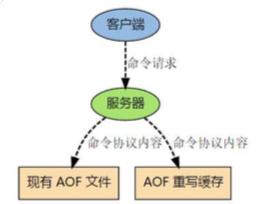

# AOF

Redis 默认不开启。

AOF 采用日志的形式来记录每个写操作，并追加到文件中。开启后，执行更改 Redis 数据的命令时，就会把命令写入到 AOF 文件中。
Redis 重启时会根据日志文件的内容把写指令从前到后执行一次以完成数据的恢复工作。

## AOF 文件的内容

直接用 vim 查看


## AOF 配置

Append Only File

```
# 开关 Redis 默认只开启 RDB 持久化，开启 AOF 需要修改为 yes
appendonly no
# 文件名 路径也是通过 dir 参数配置 config get dir
appendfilename "appendonly.aof"
```

## 数据都是实时持久化到磁盘吗?

由于操作系统的缓存机制，AOF 数据并没有真正地写入硬盘，而是进入了系统的硬盘缓存。什么时候把缓冲区的内容写入到 AOF 文件?

| 参数                 | 说明                                                         |
| -------------------- | ------------------------------------------------------------ |
| appendfsync everysec | AOF 持久化策略(硬盘缓存到磁盘)，默认 everysec<br/>no表示不执行fsync，由操作系统保证数据同步到磁盘，速度最快，但是不太安全;  always表示每次写入都执行fsync，以保证数据同步到磁盘，效率很低;<br/>everysec 表示每秒执行一次 fsync，可能会导致丢失这 1s 数据。通常选择 everysec ，<br/>兼顾安全性和效率。 |

## 文件越来越大，怎么办?

由于 AOF 持久化是 Redis 不断将写命令记录到 AOF 文件中，随着 Redis 不断的进 行，AOF 的文件会越来越大，文件越大，占用服务器内存越大以及 AOF 恢复要求时间 越长。

**AOF 重写**

aof 日志在长期运行过程中会变得无比强大,数据库重启的时候需要加载 aof 日志进行指令的重返,这个时间无比漫长,所以要对 AOF 定期重写, 给 AOF 瘦身

> bgrewriteaof 指令 用于对 AOF日志进行瘦身

AOF 文件重写并不是对原文件进行重新整理，而是直接读取服务器现有的键值对， 然后用一条命令去代替之前记录这个键值对的多条命令，生成一个新的文件后去替换原 来的 AOF 文件。

**原理就是开辟一个子进程对内存进行遍历,序列化到一个新的 aof 日志文件中,序列化完成之后再讲操作期间发生的增量 aof日志追加到这个新的 aof 日志文件中,追加完毕之后就立即替代就的 aof 文件了,瘦身工作就完成了**

```
# 重写触发机制 
auto-aof-rewrite-percentage 100 
auto-aof-rewrite-min-size 64mb
```

| 参数                         | 说明                                                         |
| ---------------------------- | ------------------------------------------------------------ |
| auto-aof-rewrite-percentag e | 默认值为 100。aof 自动重写配置，当目前 aof 文件大小超过上一次重写的 aof 文件大小的 百分之多少进行重写，即当 aof 文件增长到一定大小的时候，Redis 能够调用 bgrewriteaof 对日志文件进行重写。当前 AOF 文件大小是上次日志重写得到 AOF 文件大小的二倍(设 置为 100)时，自动启动新的日志重写过程。 |
| auto-aof-rewrite-min-size    | 默认 64M。设置允许重写的最小 aof 文件大小，避免了达到约定百分比但尺寸仍然很小的 情况还要重写。 |

#### 重写过程中,AOF 文件被更改了怎么办

> 使用子线程进行 AOF 重写



子进程在进行 AOF 重写的时候,主进程需要执行以下三个任务

1. 处理命令请求
2. 将写命令追加到现有的 AOF 文件中
3. 将写命令追加到 AOF 重写缓存中

| 参数                      | 说明                                                         |
| ------------------------- | ------------------------------------------------------------ |
| no-appendfsync-on-rewrite | 在 aof 重写或者写入 rdb 文件的时候，会执行大量 IO，此时对于 everysec 和 always 的 aof 模式来说，执行 fsync 会造成阻塞过长时间，no-appendfsync-on-rewrite 字段设置为默认设 置为 no。如果对延迟要求很高的应用，这个字段可以设置为 yes，否则还是设置为 no，这 样对持久化特性来说这是更安全的选择。设置为 yes 表示 rewrite 期间对新写操作不 fsync, 暂时存在内存中,等 rewrite 完成后再写入，默认为 no，建议修改为 yes。Linux 的默认 fsync 策略是 30 秒。可能丢失 30 秒数据。 |
| aof-load-truncated        | aof 文件可能在尾部是不完整的，当 redis 启动的时候，aof 文件的数据被载入内存。重启 可能发生在 redis 所在的主机操作系统宕机后，尤其在 ext4 文件系统没有加上 data=ordered 选项，出现这种现象。redis 宕机或者异常终止不会造成尾部不完整现象，可以选择让 redis 退出，或者导入尽可能多的数据。如果选择的是 yes，当截断的 aof 文件被导入的时候， 会自动发布一个 log 给客户端然后 load。如果是 no，用户必须手动 redis-check-aof 修复 AOF 文件才可以。默认值为 yes。 |

## AOF 数据恢复

重启 Redis 之后就会进行 AOF 文件的恢复。

## AOF 的优缺点

- AOF 持久化的方法提供了多种的同步频率，即使使用默认的同步频率每秒同步 一次，Redis 最多也就丢失 1 秒的数据而已

#### 缺点

- 对于具有相同数据的的 Redis，AOF 文件通常会比 RDF 文件体积更大(RDB 存的是数据快照)。
- 虽然 AOF 提供了多种同步的频率，默认情况下，每秒同步一次的频率也具有较 高的性能。在高并发的情况下，RDB 比 AOF 具好更好的性能保证。