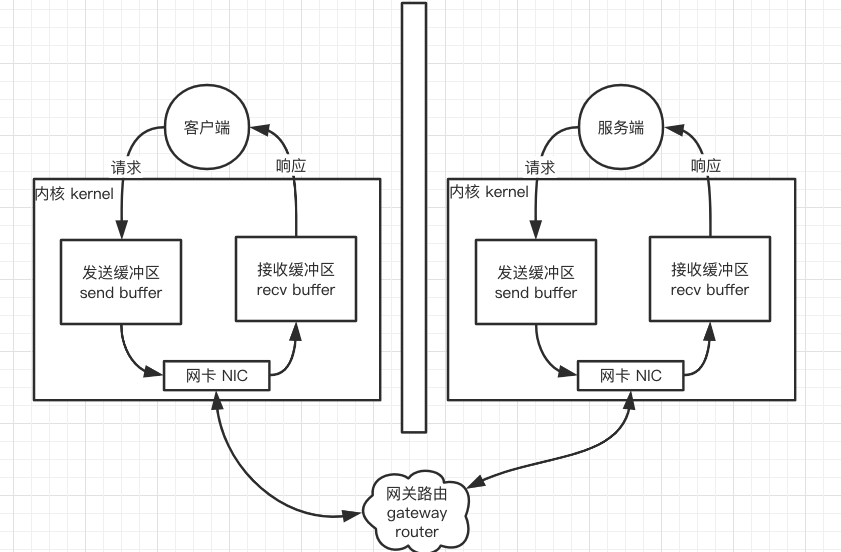

# 管道

> https://zhuanlan.zhihu.com/p/64381987

**管道的本质并不是服务器提供的特性,而是客户端通过改变读写顺序,带来性能的较大提升**

客户端技术,通过对管道中的指令列表改变读写顺序就可以大幅节省 IO 时间,管道中的指令越多,效果就越好

## 为什么需要管道

Redis客户端与服务器之间使用TCP协议进行通信，并且很早就支持管道（pipelining）技术了。在某些高并发的场景下，网络开销成了Redis速度的瓶颈，所以需要使用管道技术来实现突破。

在介绍管道之前，先来想一下单条命令的执行步骤：

- 客户端把命令发送到服务器，然后阻塞客户端，等待着从socket读取服务器的返回结果
- 服务器处理命令并将结果返回给客户端

按照这样的描述，每个**命令的执行时间 = 客户端发送时间+服务器处理和返回时间+一个网络来回的时间**

其中一个网络来回的时间是不固定的，它的决定因素有很多，比如客户端到服务器要经过多少跳，网络是否拥堵等等。但是这个时间的量级也是最大的，也就是说一个命令的完成时间的长度很大程度上取决于网络开销。如果我们的服务器每秒可以处理10万条请求，而网络开销是250毫秒，那么实际上每秒钟只能处理4个请求。最暴力的优化方法就是使客户端和服务器在一台物理机上，这样就可以将网络开销降低到1ms以下。但是实际的生产环境我们并不会这样做。而且即使使用这种方法，当请求非常频繁时，这个时间和服务器处理时间比较仍然是很长的。

## Redis Pipelining

为了解决这种问题，Redis在很早就支持了管道技术。也就是说客户端可以一次发送多条命令，不用逐条等待命令的返回值，而是到最后一起读取返回结果，这样只需要一次网络开销，速度就会得到明显的提升。管道技术其实已经非常成熟并且得到广泛应用了，例如POP3协议由于支持管道技术，从而显著提高了从服务器下载邮件的速度。

在Redis中，如果客户端使用管道发送了多条命令，那么服务器就会将多条命令放入一个队列中，这一操作会消耗一定的内存，所以**管道中命令的数量并不是越大越好**（太大容易撑爆内存），而是应该有一个合理的值。

1. 客户端进程调用`write()`把消息写入到操作系统内核为Socket分配的send buffer中
2. 操作系统会把 send buffer 中的内容写入网卡，网卡再通过网关路由把内容发送到服务器端的网卡
3. 服务端网卡会把接收到的消息写入操作系统为Socket分配的recv buffer
4. 服务器进程调用`read()`读取消息然后进行处理
5. 处理完成后调用`write()`把返回结果写入到服务器端的 **send buffer**
6. 服务器操作系统再将send buffer中的内容写入网卡，然后发送到客户端
7. 客户端操作系统将网卡内容读到recv buffer中
8. 客户端进程调用`read()`从recv buffer中读取消息并返回

**命令的执行时间 = 客户端调用write并写网卡时间 + 一次网络开销的时间 + 服务读网卡并调用read时间++ 服务器处理数据时间+服务端调用write并写网卡时间+客户端读网卡并调用read时间**

这其中除了网络开销，花费时间最长的就是进行系统调用`write()`和`read()`了，这一过程需要操作系统由**用户态**切换到**内核态**，中间涉及到的上下文切换会浪费很多时间。

使用管道时，多个命令只会进行一次`read()`和`wrtie()`系统调用，因此使用管道会提升Redis服务器处理命令的速度，随着管道中命令的增多，服务器每秒处理请求的数量会线性增长，最后会趋近于不使用管道的10倍。

## 值得注意的是

> write 操作值负责写到缓冲区后就返回了
>
> read 操作值负责将数据从本地操作系统内核的接受缓冲中取出来,如果缓冲是空的,就会等待

1. **使用管道技术可以显著提升Redis处理命令的速度，其原理就是将多条命令打包，只需要一次网络开销，在服务器端和客户端各一次`read()`和`write()`系统调用，以此来节约时间。**
2. **管道中的命令数量要适当，并不是越多越好。**
3. **Redis2.6版本以后，脚本在大部分场景中的表现要优于管道。**

#### 所以对于管道来说:

**连续的 write 操作根本没有耗时(写到缓冲区就返回),之后第一个 read 操作会等待一个网络的来回开销,然后所有的相应消息就都已经送回到内核的读缓冲了,后续的 read 操作之久就可以从缓冲中拿到结果,瞬间就返回了**