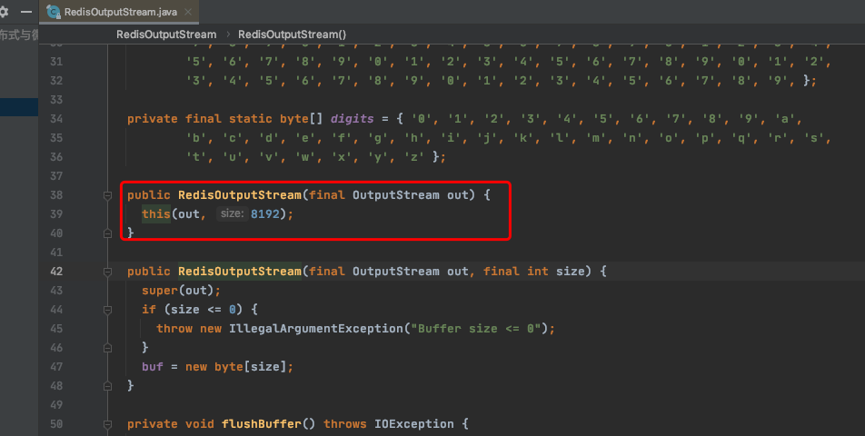

# 管道相关配置

[TOC]

## 管道简介

要实现 Pipeline，既要服务端的支持，也要客户端的支持。

- 对于服务端来说，需要能够处理客户端通过一个 TCP 连接发来的多个命令，并且逐个地执行命令一起返回 。

- 对于客户端来说，要把多个命令缓存起来，达到一定的条件就发送出去，最后才处理 Redis 的应答(这里也要注意对客户端内存的消耗)。

## Jedis 客户端里的缓冲区

jedis-pipeline 的 client-buffer 限制: 8192bytes :

也就是说

**客户端堆积的命令超过 8192 bytes 时，会发送给服务端。**



pipeline 对于命令条数没有限制，但是命令可能会受限于 TCP 包大小。

如果 Jedis 发送了一组命令，而发送请求还没有结束，**Redis 响应的结果会放在接收缓冲区。**如果接收缓冲区满了，jedis 会通知 redis win=0，此时 redis 不会再发送结果 给 jedis 端，转而把响应结果保存在 Redis 服务端的输出缓冲区中。

## 输出缓冲区的配置:redis.conf

```
client-output-buffer-limit normal 0 0 0 
client-output-buffer-limit replica 256mb 64mb 60 
client-output-buffer-limit pubsub 32mb 8mb 60
```

| 配置                    | 作用                                                         |
| ----------------------- | ------------------------------------------------------------ |
| class                   | 客户端类型，分为三种。a)normal:普通客户端;b)slave:slave 客户端，用于复制;c) pubsub:发布订阅客户端 |
| hard limit              | 如果客户端使用的输出缓冲区大于<hard limit>，客户端会被立即关闭，0 代表不限制 |
| soft limit soft seconds | 如果客户端使用的输出缓冲区超过了<soft limit>并且持续了<soft limit>秒，客户端会被立即 关闭 |

每个客户端使用的输出缓冲区的大小可以用 client list 命令查看

```
127.0.0.1:6379> client list
id=3 addr=127.0.0.1:56234 fd=8 name= age=6 idle=0 flags=N db=0 sub=0 psub=0 multi=-1 qbuf=26 qbuf-free=32742 obl=0 oll=0 omem=0 events=r cmd=client
```

- obl=0

> 输出缓冲区的长度(字节为单位， 0 表示没有分配输出缓冲区)

- oll=0

> 输出列表包含的对象数量(当输出缓冲区没有剩余空间时，命令回复会以字符串对象的形式被入队到这个
> 队列里)

- omem=0

>  输出缓冲区和输出列表占用的内存总量

# 管道适用场景

有些场景，例如批量写入数据，对于结果的**实时性和成功性**要求不高，就可以用Pipeline。

> 如果某些操作需要马上得到 Redis 操作是否成功的结果，这种场景就不适合。

