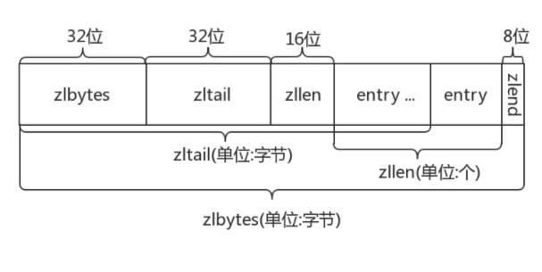

# 压缩列表

如果 Redis 内部管理的集合数据结构很小,它会使用**紧凑存储形式**压缩存储

#### 怎么理解

比如 HashMap , 是二维结构,但是如果内部元素比较少,使用二维结构反而浪费空间,还不如使用以为数据进行存储,需要查找时因为元素少,直接遍历也很快

**Redis 的 ziplist 是一个紧凑的字节数组结构**

- 每个元素都是紧挨着的
- 如果你存储的是 hash结构, 那么 key 和 value 会作为两个 entry 相邻存储
- 如果你存储的是 zset 结构, 那么 value 和 score 会作为两个 entry 相邻存储

#### Redis 中有哪些基本数据结构使用了压缩链表

- zet 
- hash 字典

这两个数据结构在元素个数较少的情况下,采用的是压缩列表(ziplist)进行存储

#### 什么是压缩列表?

压缩列表是一块连续的内存空间,元素之间紧挨着存储,

- 压缩链表支持双向遍历,使用了一个`ztail_offset`字段快速定位到最后一个字段,然后倒着遍历

#### 压缩列表是如何增加元素的?

ziplist 都是紧凑存储的,没有冗余空间,插入一个新的元素就需要调用 realloc 拓展内存,取决于内存分配器算法和当前的 ziplist 内存大小

如果 ziplist 占据的内存太大,重新分配内存和拷贝内存就会有很大的消耗

**ziplist 不适合存储大型字符串,存储的元素不宜过多**

