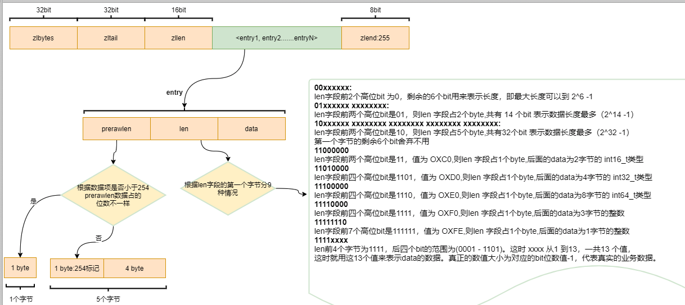
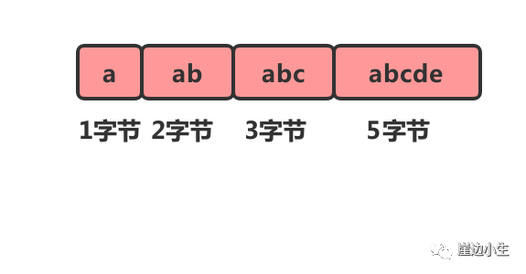
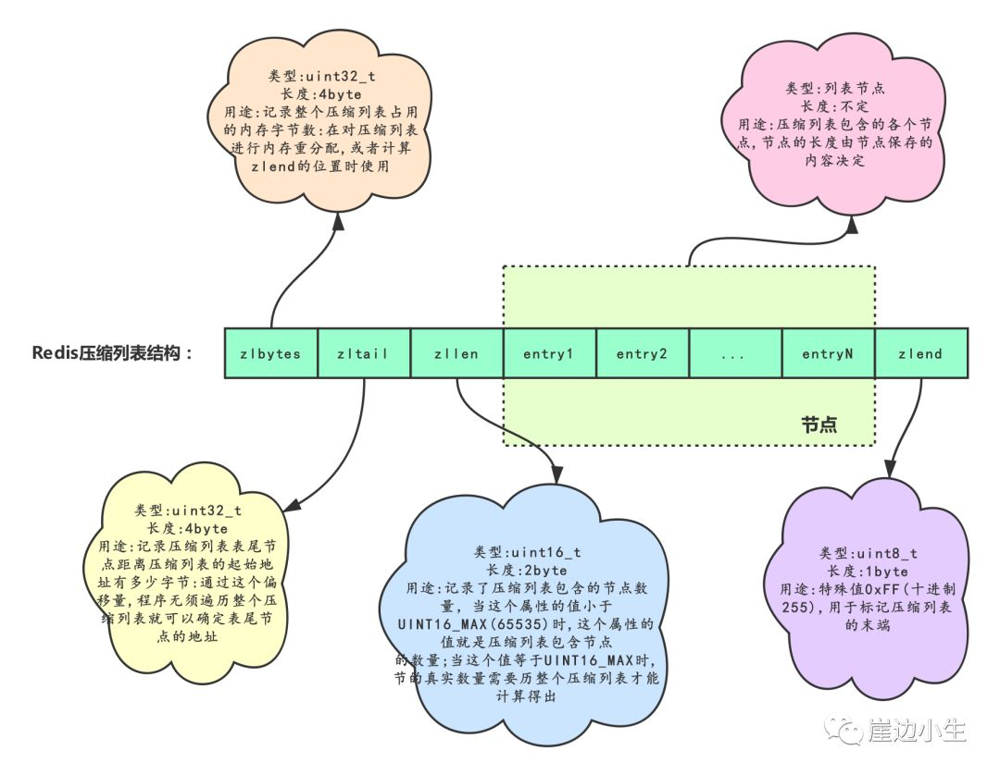
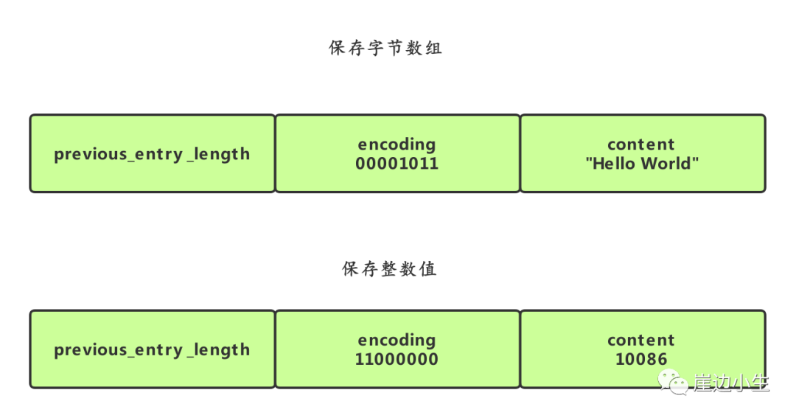

# 压缩列表ziplist

## 目录

- [压缩列表简介](#压缩列表简介)
- [图示](#图示)

---

## 压缩列表简介

压缩列表(zipList) 是列表键 和哈希键 的底层实现之一

| 对象         | 对象 type 属性值 | type 命令输出 | 底层可能的存储结构                                    | object encoding           |
| ------------ | ---------------- | ------------- | ----------------------------------------------------- | ------------------------- |
| 字符串对象   | OBJ_STRING       | "string"      | OBJ_ENCODING_INT OBJ_ENCODING_EMBSTR OBJ_ENCODING_RAW | int embstr raw            |
| 列表对象     | OBJ_LIST         | "list"        | OBJ_ENCODING_QUICKLIST                                | quicklist                 |
| 哈希对象     | OBJ_HASH         | "hash"        | OBJ_ENCODING_ZIPLIST OBJ_ENCODING_HT                  | ziplist hashtable         |
| 集合对象     | OBJ_SET          | "set"         | OBJ_ENCODING_INTSET OBJ_ENCODING_HT                   | intset hashtable          |
| 有序集合对象 | OBJ_ZSET         | "zset"        | OBJ_ENCODING_ZIPLIST OBJ_ENCODING_SKIPLIST            | ziplist skiplist(包含 ht) |

- 当一个列表键只包含少量列表项,并且每个列表项要么就是小整数值
- 长度比较短的字符串,Redis就会使用压缩列表来做列表键的底层实现

## 图示


ziplist 是一个经过特殊编码的双向链表，它不存储指向上一个链表节点和指向下一 个链表节点的指针，而是存储上一个节点长度和当前节点长度，通过牺牲部分读写性能， 来换取高效的内存空间利用率，是一种时间换空间的思想。只用在字段个数少，字段值 小的场景里面。

Redis 为了节约内存空间使用, zset 和 hash 容器对象在元素个数较小的情况下,采用的是压缩列表(ziplist)进行存储

**压缩列表是一块连续的内存空间,元素之间紧挨着存储,没有任何冗余空隙**

#### zset 

```shell
127.0.0.1:6379> zadd programmings 1.0 go 2.0 python 3.0 java
(integer) 3
127.0.0.1:6379> debug object programmings
Value at:0x7fd23dc20220 refcount:1 encoding:ziplist serializedlength:36 lru:2510073 lru_seconds_idle:11
```

#### hash

例如,我创建一个压缩列表实现的哈希键

```
127.0.0.1:6379> hmset books go fast python slow java fast
OK
127.0.0.1:6379> debug object books
Value at:0x7fd24b013d20 refcount:1 encoding:ziplist serializedlength:48 lru:2510152 lru_seconds_idle:8

```

哈希键包含的所有键和值都是**小整数值或者短字符串**的话,实际上是使用压缩列表来存储的

## 值得注意的是

- 压缩列表是一种为了节约内存而开发的顺序型数据结构
- 压缩列表可以包含多个节点,每个节点可以保存一个字节数组或者整数值
- 添加新节点到压缩列表,或者从压缩列表中删除节点,可能会引发连锁更新操作,但是这种操作出现的几率不高

## 32 位编译和 64 位编译

Redis 如果使用 32 位编译,内部所有数据结构所使用的指针空间占用会少一半,如果你的 Redis 使用内存不超过 4G , 可以考虑使用 32为编译, 能够节约大量内存

4G 的容量作为一些小型站点绰绰有余,如果不足可以增加实例的方式解决

## 压缩列表的构成

#### 源码

```c
struct ziplist<T>{
  int32 zlbytes;				//整个压缩列表占用的字节数
  int32 zltail_offset; //最后一个元素举例压缩列表起始位置的偏移量,用于快速定位最后一个元素
  int16 zllength;				//元素个数
  T[] entries;					//元素内容列表,一次紧凑存储
  int8 zlend;						//标志压缩列表的结束,值为 OxFF
}
```

#### 含义

| 属性   | 类型     | 长度   | 用途                                                         |
| ------ | -------- | ------ | ------------------------------------------------------------ |
| zlbyte | unit32_t | 4 字节 | 记录整个压缩列表占用的内存字节数, 在对压缩列表进行内存重分配或者计算 zlend 的位置时使用 |
| zltail | unit32_t | 4字节  | 记录压缩列表尾结点距离压缩列表的起始地址有多少个字节,通过这个偏移量,程序无需遍历整个压缩列表就可以确定表尾结点的地址 |
| zllen  | unit16_t | 2 字节 | 记录了压缩列表所包含的节点的数量, 当这个属性的值小于 UNIT16_MAX(65535) 时, 这个属性的值就是压缩列表包含节点的数量, 这个值等于 UNIT16_MAX 时, 节点的真实数量需要遍历整个压缩列表才能计算得出 |
| entryX | 列表节点 | 不定   | 压缩列表包含的各个节点, 节点的长度由节点保存的内容决定       |
| zlend  | unit8_t  | 1 字节 | 特殊值 0xFF , 十进制 255 , 用于标记压缩列表的末端            |

压缩列表是 Redis 为了节约内存而开发的, 是由一些列特殊编码的连续内存块组成的顺序型 (sequential) 数据结构, 

一个压缩列表可以包含任意多个节点(entry) , 每个节点可以保存一个字节数组或者一个整数值

## 每个位都有自己的含义




## 压缩列表节点的构成

上面看到了 Ziplist 实际上是多个 entry 紧凑连接到一起进行存储,

**entry 块随着容纳的元素类型不同,也会有不一样的结构**

```c
struct entry{
  int<var> pervlen; //前一个 entry 的字节长度
  int<var> encoding; //元素类型编码
  optional byte[] content; //元素内容
}
```

- pervlen 是前一个节点的长度, 当压缩链表倒着遍历的时候,需要通过这个字段来快速定位到下一个元素的位置

## 好文章参考

https://mp.weixin.qq.com/s/nba0FUEAVRs0vi24KUoyQg

## 前言

同整数集合一样压缩列表也不是基础数据结构，而是 Redis 自己设计的一种数据存储结构。它有点儿类似数组，通过一片连续的内存空间，来存储数据。不过，它跟数组不同的一点是，它允许存储的数据大小不同。

### 一、压缩列表

听到“压缩”两个字，直观的反应就是节省内存。

之所以说这种存储结构节省内存,是相较于数组的存储思路而言的。我们知道,数组要求每个元素的大小相同,如果我们要存储不同长度的字符串,那我们就需要用最大长度的字符串大小作为元素的大小(假设是20个字节)。存储小于 20 个字节长度的字符串的时候，便会浪费部分存储空间。


数组的优势占用一片连续的空间可以很好的利用CPU缓存访问数据。如果我们想要保留这种优势，又想节省存储空间我们可以对数组进行压缩。



但是这样有一个问题，我们在遍历它的时候由于不知道每个元素的大小是多少，因此也就无法计算出下一个节点的具体位置。这个时候我们可以给每个节点增加一个lenght的属性。


  如此。我们在遍历节点的之后就知道每个节点的长度(占用内存的大小)，就可以很容易计算出下一个节点再内存中的位置。这种结构就像一个简单的压缩列表了。

### 二、Redis压缩列表

压缩列表(zip1ist)是列表和哈希的底层实现之一。

当一个列表只包含少量列表项,并且每个列表项要么就是小整数值,要么就是长度比较短的字符串,那么Redis就会使用压缩列表来做列表的底层实现。

#### 2.1 Redis压缩列表的构成

压缩列表是Redis为了节约内存而开发的,是由一系列特殊编码的连续内存块组成的顺序型(sequential)数据结枃。一个压缩列表可以包含任意多个节点(entry),每个节点可以保存一个字节数组或者一个整数值，如下图。




如上图，展示了一个总长为80字节，包含3个节点的压缩列表。如果我们有一个指向压缩列表起始地址的指针p，那么表为节点的地址就是P+60。

#### 2.2 Redis压缩列表节点的构成

  每个压缩列表节点可以保存一个字节数组或者一个整数值。其中，字节数组可以是以下三种长度中的一种。

- 长度小于等于63(2^6-1)字节的字节数组;
- 长度小于等于16383(2^14-1)字节的字节数组
- 长度小于等于4294967295(2^32-1)字节的字节数组

整数值可以是以下6种长度中的一种

- 4位长,介于0至12之间的无符号整数
- 1字节长的有符号整数
- 3字节长的有符号整数
- int16_t类型整数
- int32_t类型整数
- int64_t类型整数


#### previous_entry_length

节点的 previous_entry_length属性以字节为单位,记录了压缩列表中**前一个节点的长度**。**previous_entry_length**属性的长度可以是**1字节**或者**5字节**。

- 如果前一节点的长度小于254字节,那么 **previous_entry_length** 属性的长度为1字节，前一节点的长度就保存在这一个字节里面。
- 如果前一节点的长度大于等于254字节,那么 previous_entry_length属性的长度为5字节:其中属性的第一字节会被设置为0xFE(十进制值254),而之后的四个字节则用于保存前一节点的长度.

  节点的encoding属性记录了节点的content属性所保存数据的类型以及长度。

- 一字节、两字节或者五字节长,值的最高位为00、01或者10的是字节数组编码这种编码表示节点的 content属性保存着字节数组,数组的长度由编码除去最高两位之后的其他位记录。
- 一字节长,值的最高位以11开头的是整数编码:这种编码表示节点的content属性保存着整数值,整数值的类型和长度由编码除去最高两位之后的其他位记录。

  节点的content属性负责保存节点的值,节点值可以是一个字节数组或者整数,值的类型和长度由节点的encoding属性决定。



- 编码的最高两位00表示节点保存的是一个字节数组。
- 编码的后六位001011记录了字节数组的长度11。
- content属性保存着节点的值”hello world”。
- 编码11000000表示节点保存的是一个int16_t类型的整数值;
- content属性保存着节点的值10086

#### 2.3 常用操作的时间复杂度

| 操作                                                         | 时间复杂度                                                   |
| ------------------------------------------------------------ | ------------------------------------------------------------ |
| 创建一个新的压缩列表                                         | O(1)                                                         |
| 创建一个包含给定值的新节点,并将这个新节点添加到压缩列表的表头或者表尾 | 平均O(N)，最坏O(N^2)(可能发生连锁更新)                       |
| 将包含给定值的新节点插人到给定节点之后                       | 平均O(N)，最坏O(N^2)(可能发生连锁更新)                       |
| 返回压缩列表给定索引上的节点                                 | O(N)                                                         |
| 在压缩列表中査找并返回包含了给定值的节点                     | 因为节点的值可能是一个字节数组,所以检查节点值和给定值是否相同的复杂度为O(N),而查找整个列表的复杂度则为(N^2) |
| 返回给定节点的下一个节点                                     | O(1)                                                         |
| 返回给定节点的前一个节点                                     | O(1)                                                         |
| 获取给定节点所保存的值                                       | O(1)                                                         |
| 从压缩列表中删除给定的节点                                   | 平均O(N)，最坏O(N^2)(可能发生连锁更新)                       |
| 删除压缩列表在给定索引上的连续多个                           | 平均O(N)，最坏O(N^2)(可能发生连锁更新)                       |
| 返回压缩列表目前占用的内存字节数                             | O(1)                                                         |
| 返回压缩列表目前包含的节点数量                               | 点数量小于65535时为O(1),大于65535时为O(N)                    |

### 本文重点

- 压缩列表是Redis为节约内存自己设计的一种顺序型数据结构。
- 压缩列表被用作列表键和哈希键的底层实现之一。
- 压缩列表可以包含多个节点,每个节点可以保存一个字节数组或者整数值。
- 添加新节点到压缩列表,或者从压缩列表中删除节点,可能会引发连锁更新操作,但这种操作出现的几率并不高。

## 升级版

 [04-紧凑列表.md](04-紧凑列表.md) 