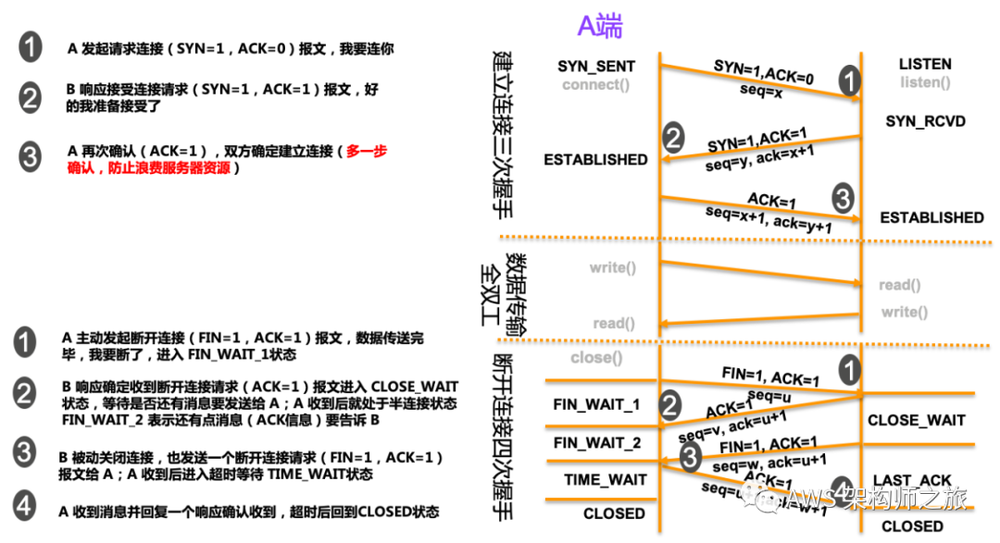
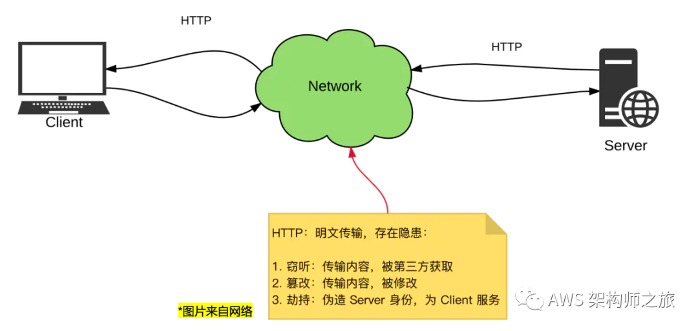

# TCP 为什么是三次握手

https://mp.weixin.qq.com/s/sDRDdtA_ECrKx72730NOMw

#### TCP连接为啥要“三次握手建立”和“四次握手断开”？

*三次握手是不可靠的通信双方为了就某一个问题（连接或协商密钥）达成一致所需要的最小数量的沟通次数。*

而 TCP/IP 网络通信的基础是套接字（Socket）接口，它抽象出通信所需要的 5元组（

- 协议，
- 本机IP地址，
- 本地协议端口，
- 远程主机IP地址，
- 远程主机协议端口）；

Socket 支持传输层 TCP 和 UDP 协议，当使用 TCP 协议时，我们就把该 Socket 连接成为 TCP 连接；通常的 HTTP 请求都是基于 TCP 协议进行通信。

TCP 协议的头部，跟三次握手相关的有如下字段：

- **Sequence Number ** **（图上缩写为 seq)**: 用来标注数据流序号（发送端）

- **Acknowledgment Number**（图上缩写为 ack)：确认序列号包含发送确认的一端所期望收到的下一个序号，应当是上次已成功收到数据字节序号加 1；

- **TCP Flag（标志位）**

- - **ACK** ：响应标志，建立连接后，所有的有效报文都必须为 1；
  - **SYN** ：同步序号，用来建立连接；
  - **FIN** ：表示数据传输完成；

*不同的 SYN 和 ACK 组合，在建立连接时，表示不同含义：（SYN=1，ACK=0）表示请求连接，（SYN=1，ACK=1）响应同意连接请求；*

通过图示，我们一起来理解下经典的 TCP 建立连接的三次握手和断开时的 四次握手：

## 如果不采用 3 次握手会怎么样?

建立连接如果不采取三次握手，而是两次，就 A 发起， B确认响应就建立连接，会出现什么问题呢？比如 A 本意只想建一个连接，但发送第一个建立连接请求 R1 后，迟迟没得到响应，就又发送了一次建立连接请求 R2, R2 请求顺利得到响应并建立连接，但 R1 后来也到达 B端，B端还以为 A 又想建立一个新请求，所以，就响应并一直等待 A 发送数据（此时 B 是有资源消耗的），但 A 早就丢弃了 R1， 那 B 端资源就在浪费空跑，所以**引入第三次握手 A 再次确认，避免 B 会错意导致资源浪费**。

## 为什么是4次挥手

四次握手断开连接，放在 **TCP 全双工**的上下文就比较好理解，A 和 B 都可以主动发送数据给到对方（全双工），A 主动断开，一个请求，一个确认，但也要等待 B 确认它的数据已经发送完毕，因此，也需要两次握手来确认断开连接。

超文本传输协议（HTTP）存在非常大的安全隐患，由于明文方式发送信息，易遭受窃听、篡改、劫持等攻击，而 HTTPS 则在传输层（TCP）和应用层（HTTP）之间加入了一个 SSL/TLS 加密协议，通过证书来验证身份，并加密数据传输，保障数据通信过程中的***保密性（第三方无法窃听）、完整性（防止篡改）和身份认证（防止冒充）***。

https://mp.weixin.qq.com/s/sDRDdtA_ECrKx72730NOMw