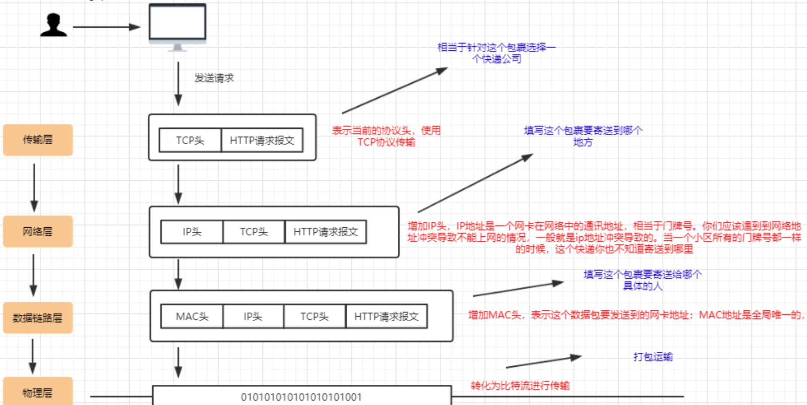
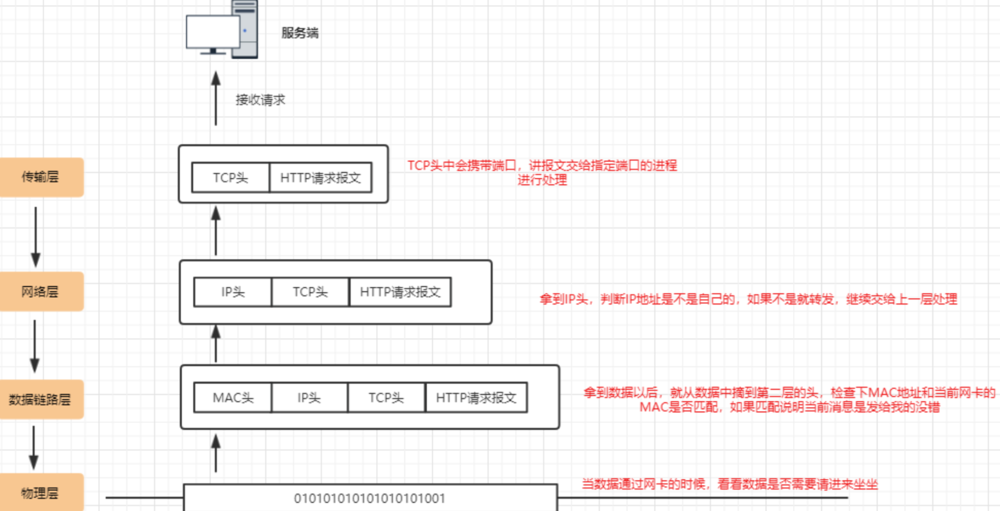

# TCP/IP 协议簇

## TCP/IP 的分层管理

因特网是在 TCP/IP 协议族的基础上运行的,而 HTTP 属于它内部的一个子集

#### 分层

如图所示

## OSI模型和TCP/IP模型图解

## TCP/IP 主要分为四层

- **应用层**

**负责提供服务与应用之间的协议**

HTTP(超文本传输协议), DNS(域名服务), FTP(文件传输协议) ,TELNET(虚拟终端协议) ,SNMP(电子邮件传输协议)  等

- **运输层**

**主要让通讯双方计算机可以基于会话互相通讯**

包括 TCP 传输控制协议 和 UDP 用户数据报协议

tcp:传输效率低,可靠性高,适用于对可靠性要求高,数据量大的数据

udp: 传输效率高,可靠性不高,适用于数据量小,可靠性要求不高的数据

- **网络层**

**主要用于数据的传输, 路由以及地址的解析,保障网络上主机间的传输**

主要使用 IP 协议和 ARP(地址解析协议)协议

- **网络接口层**

定义了主机之间网络连通的协议,类似于 Ethernet, FDDI, ATM等通讯协议

## 传输过程

下图显示了客户端到服务端之间传输的整个过程

利用 TCP/IP 进行网络通信时,会通过分层顺序与对方进行通讯

- 作为客户端在应用层通过 http 协议发送一个 http 请求,并发往传输层
- 传输层 TCP协议会对 HTTP 报文进行封装 ,加上 **标记号**和 **端口号**,发往网络层
- 网络层 IP 协议会对 报文再次封装,加上 **MAC 地址**,后发往链路层

如图

#### 服务端拆包

## TCP 中的三次握手

简要来说客户端先发出 SYN请求链接,服务端返回 SYN 和 ACK ,客户端再发送 SYN 和 ACK 进行确认

- 客户端发送 SYN (seq = x) 报文给服务端,进入 **SYN_SEND** 状态

- 服务端接收到 SYN 报文,回应一个 SYN(seq = y) 和 ACK(axk = x+1) 报文, 进入 **SYN_RECV** 状态

- 客户端收到服务器端的 SYN 报文,回应一个 ACK(ack = y+1)报文

- 客户端收到服务端的 SYN报文, 回应一个 ACK (ack = y+1) 报文,进入 Established 状态

  

两个中间状态，**syn_sent**和**syn_rcvd**，这两个状态叫着「半打开」状态，就是向对方招手了，但是还没来得及看到对方的点头微笑。**syn_sent**是主动打开方的「半打开」状态，**syn_rcvd**是被动打开方的「半打开」状态。客户端是主动打开方，服务器是被动打开方。

- syn_sent: syn package has been sent
- syn_rcvd: syn package has been received

静态图片

#### SYN 攻击

在三次握手过程中，Server 发送 SYN-ACK 之后，收到 Client 的 ACK 之前的 TCP 连接称为 半连接(half-open connect)，此时 Server 处于 SYN_RCVD 状态，当收到 ACK 后，Server 转入 ESTABLISHED 状态。

SYN 攻击就是 Client 在短时间内伪造大量不存在的 IP 地址，并向 Server 不断地发送 SYN 包，Server 回复确认包，并等待 Client 的确认，由于源地址是不存在的，因此，Server 需要不断重发直至超时，这些伪造的 SYN 包将产时间占用未连接队列，导致正常的 SYN 请求因为队列满而被丢弃，从而引起网络堵塞甚至系统瘫痪。

SYN 攻 击时一种典型的 DDOS 攻击，检测 SYN 攻击的方式非常简单，即当 Server 上有大量半连接状态且源 IP 地址是随机的，则可以断定遭到 SYN 攻击了

## 四次挥手

为什么要四次挥手,由于 TCP 半关闭造成的,因为 TCP 连接是全双工的,所以在进行关闭时,对于每个方向需要单独关闭,这种单方向的关闭叫做 **半关闭**

客户端和服务端都可以主动断开连接,通过发送 fin 信号来告知开启关闭流程

大致上分为四步

- 客户端发送终止标志位 fin=1 seq = u 到服务端, 客户端开始进入 fin-wait-1状态
- 服务端接收到 fin 消息后返回一个 ACK =1 , ack = u+1 , seq=v 的消息给客户端,表示接受请求 , 服务端进入 close-wait 状态
- 客户端收到消息后, 处于 fin_wait_2 状态
- 服务端发送一个终止标志位(fin = 1, ACK = 1,seq = w, ack = u+1)的消息给客户端,表示关闭链路前服务器需要向客户端发送的消息已经发送完毕,此时服务端进入 last_ack 状态
- 客户端接收到这个最终的 fin 消息, 发送一个 ACK=1,sql=u+1 ack = w+1的消息给服务端,此时客户端处于 TIME_WAIT 状态,等待计时器(2MSL)设置的时间后,客户端进入 close 状态

## ARP 协议

数据链路层去组装目标机器的 MAC 地址，目标机器的 mac 地址怎么得到呢? 

使用 ARP 协议

这个协议简单来说就是已知目标机器 的 ip，需要获得目标机器的 mac 地址。(发送一个广播消息，这个 ip 是谁的，请来认领。认 领 ip 的机器会发送一个 mac 地址的响应)

有了这个目标 MAC 地址，数据包在链路上广播，MAC 的网卡才能发现，这个包是给它的。 MAC 的网卡把包收进来，然后打开 IP 包，发现 IP 地址也是自己的，再打开 TCP 包，发 现端口是自己，也就是 80 端口，而这个时候这台机器上有一个 nginx 是监听 80 端口。 于是将请求提交给 nginx，nginx 返回一个网页。然后将网页需要发回请求的机器。然后层层 封装，最后到 MAC 层。因为来的时候有源 MAC 地址，返回的时候，源 MAC 就变成了目 标 MAC，再返给请求的机器。

> 为了避免每次都用 ARP 请求，机器本地也会进行 ARP 缓存。当然机器会不断地上线下线， IP 也可能会变，所以 ARP 的 MAC 地址缓存过一段时间就会过期。

## 为什么有了 MAC 层还要走 IP 层呢?

之前我们提到，mac 地址是唯一的，那理论上，在任何两个设备之间，我应该都可以通过 mac 地址发送数据，为什么还需要 ip 地址?

mac 地址就好像个人的身份证号，人的身份证号和人户口所在的城市，出生的日期有关， 但是和人所在的位置没有关系，人是会移动的，知道一个人的身份证号，并不能找到它这个 人，mac 地址类似，它是和设备的生产者，批次，日期之类的关联起来，知道一个设备的 mac，并不能在网络中将数据发送给它，除非它和发送方的在同一个网络内。 所以要实现机器之间的通信，我们还需要有 ip 地址的概念，ip 地址表达的是当前机器在网 络中的位置，类似于城市名+道路号+门牌号的概念。通过 ip 层的寻址，我们能知道按何种 路径在全世界任意两台 Internet 上的的机器间传输数据。

## 滑动窗口协议

滑动窗口(Sliding window)是一种流量控制技术。早期的网络通信中，通信双方不会考虑网络的拥挤情况直接发送数据。由于大家不知道 网络拥塞状况，同时发送数据，导致中间节点阻塞掉包，谁也发不了数据，所以就有了滑动 窗口机制来解决此问题;发送和接受方都会维护一个数据帧的序列，这个序列被称作窗口

#### 发送窗口

就是发送端允许连续发送的幀的序号表。
发送端可以不等待应答而连续发送的最大幀数称为发送窗口的尺寸。

#### 接收窗口

接收方允许接收的幀的序号表，凡落在 接收窗口内的幀，接收方都必须处理，落在接收窗口 外的幀被丢弃。
接收方每次允许接收的幀数称为接收窗口的尺寸。

> 在线滑动窗口演示功能
>
> https://media.pearsoncmg.com/aw/ecs_kurose_compnetwork_7/cw/content/interactiveanimations/selective-repeat-protocol/index.html

