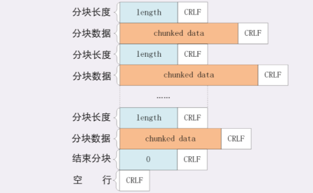
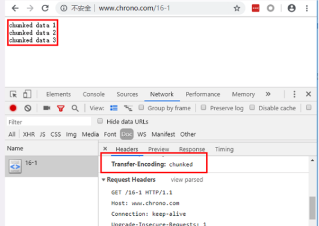
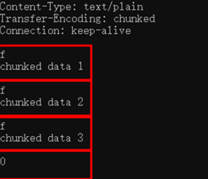
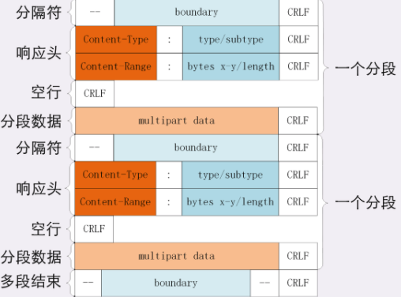

# 020-HTTP传输大文件的方法.md

[TOC]

## 总结

1. 压缩 HTML 等文本文件是传输大文件最基本的方法；
2. 分块传输可以流式收发数据，节约内存和带宽，使用响应头字段“Transfer-Encoding: chunked”来表示，分块的格式是 16 进制长度头 + 数据块；
3. 范围请求可以只获取部分数据，即“分块请求”，实现视频拖拽或者断点续传，使用请求头字段“Range”和响应头字段“Content-Range”，响应状态码必须是 206；
4. 也可以一次请求多个范围，这时候响应报文的数据类型是“multipart/byteranges”，body 里的多个部分会用 boundary 字符串分隔。

要注意这四种方法不是互斥的，而是可以混合起来使用，例如压缩后再分块传输，或者分段后再分块，实验环境的 URI“/16-3”就模拟了后一种的情形，你可以自己用 Telnet 试一下。

## 数据压缩

通常浏览器在发送请求时都会带着“**Accept-Encoding**”头字段，里面是浏览器支持的压缩格式列表，例如 gzip、deflate、br 等，这样服务器就可以从中选择一种压缩算法，放进“**Content-Encoding**”响应头里，再把原数据压缩后发给浏览器。

如果压缩率能有 50%，也就是说 100K 的数据能够压缩成 50K 的大小，那么就相当于在带宽不变的情况下网速提升了一倍，加速的效果是非常明显的。

不过这个解决方法也有个缺点，gzip 等压缩算法通常只对文本文件有较好的压缩率，而图片、音频视频等多媒体数据本身就已经是高度压缩的，再用 gzip 处理也不会变小（甚至还有可能会增大一点），所以它就失效了。

不过数据压缩在处理文本的时候效果还是很好的，所以各大网站的服务器都会使用这个手段作为“保底”。例如，在 Nginx 里就会使用“gzip on”指令，启用对“text/html”的压缩。

## 分块传输

在数据压缩之外，还能有什么办法来解决大文件的问题呢？

压缩是把大文件整体变小，我们可以反过来思考，如果大文件整体不能变小，那就把它“拆开”，分解成多个小块，把这些小块分批发给浏览器，浏览器收到后再组装复原。

这样浏览器和服务器都不用在内存里保存文件的全部，每次只收发一小部分，网络也不会被大文件长时间占用，内存、带宽等资源也就节省下来了。

这种“**化整为零**”的思路在 HTTP 协议里就是“**chunked**”分块传输编码，在响应报文里用头字段“**Transfer-Encoding: chunked**”来表示，意思是报文里的 body 部分不是一次性发过来的，而是分成了许多的块（chunk）逐个发送。

这就好比是用魔法把大象变成“乐高积木”，拆散了逐个装进冰箱，到达目的地后再施法拼起来“满血复活”。

分块传输也可以用于“流式数据”，例如由数据库动态生成的表单页面，这种情况下 body 数据的长度是未知的，无法在头字段“**Content-Length**”里给出确切的长度，所以也只能用 chunked 方式分块发送。

“Transfer-Encoding: chunked”和“Content-Length”这两个字段是**互斥的**，也就是说响应报文里这两个字段不能同时出现，一个响应报文的传输要么是长度已知，要么是长度未知（chunked），这一点你一定要记住。

下面我们来看一下分块传输的编码规则，其实也很简单，同样采用了明文的方式，很类似响应头。

1. 每个分块包含两个部分，长度头和数据块；
2. 长度头是以 CRLF（回车换行，即\r\n）结尾的一行明文，用 16 进制数字表示长度；
3. 数据块紧跟在长度头后，最后也用 CRLF 结尾，但数据不包含 CRLF；
4. 最后用一个长度为 0 的块表示结束，即“0\r\n\r\n”。

听起来好像有点难懂，看一下图就好理解了：



实验环境里的 URI“/16-1”简单地模拟了分块传输，可以用 Chrome 访问这个地址看一下效果：



不过浏览器在收到分块传输的数据后会自动按照规则去掉分块编码，重新组装出内容，所以想要看到服务器发出的原始报文形态就得用 Telnet 手工发送请求（或者用 Wireshark 抓包）：

```
GET /16-1 HTTP/1.1
Host: www.chrono.com
```

因为 Telnet 只是收到响应报文就完事了，不会解析分块数据，所以可以很清楚地看到响应报文里的 chunked 数据格式：先是一行 16 进制长度，然后是数据，然后再是 16 进制长度和数据，如此重复，最后是 0 长度分块结束。



## 范围请求

有了分块传输编码，服务器就可以轻松地收发大文件了，但对于上 G 的超大文件，还有一些问题需要考虑。

比如，你在看当下正热播的某穿越剧，想跳过片头，直接看正片，或者有段剧情很无聊，想拖动进度条快进几分钟，这实际上是想获取一个大文件其中的片段数据，而分块传输并没有这个能力。

HTTP 协议为了满足这样的需求，提出了“**范围请求**”（range requests）的概念，允许客户端在请求头里使用专用字段来表示只获取文件的一部分，相当于是**客户端的“化整为零”**。

范围请求不是 Web 服务器必备的功能，可以实现也可以不实现，所以服务器必须在响应头里使用字段“**Accept-Ranges: bytes**”明确告知客户端：“我是支持范围请求的”。

如果不支持的话该怎么办呢？服务器可以发送“Accept-Ranges: none”，或者干脆不发送“Accept-Ranges”字段，这样客户端就认为服务器没有实现范围请求功能，只能老老实实地收发整块文件了。

请求头**Range**是 HTTP 范围请求的专用字段，格式是“**bytes=x-y**”，其中的 x 和 y 是以字节为单位的数据范围。

要注意 x、y 表示的是“偏移量”，范围必须从 0 计数，例如前 10 个字节表示为“0-9”，第二个 10 字节表示为“10-19”，而“0-10”实际上是前 11 个字节。

Range 的格式也很灵活，起点 x 和终点 y 可以省略，能够很方便地表示正数或者倒数的范围。假设文件是 100 个字节，那么：

- “0-”表示从文档起点到文档终点，相当于“0-99”，即整个文件；
- “10-”是从第 10 个字节开始到文档末尾，相当于“10-99”；
- “-1”是文档的最后一个字节，相当于“99-99”；
- “-10”是从文档末尾倒数 10 个字节，相当于“90-99”。

服务器收到 Range 字段后，需要做四件事。

第一，它必须检查范围是否合法，比如文件只有 100 个字节，但请求“200-300”，这就是范围越界了。服务器就会返回状态码**416**，意思是“你的范围请求有误，我无法处理，请再检查一下”。

第二，如果范围正确，服务器就可以根据 Range 头计算偏移量，读取文件的片段了，返回状态码“**206 Partial Content**”，和 200 的意思差不多，但表示 body 只是原数据的一部分。

第三，服务器要添加一个响应头字段**Content-Range**，告诉片段的实际偏移量和资源的总大小，格式是“**bytes x-y/length**”，与 Range 头区别在没有“=”，范围后多了总长度。例如，对于“0-10”的范围请求，值就是“bytes 0-10/100”。

最后剩下的就是发送数据了，直接把片段用 TCP 发给客户端，一个范围请求就算是处理完了。

你可以用实验环境的 URI“/16-2”来测试范围请求，它处理的对象是“/mime/a.txt”。不过我们不能用 Chrome 浏览器，因为它没有编辑 HTTP 请求头的功能（这点上不如 Firefox 方便），所以还是要用 Telnet。

例如下面的这个请求使用 Range 字段获取了文件的前 32 个字节：

```
GET /16-2 HTTP/1.1
Host: www.chrono.com
Range: bytes=0-31
```

返回的数据是（去掉了几个无关字段）：

```
HTTP/1.1 206 Partial Content
Content-Length: 32
Accept-Ranges: bytes
Content-Range: bytes 0-31/96
 
// this is a plain text json doc
```

有了范围请求之后，HTTP 处理大文件就更加轻松了，看视频时可以根据时间点计算出文件的 Range，不用下载整个文件，直接精确获取片段所在的数据内容。

不仅看视频的拖拽进度需要范围请求，常用的下载工具里的多段下载、断点续传也是基于它实现的，要点是：

- 先发个 HEAD，看服务器是否支持范围请求，同时获取文件的大小；
- 开 N 个线程，每个线程使用 Range 字段划分出各自负责下载的片段，发请求传输数据；
- 下载意外中断也不怕，不必重头再来一遍，只要根据上次的下载记录，用 Range 请求剩下的那一部分就可以了。

## 多段数据

刚才说的范围请求一次只获取一个片段，其实它还支持在 Range 头里使用多个“x-y”，一次性获取多个片段数据。

这种情况需要使用一种特殊的 MIME 类型：“**multipart/byteranges**”，表示报文的 body 是由多段字节序列组成的，并且还要用一个参数“**boundary=xxx**”给出段之间的分隔标记。

多段数据的格式与分块传输也比较类似，但它需要用分隔标记 boundary 来区分不同的片段，可以通过图来对比一下。



每一个分段必须以“- -boundary”开始（前面加两个“-”），之后要用“Content-Type”和“Content-Range”标记这段数据的类型和所在范围，然后就像普通的响应头一样以回车换行结束，再加上分段数据，最后用一个“- -boundary- -”（前后各有两个“-”）表示所有的分段结束。

例如，我们在实验环境里用 Telnet 发出有两个范围的请求：

```
GET /16-2 HTTP/1.1
Host: www.chrono.com
Range: bytes=0-9, 20-29
```

得到的就会是下面这样：

```
HTTP/1.1 206 Partial Content
Content-Type: multipart/byteranges; boundary=00000000001
Content-Length: 189
Connection: keep-alive
Accept-Ranges: bytes
 
 
--00000000001
Content-Type: text/plain
Content-Range: bytes 0-9/96
 
// this is
--00000000001
Content-Type: text/plain
Content-Range: bytes 20-29/96
 
ext json d
--00000000001--
```

报文里的“- -00000000001”就是多段的分隔符，使用它客户端就可以很容易地区分出多段 Range 数据。

## 课下作业

1. 分块传输数据的时候，如果数据里含有回车换行（\r\n）是否会影响分块的处理呢？
2. 如果对一个被 gzip 的文件执行范围请求，比如“Range: bytes=10-19”，那么这个范围是应用于原文件还是压缩后的文件呢？