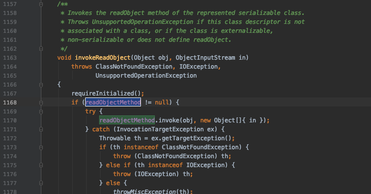

# 序列化和反序列化

**序列化是指把一个 java 对象转换成字节数组的过程,反序列化是把字节数组转化成 Java 对象的过程**

## 什么序列化,为什么我们要序列化

Java 对象在 JVM 运行的时候被创建, 更新, 或者销毁, 当 JVM 退出时,对象也会随之销毁

在现实应用中,我们常常需要将对象以及其状态在多个应用之间传递, 共享, 例如在一个应用中将对象以及其状态持久化, 在其他地方重新读取被保存的对象以及其状态继续进行处理

**序列化就是将对象以及其状态保存成一组字节数组中,其中**

- **序列化和反序列化必须序列化 ID 一致**,如果不一致会报错,没有写,jvm 会默认生成一个(安全校验)

```java
private static final long serialVersionUid = 1234567889L
```

- **静态变量不会被序列化**
- **transient 修饰的变量不会被序列化**
- 可以通过写 writeObject 方法和 readObject 方法定制序列化实现

## 开发中怎么实现序列化

- 对象实现`Serializable`接口, 可以实现默认的序列化机制,可以通过定义`writeObject` 和 `readObject`来自定义序列化的实现

- 对象实现 `Externalizable` 接口, 重写`writeExternal`方法和`readExternal`方来定义序列化的实现

## Transient

Transient 关键字的作用是控制变量的序列化，在变量声明前加上该关键字，可以阻止该变 量被序列化到文件中，在被反序列化后，transient 变量的值被设为初始值，如 int 型的是 0，对象型的是 null。

#### 绕开 transient 机制的办法

在标有 transient 在序列化时会被忽略,我们可以通过在实体类中写`writeObject`方法和`readObject`方法在自定义序列化机制

#### writeObject 和 readObject 原理

writeObject 和 readObject 是两个私有的方法，他们是`ObjectInputStream` 和 `ObjectOutPutStream`中触发的




readObject 方法会在反序列化时通过反射调用


#### Java 序列化的一些简单总结

1. Java 序列化只是针对对象的状态进行保存，至于对象中的方法，序列化不关心
2. 当一个父类实现了序列化，那么子类会自动实现序列化，不需要显示实现序列化接口
3. 当一个对象的实例变量引用了其他对象，序列化这个对象的时候会自动把引用的对象也进
 行序列化(实现深度克隆)
4. 当某个字段被申明为 transient 后，默认的序列化机制会忽略这个字段
5. 被申明为 transient 的字段，如果需要序列化，可以添加两个私有方法:writeObject 和
readObject


## 序列化方式

- JDK 自带的序列化,将对象转化为字节数组
- XML 序列化,可读性比较好,缺点是数组长度太长,传输效率低
- JSON 序列化,字节流更小，而且可读性也非常好,比较主流
- Hessian 序列化框架

Hessian 是一个支持跨语言传输的二进制序列化协议，相对于 Java 默认的序列化机制来说， Hessian 具有更好的性能和易用性，而且支持多种不同的语言,实际上 Dubbo 采用的就是 Hessian 序列化来实现，只不过 Dubbo 对 Hessian 进行了重构， 性能更高

- Avro 序列化

Avro 是一个数据序列化系统，设计用于支持大批量数据交换的应用。它的主要特点有:支持 二进制序列化方式，可以便捷，快速地处理大量数据;动态语言友好，Avro 提供的机制使动 态语言可以方便地处理 Avro 数据

- kyro 序列化框架

Kryo 是一种非常成熟的序列化实现，已经在 Hive、Storm)中使用得比较广泛，不过它不能 跨语言. 目前 dubbo 已经在 2.6 版本支持 kyro 的序列化机制。它的性能要优于之前的 hessian2

- Protobuf 序列化框架

Protobuf 是 Google 的一种数据交换格式，它独立于语言、独立于平台。Google 提供了多种 语言来实现，比如 Java、C、Go、Python，每一种实现都包含了相应语言的编译器和库文件， Protobuf 是一个纯粹的表示层协议，可以和各种传输层协议一起使用。
Protobuf 使用比较广泛，主要是空间开销小和性能比较好，非常适合用于公司内部对性能要 求高的 RPC 调用。 另外由于解析性能比较高，序列化以后数据量相对较少，所以也可以应 用在对象的持久化场景中
但是要使用 Protobuf 会相对来说麻烦些，因为他有自己的语法，有自己的编译器，如果需要 用到的话必须要去投入成本在这个技术的学习中
protobuf 有个缺点就是要传输的每一个类的结构都要生成对应的 proto 文件，如果某个类发 生修改，还得重新生成该类对应的 proto 文件

## 序列化技术的选型

技术层面

1. 序列化空间开销，也就是序列化产生的结果大小，这个影响到传输的性能
2. 序列化过程中消耗的时长，序列化消耗时间过长影响到业务的响应时间
3. 序列化协议是否支持跨平台，跨语言。因为现在的架构更加灵活，如果存在异构系统通信
 需求，那么这个是必须要考虑的
4. 可扩展性/兼容性，在实际业务开发中，系统往往需要随着需求的快速迭代来实现快速更新，
这就要求我们采用的序列化协议基于良好的可扩展性/兼容性，比如在现有的序列化数据结
 构中新增一个业务字段，不会影响到现有的服务
5. 技术的流行程度，越流行的技术意味着使用的公司多，那么很多坑都已经淌过并且得到了解决，技术解决方案也相对成熟 6. 学习难度和易用性

选型建议
1. 对性能要求不高的场景，可以采用基于 XML 的 SOAP 协议
2. 对性能和间接性有比较高要求的场景，那么 Hessian、Protobuf、Thrift、Avro 都可以。
3. 基于前后端分离，或者独立的对外的 api 服务，选用 JSON 是比较好的，对于调试、可读
性都很不错
4. Avro 设计理念偏于动态类型语言，那么这类的场景使用 Avro 是可以的

各个序列化技术的性能比较

>  这 个 地 址 有 针 对 不 同 序 列 化 技 术 进 行 性 能 比 较 : https://github.com/eishay/jvm- serializers/wiki

## Protobuf 序列化的原理

protobuf 的基本应用
使用 protobuf 开发的一般步骤是
1. 配置开发环境，安装 protocol compiler 代码编译器
2. 编写.proto 文件，定义序列化对象的数据结构
3. 基于编写的.proto 文件，使用 protocol compiler 编译器生成对应的序列化/反序列化工具
类
4. 基于自动生成的代码，编写自己的序列化应用