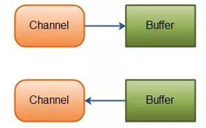
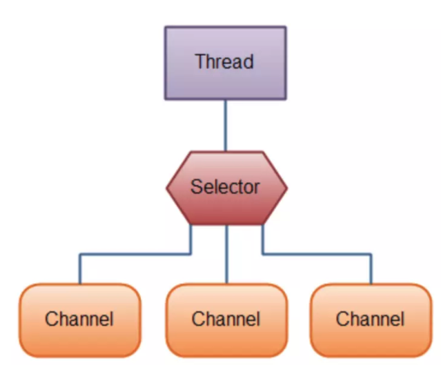

# Java NIO

java Nio 的实现主要涉及三大核心内容

- Selector 选择器
- Channel 通道
  - 通道可以同时进行读写,而流只能读或者只能写
  - 通道可以实现异步读写数据
  - 通道可以从缓冲读数据,也可以写数据到缓冲
- Buffer 缓冲区
  - 写数据到缓冲区, buffer.flip()方法
  - 从缓冲区中读数据, 调用 buffer.clear(), buffer.compat()方法

Selector 用于监听多个 Channal 的事件,比如连接打开或者数据到达,因此,一个线程可以实现对多个数据 Channel的管理

- 传统 I/O 基于数据流进行 I/O 读写操作

- java NIO 基于 Channel 和 Buffer 进行 I/O 读写操作 并且数据总是被 从 Channel读取到 Buffer 中, 或者从 Buffer 写入 Channel 中


## Java NIO 和 java IO 最大的区别

- IO 是面向流的,NIO是面向缓冲区的:在面向流的操作中,数据只能在一个流中连续进行读写,数据没有缓冲,因此字节流无法前后移动
- NIO 每次都是讲数据从一个 Channel 读取到一个 Buffer 中,再从 Buffer 写入 Channel 中,因此可以方便地再缓冲区中进行数据的前后移动等操作

- 传统 IO的流操作是阻塞模式的,NIO 的操作模式是非阻塞模式的,在传统的模式下,用户线程调用 read() 或者 write 方法进行 IO 读写操作的时候,该线程一直被阻塞,知道数据被读取或者数据完全写入
- NIO 通过 Selector 监听 Channel 上事件的变化,在 Channel 上有数据发生变化时通知改线程进行读写操作,
  - 对于读请求而言,在通道上有可用的数据时,线程将进行 Buffer的读操作,在没有数据时,线程可以执行其他业务逻辑操作,
  - 对于写操作而言,在使用一个线程执行写操作将一些数据写入到某通道时,只需要将 Channel 上的数据异步写入 buffer 即可,buffer 上的数据会被异步写入目标 Channel 上,用户线层不需要等待整个数据完全被写入目标 Channel 就可以继续执行其他业务逻辑

**非阻塞IO 模型中的 Selector 线程通常将 IO 的空闲时间用于执行其他通道上的 I/O操作,所以 Selector 线程可以管理多个输入和输出通道**

## Channel

Channel 和 IO 中的 Stream 流类似,只不过 Stream 是单向的(InputStream , OutputStream),而 Channel 是双向的,既可以用来进行读操作,也可以用来写操作

NIO 中的 Channel 的主要实现有, FIleChannel , DatagramChannel , SocketChannel, ServerSocketChannel ,分别对应 I/O, UDP, TCP, Socket client ,Socket Server 

|      | Channel实现类       | 对应          |
| ---- | ------------------- | ------------- |
| 1    | FIleChannel         | I/O           |
| 2    | DatagramChannel     | UDP/TCP       |
| 3    | SocketChannel       | Socket client |
|      | ServerSocketChannel | Socket Server |



Channel 可以写缓冲区到 Buffer 中, Buffer 也可以写数据到 Channel 中

## Buffer 缓冲区

缓冲区本质上是一个可读可写的内存块,使用步骤如下

- 写数据到缓冲区
- 调用 buffer.flip()方法 , 切换写模式到读模式
- 从缓冲区中读取数据
- 调用 buffer.clear() 或者 buffer.compat()方法,情况缓冲区,然后就可以再次写

#### 值得注意的是

- 客户端向服务端发送数据时, 必须先写入 buffer
- 将 buffer 中的数据写入到服务器端的对应的 Channel 上
- 服务端在接受数据时必须要通过 Channel 将数据读入的 buffer 中,然后从 buffer 中读取数据并处理

当向buffer写入数据时，buffer会记录下写了多少数据，一旦要读取数据，需要通过flip()方法将Buffer从写模式切换到读模式，在读模式下可以读取之前写入到buffer的所有数据，一旦读完了所有的数据，就需要清空缓冲区，让它可以再次被写入

|      | Buffer 子类  |      |
| ---- | ------------ | ---- |
| 1    | ByteBuffer   |      |
| 2    | IntBuffer    |      |
| 3    | CharBuffer   |      |
| 4    | LongBuffer   |      |
| 5    | DoubleBuffer |      |
| 6    | FloatBuffer  |      |
| 7    | ShortBuffer  |      |

## Selector

一个Selector 选择器可以检测多个 Channel 通道, 主要是检测读或者写事件是否就绪

通常我们将多个 Channel 以事件的方式注册到 Selector,从而达到用一个线程处理多个请求成为可能,不必为每个连接都创建一个线程,避免线程资源的浪费和多线程之间的上下文切换导致的开销



同时, Selector 值有在 Channel 上有读写事件发生时,才会调用 I/O 函数进行读写操作,可极大减少系统的开销,提高系统的并发量


## NIO 代码实例

#### 服务端

```java

/**
 * <p>
 * NIO 实现服务端
 * </p>
 *
 * @author ericchen.vip@foxmail.com 2020/04/13 22:49
 */
public class NIOServer {

    private int size = 1024;
    private ServerSocketChannel serverSocketChannel;
    private ByteBuffer byteBuffer;
    private Selector selector;
    private int remoteClientNum = 0;//记录远程客户端的数量


    public NIOServer(int port) {
        try {
            initChannel(port);
        } catch (IOException e) {
            e.printStackTrace();
            System.exit(-1);
        }
    }

    private void initChannel(int port) throws IOException {
        //打开 Channel
        serverSocketChannel = ServerSocketChannel.open();
        //设置为非阻塞模式
        serverSocketChannel.configureBlocking(false);
        //绑定端口
        serverSocketChannel.bind(new InetSocketAddress(port));
        System.out.println("listen on port: " + port);
        //创建选择器
        selector = Selector.open();
        //向选择器注册通道
        serverSocketChannel.register(selector, SelectionKey.OP_ACCEPT);
        //分配缓冲区的大小
        byteBuffer = ByteBuffer.allocate(size);
    }

    private void listener() throws Exception {
        for (;;) {
            //返回 int 值就表示有多少个 Channel 出于就绪状态
            int select = selector.select();
            if (select == 0) {
                continue;
            }
            Iterator<SelectionKey> iterator = selector.selectedKeys().iterator();
            while (iterator.hasNext()) {
                SelectionKey key = iterator.next();
                //如果 selcetkey 出于连续就绪状态,则开始接受客户端的链接
                if (key.isAcceptable()) {
                    //获取 Channel
                    ServerSocketChannel channel = (ServerSocketChannel) key.channel();
                    //接受链接
                    SocketChannel accept = channel.accept();
                    //channel 注册
                    registerChannel(selector, accept, SelectionKey.OP_READ);
                    //远程客户端的连接数
                    remoteClientNum++;
                    System.out.println("online remote client num = " + remoteClientNum);
                    write(accept, "helloClient".getBytes());
                }
                if (key.isReadable()) {
                    //如果已经出于就绪状态
                    read(key);
                }
                iterator.remove();
            }

        }
    }

    private void registerChannel(Selector selector, SocketChannel channel, int opRead) throws IOException {
        if (channel == null){
            return;
        }
        channel.configureBlocking(false);
        channel.register(selector,opRead);

    }

    private void write(SocketChannel channel, byte[] bytes) throws IOException {
        byteBuffer.clear();
        byteBuffer.put(bytes);
        //byte buffer 从写模式变为读模式
        byteBuffer.flip();
        //将缓冲区的数据写入通道中
        channel.write(byteBuffer);
    }

    private void read(SelectionKey key) throws Exception {
        SocketChannel socketChannel = (SocketChannel) key.channel();
        int count;
        byteBuffer.clear();

        //从通道中读到缓冲器
        while ((count = socketChannel.read(byteBuffer)) > 0) {
            //byteBuffer 写模式变为读模式
            Buffer flip = byteBuffer.flip();
            while (flip.hasRemaining()) {
                System.out.println((char) byteBuffer.get());
            }
            byteBuffer.clear();
        }
        if (count < 0) {
            socketChannel.close();
        }
    }

    public static void main(String[] args) throws Exception {
        NIOServer nioServer = new NIOServer(9999);
        nioServer.listener();
    }
}

```

#### 客户端代码

```java

/**
 * <p>
 * 使用 NIO 编写客户端
 * </p>
 *
 * @author ericchen.vip@foxmail.com 2020/04/13 23:14
 */
public class NIOClient {
    private int size = 1024;
    private SocketChannel socketChannel;
    private ByteBuffer byteBuffer;

    public static void main(String[] args) throws IOException {
        new NIOClient().connectServer();
    }

    private void connectServer() throws IOException {
        socketChannel = SocketChannel.open();
        socketChannel.connect(new InetSocketAddress(9999));
        socketChannel.configureBlocking(false);
        byteBuffer = ByteBuffer.allocate(size);
        receive();

    }

    private void receive() throws IOException {
        while (true){
            byteBuffer.clear();
            int count;
            //如果没有数据可以读,那read 方法会一直阻塞,,知道读取到新的值
            while ((count = socketChannel.read(byteBuffer)) > 0){
                byteBuffer.flip();
                while (byteBuffer.hasRemaining()){
                    System.out.println((char) byteBuffer.get());
                }
                send2Server("say hi ".getBytes());
                byteBuffer.clear();
            }
        }

    }

    private void send2Server(byte[] bytes) throws IOException {
        byteBuffer.clear();
        byteBuffer.put(bytes);
        byteBuffer.flip();
        socketChannel.write(byteBuffer);
    }


}

```

