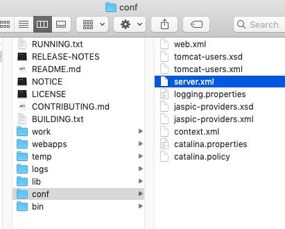
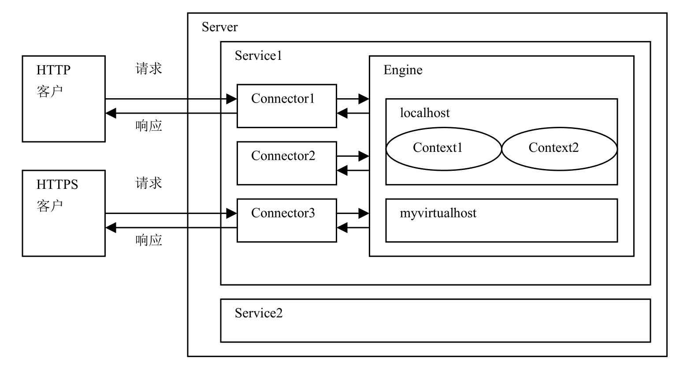
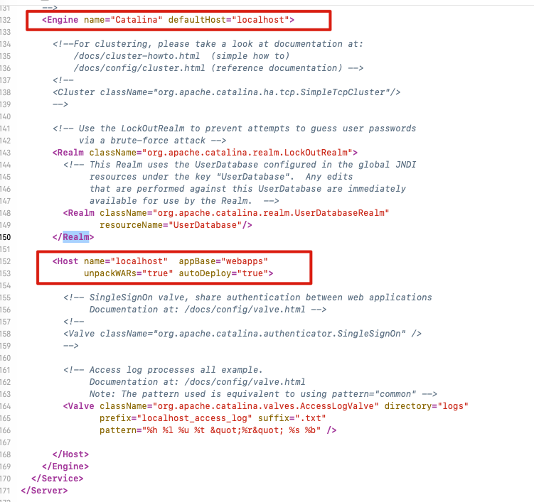

# Tomcat的组织结构



# Server.xml文件结构

```xml
<Server>
  <Service>
    <Connector/>
    <Engine>
      <Realm/>
      <Host >
        	<Context>
        	</Context>
        	<Valve>
        	</Valve>
      </Host>
    </Engine>
  </Service>
</Server>

```

每个元素都代表一种Tomcat组件,大致分为四类

- 顶层类元素

#### 顶层类元素

| 顶层类元素 |                                                              |
| ---------- | ------------------------------------------------------------ |
| Server     | <Server>元素代表整个Servlet容器组件，它是Tomcat的顶层元素。<Server>元素中可包含一个或多个<Service>元素。 |
| Service    | <Service>元素中包含一个<Engine>元素，以及一个或多个<Connector>元素，这些<Connector>元素共享同一个<Engine>元素。 |
|            |                                                              |

#### 连接器类元素

| 连接器类元素 | 简介                                                         |
| ------------ | ------------------------------------------------------------ |
| Connector    | 代表客户与服务器之间的通信接口,负责将客户的请求发送给服务器,并将服务器的响应结果发送给客户 |
|              |                                                              |
|              |                                                              |

#### 容器类元素

| 容器类元素 | 简介                                                         |                                                              |
| ---------- | ------------------------------------------------------------ | ------------------------------------------------------------ |
| Engine     | Engine组件为特定的Service组件处理所有客户请求,               | 每个<Service>元素只能包含一个<Engine>元素。<Engine>元素处理在同一个<Service>中所有<Connector>元素接收到的客户请求。 |
| Host       | Host组件为特定的虚拟主机处理所有客户请求                     | 一个<Engine>元素中可以包含多个<Host>元素。每个<Host>元素定义了一个虚拟主机，它可以包含一个或多个Web应用。 |
| Context    | Context组件为特定的Web应用处理所有客户请求                   | 每个<Context>元素代表了运行在虚拟主机上的单个Web应用。一个<Host>元素中可以包含多个<Context>元素。 |
| Cluster    | Cluster组件负责为Tomcat集群系统进行会话复制、Context组件的属性的复制，以及集群范围内WAR文件的发布。 |                                                              |
|            |                                                              |                                                              |

#### 嵌套类组件

| 嵌套类组件 | 简介 |
| ---------- | ---- |
| Valve      |      |
| Realm      |      |

## 各组件之间关系



- Connector组件负责接收客户的请求并向客户返回响应结果
- 在同一个Service组件中，多个Connector组件共享同一个Engine组件。
- 同一个Engine组件中可以包含多个Host组件
- 同一个Host组件中可以包含多个Context组件
- Tomcat安装好以后，在它的server.xml配置文件中已经配置了<Server>、<Service>、<Connector>、<Engine>和<Host>等组件



可以看出默认的配置文件

- 默认的Engine为 "Catalina"
- 默认的host为 "localhost"

