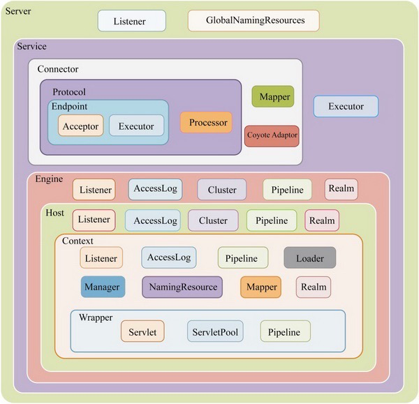

# 整体结构与组件介绍



## Tomcat架构简介

Tomcat可以看成由连接器(Connector)组件和容器(Container)组件组成

- Connector组件负责在服务器端处理客户端连接，包括接收客户端连接、接收客户端的消息报文以及消息报文的解析等工作，

- Container组件则负责对客户端的请求进行逻辑处理，并把结果返回给客户端。

Container组件则不能在图中直接找到。它其实包括4个级别的容器：

- Engine组件
- Host组件
- Context组件
- Wrapper组件

```xml
<Server>
    <Listener /><!-- 监听器 -->
    <GlobaNamingResources> <!-- 全局资源 -->
    </GlobaNamingResources
    <Service>          <!-- 服务 用于 绑定 连接器与 Engine -->
        <Connector 8080/> <!-- 连接器-->
        <Connector 8010 /> <!-- 连接器-->
        <Connector 8030/> <!-- 连接器-->
        <Engine>      <!-- 执行引擎-->
            <Logger />
            <Realm />
               <host "www.test.com" appBase="">  <!-- 虚拟主机-->
                   <Logger /> <!-- 日志配置-->
                   <Context "/applction" path=""/> <!-- 上下文配置-->
               </host>
        </Engine>
    </Service>
</Server>
```

## 顶层类元素

| 顶层类元素 | 简介                                                         |
| ---------- | ------------------------------------------------------------ |
| Server     | `<Server>`元素代表整个Servlet容器组件，它是Tomcat的顶层元素。`<Server>`元素中可包含一个或多个`<Service>`元素。 |
| Service    | `<Service>`元素中包含一个`<Engine>`元素，以及一个或多个`<Connector>`元素，这些`<Connector>`元素共享同一个`<Engine>`元素 |

#### Server组件

Server是最顶级的组件，它代表Tomcat的运行实例，在一个JVM中只会包含一个Server。在Server的整个生命周期中，不同阶段会有不同的事情要完成。为了方便扩展，它引入了监听器方式，所以它也包含了Listener组件。

另外，为了方便在Tomcat中集成JNDI，引入了GlobalNamingResources组件。同时，还包含了Service核心组件。

#### Service组件

Service是服务的抽象，它代表请求从接收到处理的所有组件的集合在设计上Server组件可以包含多个Service组件，每个Service组件都包含了若干用于接收客户端消息的Connector组件和处理请求的Engine组件。

其中，不同的Connector组件使用不同的通信协议，如HTTP协议和AJP协议，当然还可以有其他的协议A和协议B。若干Connector组件和一个客户端请求处理组件Engine组成的集合即为Service。

Service组件还包含了若干Executor组件，每个Executor都是一个线程池，它可以为Service内所有组件提供线程池执行任务。



