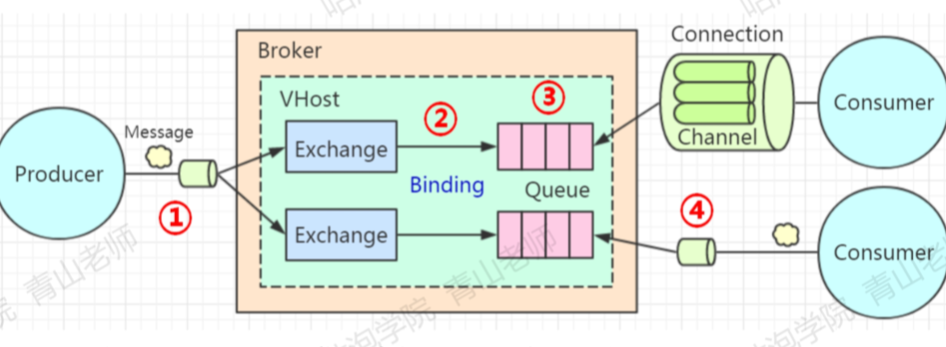

# 影响可靠性的四个环节

---

[TOC]

## 图示

## 影响可靠性的四个环节

1.  [031-影响可靠性的第一阶段-生产者发送到Broker.md](031-影响可靠性的第一阶段-生产者发送到Broker.md) 
2.  [032-影响可靠性的第二阶段-消息从交换机路由到队列.md](032-影响可靠性的第二阶段-消息从交换机路由到队列.md) 
3.  [033-影响可靠性的第三个阶段-消息在队列中存储.md](033-影响可靠性的第三个阶段-消息在队列中存储.md) 
4.  [034-影响可靠性的第四个阶段-消息投递到消费者.md](034-影响可靠性的第四个阶段-消息投递到消费者.md) 

## 高可用策略

- 可靠性策略-消费者回调通知生产者

### 可靠性策略-消费者回调通知生产者

注意: 我们使用消息中间件很大程度上是为了解耦,调用生产者的API显然影响了这一点

### 可靠性策略-补偿机制

 [060-TCC补偿方案.md](../../../../../08-transaction/02-distributed-transaction/060-TCC补偿方案.md)  

 [061-Saga补偿方案.md](../../../../../08-transaction/02-distributed-transaction/061-Saga补偿方案.md) 

### 可靠性策略-消息幂等性

[080-最大努力通知型方案.md](../../../../../08-transaction/02-distributed-transaction/080-最大努力通知型方案.md) 

### 可靠性策略-最终一致性

[070-基于可靠性消息的最终一致性方案.md](../../../../../08-transaction/02-distributed-transaction/070-基于可靠性消息的最终一致性方案.md)  

### 可靠性策略-消息顺序性

消息的顺序性指的的是消费者消息消息的顺序跟生产者生产消息的顺序是一致的,

例如

- 新增门店
- 绑定产品
- 激活门店

三者顺序不能颠倒,必须要有门店才能激活

在RabbitMQ中,一个队列有多个消费者时,由于不同的消费者消费消息的速度是不一样的,顺序无法保证

只有一个队列仅有一个消费者的情况才能保证顺序消费,把不同的业务发送到不同的专业队列

