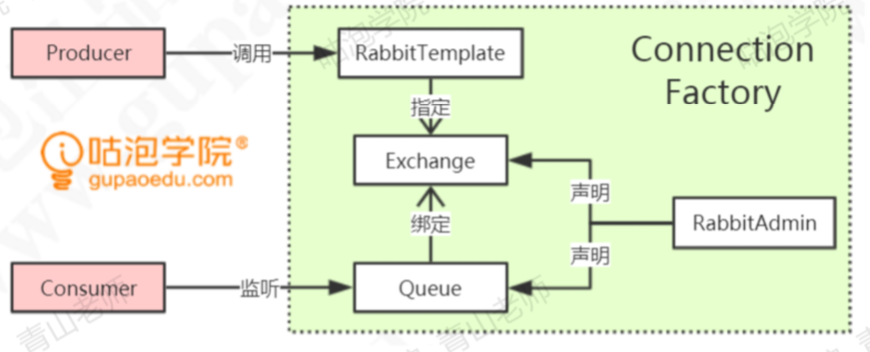

# 030-Spring中配置RabbitMQ.md

- [测试用例](#测试用例)
- [applicationContext.xml](#applicationContext.xml)



## 核心对象

| 对象                            | 描述                                                         |
| ------------------------------- | ------------------------------------------------------------ |
| ConnectionFactory               | Spring AMQP的连接工厂接口,用于创建连接, CachingConnectionFactory 是一个实现类 |
| RabbitAdmin                     | RabbitAdmin是对AmqpAdmin的实现,封装了RabbitMQ的基础管理操作,比如对交换机,队列,绑定的声明和删除 |
| Message                         | Message 是Spring AMQP对消息的封装                            |
| RabbitTemplate                  | RabbitTemplate是AmqpTemplate的一个实现(唯一),用来简化消息的收发,支持消息的确认(Conform)和返回(Return),它封装了创建连接,创建消息信道,收发消息,消息格式转换等等操作 |
| MessageListener                 | MessageLister 是SpringAMQP异步消息投递的一个监听器接口,它只有一个方法onMessage,用于处理消息队列对宋来的消息 |
| MessageListenerContainer        | MessageListenerContainer可以理解为MessageListener的容器,一个Container只有一个listener,但是可以生成多个线程相同的MessageListener同时消费消息<br />Container可以管理Listener的声明周期,可以用于对消费者进行配置<br />例如:<br />- 消息动态移除队列<br />- 对消费者进行设置,例如ConsumerTag,Arguments,并发,消费者数量,消息确认模式等等<br />SpringBoot2.0里新增了一个DirectMessageListenerContainer |
| MessageListenerContainerFactory | 可以在消费者上指定,当我们需要监听多个RabbitMQ的服务的时候,指定不同的MessageListenerContainerFactory |
| MessageConvertor                | 在调用RabbitTemplate的convertAndSend()方法时发送消息时,会使用MessageConvertor 进行消息的序列化,<br />默认使用的是SimplteMessageConvertor<br />在某些情况下,我们需要选择其他高效的序列化工具,可以自定义一个MessageConvertor |


## 测试用例

```java
public class RabbitTest {
    private ApplicationContext context = null;

    @Test
    public void sendMessage() {
        context = new ClassPathXmlApplicationContext("applicationContext.xml");
        MessageProducer messageProducer = (MessageProducer) context.getBean("messageProducer");
        int k = 100;
        while (k > 0) {
            messageProducer.sendMessage("第" + k + "次发送的消息");
            k--;
            try {
                Thread.sleep(1000);
            } catch (Exception e) {
                e.printStackTrace();
            }
        }
    }
}
```

## applicationContext.xml

```xml
<?xml version="1.0" encoding="UTF-8"?>
<beans xmlns="http://www.springframework.org/schema/beans"
       xmlns:xsi="http://www.w3.org/2001/XMLSchema-instance" xmlns:context="http://www.springframework.org/schema/context"
       xsi:schemaLocation="http://www.springframework.org/schema/beans http://www.springframework.org/schema/beans/spring-beans-3.1.xsd
    http://www.springframework.org/schema/context http://www.springframework.org/schema/context/spring-context-3.1.xsd">

    <import resource="classpath*:rabbitMQ.xml"/>

    <!-- 扫描指定package下所有带有如 @Controller,@Service,@Resource 并把所注释的注册为Spring Beans -->
    <context:component-scan base-package="spring.*"/>

    <!-- 激活annotation功能 -->
    <context:annotation-config/>

    <!-- 激活annotation功能 -->
    <context:spring-configured/>
</beans>

```

## log4j.properties

```xml
log4j.rootLogger=INFO,consoleAppender,fileAppender
log4j.category.ETTAppLogger=DEBUG, ettAppLogFile
log4j.appender.consoleAppender=org.apache.log4j.ConsoleAppender
log4j.appender.consoleAppender.Threshold=TRACE
log4j.appender.consoleAppender.layout=org.apache.log4j.PatternLayout
log4j.appender.consoleAppender.layout.ConversionPattern=%-d{yyyy-MM-dd HH:mm:ss SSS} ->[%t]--[%-5p]--[%c{1}]--%m%n
log4j.appender.fileAppender=org.apache.log4j.DailyRollingFileAppender
log4j.appender.fileAppender.File=F:/dev_logs/rabbitmq/debug1.log
log4j.appender.fileAppender.DatePattern='_'yyyy-MM-dd'.log'
log4j.appender.fileAppender.Threshold=TRACE
log4j.appender.fileAppender.Encoding=BIG5
log4j.appender.fileAppender.layout=org.apache.log4j.PatternLayout
log4j.appender.fileAppender.layout.ConversionPattern=%-d{yyyy-MM-dd HH:mm:ss SSS}-->[%t]--[%-5p]--[%c{1}]--%m%n
log4j.appender.ettAppLogFile=org.apache.log4j.DailyRollingFileAppender
log4j.appender.ettAppLogFile.File=F:/dev_logs/rabbitmq/ettdebug.log
log4j.appender.ettAppLogFile.DatePattern='_'yyyy-MM-dd'.log'
log4j.appender.ettAppLogFile.Threshold=DEBUG
log4j.appender.ettAppLogFile.layout=org.apache.log4j.PatternLayout
log4j.appender.ettAppLogFile.layout.ConversionPattern=%-d{yyyy-MM-dd HH\:mm\:ss SSS}-->[%t]--[%-5p]--[%c{1}]--%m%n

```

## rabbitMQ.xml

```xml
<?xml version="1.0" encoding="UTF-8"?>
<beans xmlns="http://www.springframework.org/schema/beans"
       xmlns:xsi="http://www.w3.org/2001/XMLSchema-instance" xmlns:rabbit="http://www.springframework.org/schema/rabbit"
       xsi:schemaLocation="http://www.springframework.org/schema/beans
     http://www.springframework.org/schema/beans/spring-beans-3.0.xsd
     http://www.springframework.org/schema/rabbit
     http://www.springframework.org/schema/rabbit/spring-rabbit-1.2.xsd">

    <!--配置connection-factory，指定连接rabbit server参数 -->
    <rabbit:connection-factory id="connectionFactory" virtual-host="/" username="guest" password="guest" host="127.0.0.1" port="5673"/>

    <!--通过指定下面的admin信息，当前producer中的exchange和queue会在rabbitmq服务器上自动生成 -->
    <rabbit:admin id="connectAdmin" connection-factory="connectionFactory"/>

    <!--######分隔线######-->
    <!--定义queue -->
    <rabbit:queue name="MY_FIRST_QUEUE" durable="true" auto-delete="false" exclusive="false" declared-by="connectAdmin"/>

    <!--定义direct exchange，绑定MY_FIRST_QUEUE -->
    <rabbit:direct-exchange name="MY_DIRECT_EXCHANGE" durable="true" auto-delete="false" declared-by="connectAdmin">
        <rabbit:bindings>
            <rabbit:binding queue="MY_FIRST_QUEUE" key="FirstKey">
            </rabbit:binding>
        </rabbit:bindings>
    </rabbit:direct-exchange>

    <!--定义rabbit template用于数据的接收和发送 -->
    <rabbit:template id="amqpTemplate" connection-factory="connectionFactory" exchange="MY_DIRECT_EXCHANGE"/>

    <!--消息接收者 -->
    <bean id="messageReceiver" class="spring.consumer.FirstConsumer"></bean>

    <!--queue listener 观察 监听模式 当有消息到达时会通知监听在对应的队列上的监听对象 -->
    <rabbit:listener-container connection-factory="connectionFactory">
        <rabbit:listener queues="MY_FIRST_QUEUE" ref="messageReceiver"/>
    </rabbit:listener-container>


    <!--定义queue -->
    <rabbit:queue name="MY_SECOND_QUEUE" durable="true" auto-delete="false" exclusive="false" declared-by="connectAdmin"/>

    <!-- 将已经定义的Exchange绑定到MY_SECOND_QUEUE，注意关键词是key -->
    <rabbit:direct-exchange name="MY_DIRECT_EXCHANGE" durable="true" auto-delete="false" declared-by="connectAdmin">
        <rabbit:bindings>
            <rabbit:binding queue="MY_SECOND_QUEUE" key="SecondKey"></rabbit:binding>
        </rabbit:bindings>
    </rabbit:direct-exchange>

    <!-- 消息接收者 -->
    <bean id="receiverSecond" class="spring.consumer.SecondConsumer"></bean>

    <!-- queue litener 观察 监听模式 当有消息到达时会通知监听在对应的队列上的监听对象 -->
    <rabbit:listener-container connection-factory="connectionFactory">
        <rabbit:listener queues="MY_SECOND_QUEUE" ref="receiverSecond"/>
    </rabbit:listener-container>

    <!--######分隔线######-->
    <!--定义queue -->
    <rabbit:queue name="MY_THIRD_QUEUE" durable="true" auto-delete="false" exclusive="false" declared-by="connectAdmin"/>

    <!-- 定义topic exchange，绑定MY_THIRD_QUEUE，注意关键词是pattern -->
    <rabbit:topic-exchange name="MY_TOPIC_EXCHANGE" durable="true" auto-delete="false" declared-by="connectAdmin">
        <rabbit:bindings>
            <rabbit:binding queue="MY_THIRD_QUEUE" pattern="#.Third.#"></rabbit:binding>
        </rabbit:bindings>
    </rabbit:topic-exchange>

    <!--定义rabbit template用于数据的接收和发送 -->
    <rabbit:template id="amqpTemplate2" connection-factory="connectionFactory" exchange="MY_TOPIC_EXCHANGE"/>

    <!-- 消息接收者 -->
    <bean id="receiverThird" class="spring.consumer.ThirdConsumer"></bean>

    <!-- queue litener 观察 监听模式 当有消息到达时会通知监听在对应的队列上的监听对象 -->
    <rabbit:listener-container connection-factory="connectionFactory">
        <rabbit:listener queues="MY_THIRD_QUEUE" ref="receiverThird"/>
    </rabbit:listener-container>

    <!--######分隔线######-->
    <!--定义queue -->
    <rabbit:queue name="MY_FOURTH_QUEUE" durable="true" auto-delete="false" exclusive="false" declared-by="connectAdmin"/>

    <!-- 定义fanout exchange，绑定MY_FIRST_QUEUE 和 MY_FOURTH_QUEUE -->
    <rabbit:fanout-exchange name="MY_FANOUT_EXCHANGE" auto-delete="false" durable="true" declared-by="connectAdmin">
        <rabbit:bindings>
            <rabbit:binding queue="MY_FIRST_QUEUE"></rabbit:binding>
            <rabbit:binding queue="MY_FOURTH_QUEUE"></rabbit:binding>
        </rabbit:bindings>
    </rabbit:fanout-exchange>

    <!-- 消息接收者 -->
    <bean id="receiverFourth" class="spring.consumer.FourthConsumer"></bean>

    <!-- queue litener 观察 监听模式 当有消息到达时会通知监听在对应的队列上的监听对象 -->
    <rabbit:listener-container connection-factory="connectionFactory">
        <rabbit:listener queues="MY_FOURTH_QUEUE" ref="receiverFourth"/>
    </rabbit:listener-container>
</beans>
```

## 生产者

```java
@Service
public class MessageProducer {
    private Logger logger = LoggerFactory.getLogger(MessageProducer.class);

    @Autowired
    @Qualifier("amqpTemplate")
    private AmqpTemplate amqpTemplate;

    @Autowired
    @Qualifier("amqpTemplate2")
    private AmqpTemplate amqpTemplate2;

    /**
     * 演示三种交换机的使用
     *
     * @param message
     */
    public void sendMessage(Object message) {


        // amqpTemplate 默认交换机 MY_DIRECT_EXCHANGE
        // amqpTemplate2 默认交换机 MY_TOPIC_EXCHANGE

        // Exchange 为 direct 模式，直接指定routingKey
        amqpTemplate.convertAndSend("FirstKey", "[Direct,FirstKey] "+message);
        amqpTemplate.convertAndSend("SecondKey", "[Direct,SecondKey] "+message);

        // Exchange模式为topic，通过topic匹配关心该主题的队列
        amqpTemplate2.convertAndSend("msg.Third.send","[Topic,msg.Third.send] "+message);

        // 广播消息，与Exchange绑定的所有队列都会收到消息，routingKey为空
        amqpTemplate2.convertAndSend("MY_FANOUT_EXCHANGE",null,"[Fanout] "+message);
    }
}
```

### 消费者

```java
public class FirstConsumer implements MessageListener {
    private Logger logger = LoggerFactory.getLogger(FirstConsumer.class);

    public void onMessage(Message message) {
        logger.info("The first consumer received message : " + message.getBody());
    }
}
```

