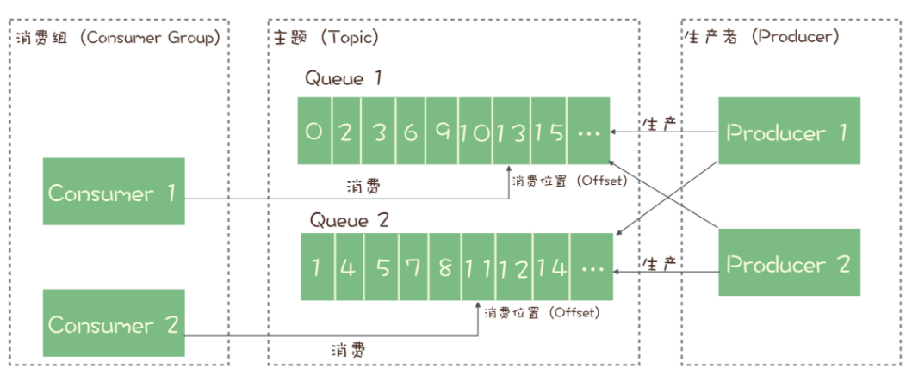

# 030-消息模型-主题和队列有什么区别

## 目录

- [简介](#简介)
- [消息队列的演进](#消息队列的演进)
- [队列模型](#队列模型)
- [发布订阅模型](#发布订阅模型)
- [RabbitMQ的消息模型](#RabbitMQ的消息模型)
- [RocketMQ的消息模型](#RocketMQ的消息模型)
- [Kafka的消息模型](#Kafka的消息模型)
- [总结](#总结)

## 简介

消息队列中像队列、主题、分区等基础概念。这些基础的概念，就像我们学习一门编程语言中的基础语法一样，你只有搞清楚它们，才能进行后续的学习。

如果你研究过超过一种消息队列产品，你可能已经发现，每种消息队列都有自己的一套消息模型，像队列（Queue）、主题（Topic）或是分区（Partition）这些名词概念，在每个消息队列模型中都会涉及一些，含义还不太一样。

为什么出现这种情况呢？因为没有标准。曾经，也是有一些国际组织尝试制定过消息相关的标准，比如早期的 JMS 和 AMQP。但让人无奈的是，标准的进化跟不上消息队列的演进速度，这些标准实际上已经被废弃了。

那么，到底什么是队列？什么是主题？主题和队列又有什么区别呢？想要彻底理解这些，我们需要从消息队列的演进说起。

## 消息队列的演进

好的架构不是设计出来的，而是演进出来的。 现代的消息队列呈现出的模式，一样是经过之前的十几年逐步演进而来的。

最初的消息队列，就是一个严格意义上的队列。在计算机领域，“队列（Queue）”是一种数据结构，有完整而严格的定义。在维基百科中，队列的定义是这样的：

> 队列是先进先出（FIFO, First-In-First-Out）的线性表（Linear List）。在具体应用中通常用链表或者数组来实现。队列只允许在后端（称为 rear）进行插入操作，在前端（称为 front）进行删除操作。

这个定义里面包含几个关键点，第一个是**先进先出**，这里面隐含着的一个要求是，在消息入队出队过程中，需要保证这些消息**严格有序**，按照什么顺序写进队列，必须按照同样的顺序从队列中读出来。不过，队列是没有“读”这个操作的，“读”就是出队，也就是从队列中“删除”这条消息。

**早期的消息队列，就是按照“队列”的数据结构来设计的。**

下图，

- 生产者（Producer）发消息就是入队操作，

- 消费者（Consumer）收消息就是出队也就是删除操作
- 服务端存放消息的容器自然就称为“队列”。

这就是最初的一种消息模型：队列模型。

## 队列模型

如果有多个生产者往同一个队列里面发送消息，这个队列中可以消费到的消息，就是这些生产者生产的所有消息的合集。消息的顺序就是这些生产者发送消息的自然顺序。如果有多个消费者接收同一个队列的消息，这些消费者之间实际上是竞争的关系，每个消费者只能收到队列中的一部分消息，也就是说任何一条消息只能被其中的一个消费者收到。

如果有多个生产者往同一个队列里面发送消息，这个队列中可以消费到的消息，就是这些生产者生产的所有消息的合集。消息的顺序就是这些生产者发送消息的自然顺序。如果有多个消费者接收同一个队列的消息，这些消费者之间实际上是竞争的关系，每个消费者只能收到队列中的一部分消息，也就是说任何一条消息只能被其中的一个消费者收到。

如果需要将一份消息数据分发给多个消费者，要求每个消费者都能收到全量的消息，例如，对于一份订单数据，风控系统、分析系统、支付系统等都需要接收消息。这个时候，单个队列就满足不了需求，一个可行的解决方式是，为每个消费者创建一个单独的队列，让生产者发送多份。

显然这是个比较蠢的做法，同样的一份消息数据被复制到多个队列中会浪费资源，更重要的是，生产者必须知道有多少个消费者。为每个消费者单独发送一份消息，这实际上违背了消息队列“解耦”这个设计初衷。

为了解决这个问题，演化出了另外一种消息模型：“**发布 - 订阅模型（Publish-Subscribe Pattern）**”。

## 发布订阅模型

在发布 - 订阅模型中，

- 消息的发送方称为发布者（Publisher）
- 消息的接收方称为订阅者（Subscriber）
- 服务端存放消息的容器称为主题（Topic）

发布者将消息发送到主题中，订阅者在接收消息之前需要先“订阅主题”。“订阅”在这里既是一个动作，同时还可以认为是主题在消费时的一个逻辑副本，每份订阅中，订阅者都可以接收到主题的所有消息。

在消息领域的历史上很长的一段时间，队列模式和发布 - 订阅模式是并存的，有些消息队列同时支持这两种消息模型，比如 ActiveMQ。我们仔细对比一下这两种模型，生产者就是发布者，消费者就是订阅者，队列就是主题，并没有本质的区别。

**它们最大的区别其实就是，一份消息数据能不能被消费多次的问题。**

实际上，在这种发布 - 订阅模型中，如果只有一个订阅者，那它和队列模型就基本是一样的了。也就是说，发布 - 订阅模型在功能层面上是可以兼容队列模型的。

现代的消息队列产品使用的消息模型大多是这种发布 - 订阅模型，当然也有例外。

## RabbitMQ的消息模型

RabbitMQ是少数依然坚持使用队列模型的产品之一。

那它是怎么解决多个消费者的问题呢？

在 RabbitMQ 中，Exchange 位于生产者和队列之间，生产者并不关心将消息发送给哪个队列，而是将消息发送给 Exchange，由 Exchange 上配置的策略来决定将消息投递到哪些队列中。

同一份消息如果需要被多个消费者来消费，需要配置 Exchange将消息发送到多个队列，每个队列中都存放一份完整的消息数据，可以为一个消费者提供消费服务。这也可以变相地实现新发布 - 订阅模型中，“一份消息数据可以被多个订阅者来多次消费”这样的功能。

- https://www.rabbitmq.com/tutorials/tutorial-three-python.html

- [040-RabbitMQ的工作模型简介.md](010-RabbitMQ/010-tutorials/010-RabbitMQ实战基础/040-RabbitMQ的工作模型简介.md) 

## RocketMQ的消息模型

**RocketMQ 使用的消息模型是标准的发布 - 订阅模型**

在 RocketMQ 的术语表中，生产者、消费者和主题与我在上面讲的发布 - 订阅模型中的概念是完全一样的。

但是，在 RocketMQ 也有队列（Queue）这个概念，并且队列在 RocketMQ 中是一个非常重要的概念，那队列在 RocketMQ 中的作用是什么呢？这就要从消息队列的消费机制说起。

几乎所有的消息队列产品都使用一种非常朴素的“请求 - 确认”机制，确保消息不会在传递过程中由于网络或服务器故障丢失。具体的做法也非常简单。在生产端，生产者先将消息发送给服务端，也就是 Broker，服务端在收到消息并将消息写入主题或者队列中后，会给生产者发送确认的响应。

如果生产者没有收到服务端的确认或者收到失败的响应，则会重新发送消息；在消费端，消费者在收到消息并完成自己的消费业务逻辑（比如，将数据保存到数据库中）后，也会给服务端发送消费成功的确认，服务端只有收到消费确认后，才认为一条消息被成功消费，否则它会给消费者重新发送这条消息，直到收到对应的消费成功确认。

这个确认机制很好地保证了消息传递过程中的可靠性，但是，引入这个机制在消费端带来了一个不小的问题。什么问题呢？为了确保消息的有序性，在某一条消息被成功消费之前，下一条消息是不能被消费的，否则就会出现消息空洞，违背了有序性这个原则。

也就是说，每个主题在任意时刻，至多只能有一个消费者实例在进行消费，那就没法通过水平扩展消费者的数量来提升消费端总体的消费性能。为了解决这个问题，RocketMQ 在主题下面增加了队列的概念。

**每个主题包含多个队列，通过多个队列来实现多实例并行生产和消费。**需要注意的是，RocketMQ 只在队列上保证消息的有序性，主题层面是无法保证消息的严格顺序的。

RocketMQ 中，订阅者的概念是通过消费组（Consumer Group）来体现的。

##### 消费组（Consumer Group）

每个消费组都消费主题中一份完整的消息，不同消费组之间消费进度彼此不受影响，也就是说，一条消息被 Consumer Group1 消费过，也会再给 Consumer Group2 消费。

消费组中包含多个消费者，同一个组内的消费者是竞争消费的关系，每个消费者负责消费组内的一部分消息。如果一条消息被消费者 Consumer1 消费了，那同组的其他消费者就不会再收到这条消息。

在 Topic 的消费过程中，由于消息需要被不同的组进行多次消费，所以消费完的消息并不会立即被删除，这就需要 RocketMQ 为每个消费组在每个队列上维护一个消费位置（Consumer Offset），这个位置之前的消息都被消费过，之后的消息都没有被消费过，每成功消费一条消息，消费位置就加一。这个消费位置是非常重要的概念，我们在使用消息队列的时候，丢消息的原因大多是由于消费位置处理不当导致的。

## Kafka的消息模型

Kafka 的消息模型和 RocketMQ 是完全一样的，上节RocketMQ 中对应的概念，和生产消费过程中的确认机制，都完全适用于 Kafka。唯一的区别是，在 Kafka 中，队列这个概念的名称不一样，Kafka 中对应的名称是“分区（Partition）”，含义和功能是没有任何区别的。

## 总结

队列和主题的区别，这两个概念的背后实际上对应着两种不同的消息模型：

- 队列模型
- 发布 - 订阅模型。

这两种消息模型其实并没有本质上的区别，都可以通过一些扩展或者变化来互相替代。

常用的消息队列中，

- RabbitMQ 采用的是队列模型，但是它一样可以实现发布 - 订阅的功能。
- RocketMQ 和 Kafka 采用的是发布 - 订阅模型，并且二者的消息模型是基本一致的。

但业务模型不等于就是实现层面的模型。比如说 MySQL 和 Hbase 同样是支持 SQL 的数据库，它们的业务模型中，存放数据的单元都是“表”，但是在实现层面，没有哪个数据库是以二维表的方式去存储数据的，MySQL 使用 B+ 树来存储数据，而 HBase 使用的是 KV 的结构来存储。同样，像 Kafka 和 RocketMQ 的业务模型基本是一样的，并不是说他们的实现就是一样的，实际上这两个消息队列的实现是完全不同的。

