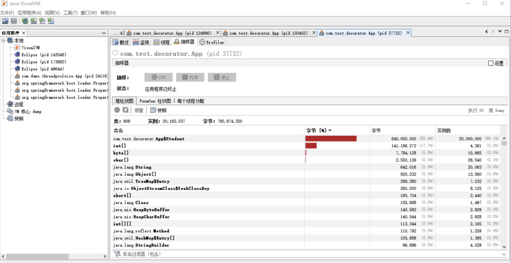

# 070-编译优化技术

[TOC]

# 方法内联和逃逸分析

JIT 编译运用了一些经典的编译优化技术来实现代码的优化，即通过一些例行检查优化，可以智能地编译出运行时的最优性能代码。今天我们主要来学习以下两种优化手段：

1. 方法内联
2. 逃逸分析

## 1. 方法内联

调用一个方法通常要经历压栈和出栈。调用方法是将程序执行顺序转移到存储该方法的内存地址，将方法的内容执行完后，再返回到执行该方法前的位置。

这种执行操作要求在执行前保护现场并记忆执行的地址，执行后要恢复现场，并按原来保存的地址继续执行。 因此，方法调用会产生一定的时间和空间方面的开销。

那么对于那些方法体代码不是很大，又频繁调用的方法来说，这个时间和空间的消耗会很大。

**方法内联的优化行为就是把目标方法的代码复制到发起调用的方法之中，避免发生真实的方法调用。**

例如以下方法：

```java
private int add1(int x1, int x2, int x3, int x4) {
    return add2(x1, x2) + add2(x3, x4);
}
private int add2(int x1, int x2) {
    return x1 + x2;
}
```

最终会被优化为：

```java
private int add1(int x1, int x2, int x3, int x4) {
    return x1 + x2+ x3 + x4;
}
```

JVM 会自动识别热点方法，并对它们使用方法内联进行优化。

我们可以通过 -XX:CompileThreshold 来设置热点方法的阈值。但要强调一点，热点方法不一定会被 JVM 做内联优化，如果这个方法体太大了，JVM 将不执行内联操作。而方法体的大小阈值，我们也可以通过参数设置来优化：

- 经常执行的方法，默认情况下，方法体大小小于 325 字节的都会进行内联，我们可以通过 -XX:MaxFreqInlineSize=N 来设置大小值；
- 不是经常执行的方法，默认情况下，方法大小小于 35 字节才会进行内联，我们也可以通过 -XX:MaxInlineSize=N 来重置大小值。

之后我们就可以通过配置 JVM 参数来查看到方法被内联的情况：

```
-XX:+PrintCompilation // 在控制台打印编译过程信息
-XX:+UnlockDiagnosticVMOptions // 解锁对 JVM 进行诊断的选项参数。默认是关闭的，开启后支持一些特定参数对 JVM 进行诊断
-XX:+PrintInlining // 将内联方法打印出来
```

当我们设置 VM 参数：-XX:+PrintCompilation -XX:+UnlockDiagnosticVMOptions -XX:+PrintInlining 之后，运行以下代码：

```java
public static void main(String[] args) {
  for(int i=0; i<1000000; i++) {// 方法调用计数器的默认阈值在 C1 模式下是 1500 次，在 C2 模式在是 10000 次，我们循环遍历超过需要阈值
    add1(1,2,3,4);
  }
}
```

我们可以看到运行结果中，显示了方法内联的日志：


热点方法的优化可以有效提高系统性能，一般我们可以通过以下几种方式来提高方法内联：

- 通过设置 JVM 参数来减小热点阈值或增加方法体阈值，以便更多的方法可以进行内联，但这种方法意味着需要占用更多地内存；
- 在编程中，避免在一个方法中写大量代码，习惯使用小方法体；
- 尽量使用 final、private、static 关键字修饰方法，编码方法因为继承，会需要额外的类型检查。

## 2.逃逸分析

逃逸分析（Escape Analysis）是判断一个对象是否被外部方法引用或外部线程访问的分析技术，编译器会根据逃逸分析的结果对代码进行优化。

**栈上分配**

我们知道，在 Java 中默认创建一个对象是在堆中分配内存的，而当堆内存中的对象不再使用时，则需要通过垃圾回收机制回收，这个过程相对分配在栈中的对象的创建和销毁来说，更消耗时间和性能。

**这个时候，逃逸分析如果发现一个对象只在方法中使用，就会将对象分配在栈上。**

以下是通过循环获取学生年龄的案例，方法中创建一个学生对象，我们现在通过案例来看看打开逃逸分析和关闭逃逸分析后，堆内存对象创建的数量对比。

```java
public static void main(String[] args) {
    for (int i = 0; i < 200000 ; i++) {
    	getAge();
    }
}
 
public static int getAge(){
	Student person = new Student(" 小明 ",18,30);   
    return person.getAge();
}
 
static class Student {
    private String name;
    private int age;
   
    public Student(String name, int age) {
        this.name = name;
        this.age = age;
    }
 
    public String getName() {
        return name;
    }
 
    public void setName(String name) {
        this.name = name;
    }
 
    public int getAge() {
        return age;
    }
 
    public void setAge(int age) {
        this.age = age;
    }
}
```

然后，我们分别设置 VM 参数：

- Xmx1000m -Xms1000m -XX:-DoEscapeAnalysis -XX:+PrintGC 
-  -Xmx1000m -Xms1000m -XX:+DoEscapeAnalysis -XX:+PrintGC，

通过之前讲过的 VisualVM 工具，查看堆中创建的对象数量。

然而，运行结果却没有达到我们想要的优化效果，也许你怀疑是 JDK 版本的问题，然而我分别在 1.6~1.8 版本都测试过了，效果还是一样的：

（-server -Xmx1000m -Xms1000m -XX:-DoEscapeAnalysis -XX:+PrintGC）



（-server -Xmx1000m -Xms1000m -XX:+DoEscapeAnalysis -XX:+PrintGC）


这其实是因为由于 HotSpot 虚拟机目前的实现导致栈上分配实现比较复杂，可以说，在 HotSpot 中暂时没有实现这项优化。随着即时编译器的发展与逃逸分析技术的逐渐成熟，相信不久的将来 HotSpot 也会实现这项优化功能。

## 3.锁消除

在非线程安全的情况下，尽量不要使用线程安全容器，比如 StringBuffer。由于 StringBuffer 中的 append 方法被 Synchronized 关键字修饰，会使用到锁，从而导致性能下降。

但实际上，在以下代码测试中，StringBuffer 和 StringBuilder 的性能基本没什么区别。这是因为在局部方法中创建的对象只能被当前线程访问，无法被其它线程访问，这个变量的读写肯定不会有竞争，这个时候 JIT 编译会对这个对象的方法锁进行锁消除。

```java
public static String getString(String s1, String s2) {
  StringBuffer sb = new StringBuffer();
  sb.append(s1);
  sb.append(s2);
  return sb.toString();
}
```

## 4.标量替换

逃逸分析证明一个对象不会被外部访问，如果这个对象可以被拆分的话，当程序真正执行的时候可能不创建这个对象，而直接创建它的成员变量来代替。将对象拆分后，可以分配对象的成员变量在栈或寄存器上，原本的对象就无需分配内存空间了。这种编译优化就叫做标量替换。

我们用以下代码验证：

```java
public void foo() {
  TestInfo info = new TestInfo();
  info.id = 1;
  info.count = 99;
  ...//to do something
}
```

逃逸分析后，代码会被优化为：

```java
public void foo() {
  id = 1;
  count = 99;
  ...//to do something
}
```

我们可以通过设置 JVM 参数来开关逃逸分析，还可以单独开关同步消除和标量替换，在 JDK1.8 中 JVM 是默认开启这些操作的。

```
-XX:+DoEscapeAnalysis 开启逃逸分析（jdk1.8 默认开启，其它版本未测试）
-XX:-DoEscapeAnalysis 关闭逃逸分析
 
-XX:+EliminateLocks 开启锁消除（jdk1.8 默认开启，其它版本未测试）
-XX:-EliminateLocks 关闭锁消除
 
-XX:+EliminateAllocations 开启标量替换（jdk1.8 默认开启，其它版本未测试）
-XX:-EliminateAllocations 关闭就可以了
```

## 总结

今天我们主要了解了 JKD1.8 以及之前的类的编译和加载过程，Java 源程序是通过 Javac 编译器编译成 .class 文件，其中文件中包含的代码格式我们称之为 Java 字节码（bytecode）。

这种代码格式无法直接运行，但可以被不同平台 JVM 中的 Interpreter 解释执行。由于 Interpreter 的效率低下，JVM 中的 JIT 会在运行时有选择性地将运行次数较多的方法编译成二进制代码，直接运行在底层硬件上。

在 Java8 之前，HotSpot 集成了两个 JIT，用 C1 和 C2 来完成 JVM 中的即时编译。虽然 JIT 优化了代码，但收集监控信息会消耗运行时的性能，且编译过程会占用程序的运行时间。

到了 Java9，AOT 编译器被引入。和 JIT 不同，AOT 是在程序运行前进行的静态编译，这样就可以避免运行时的编译消耗和内存消耗，且 .class 文件通过 AOT 编译器是可以编译成 .so 的二进制文件的。

到了 Java10，一个新的 JIT 编译器 Graal 被引入。Graal 是一个以 Java 为主要编程语言、面向 Java bytecode 的编译器。与用 C++ 实现的 C1 和 C2 相比，它的模块化更加明显，也更容易维护。Graal 既可以作为动态编译器，在运行时编译热点方法；也可以作为静态编译器，实现 AOT 编译。

## 思考题

我们知道 Class.forName 和 ClassLoader.loadClass 都能加载类，你知道这两者在加载类时的区别吗？

- Class.forName有重载方法可以指定是否需要初始化，而默认的方法初始化设置为true, 会初始化类执行链接和初始化操作，
- ClasaLoader是有类加载器的loadClass方法加载，传入的是false只会执行连接操作，而不会执行初始化操作