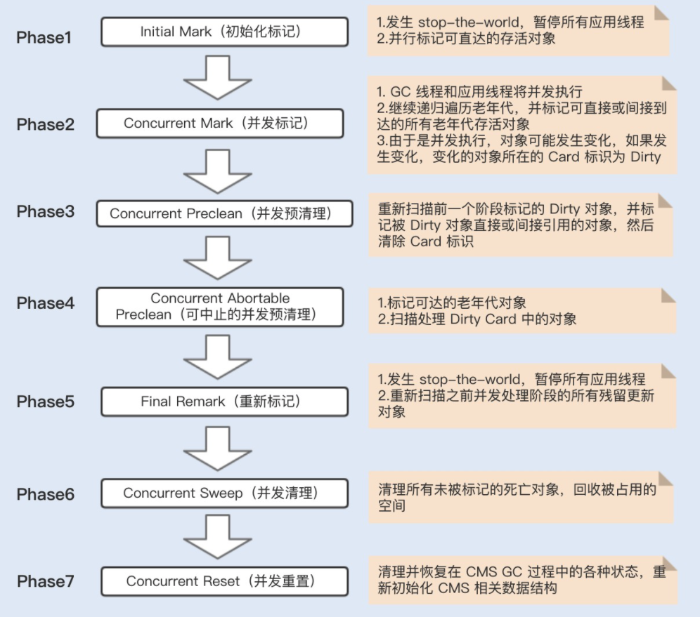
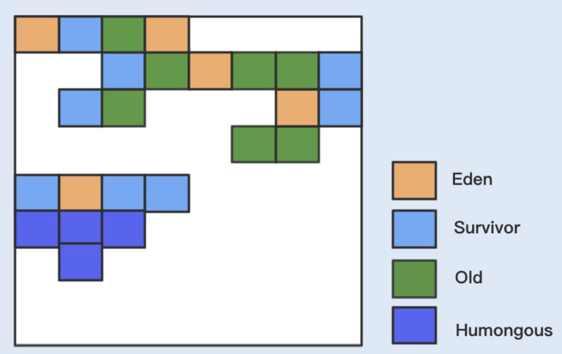
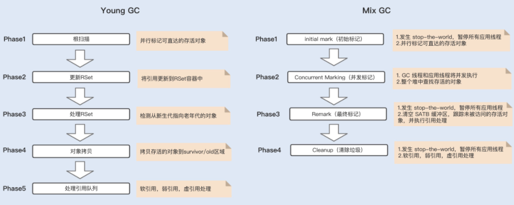

# 060-热点问题

[TOC]

## 字符串常量池放在哪里

字符串常量池

- JDK8之后放入了元空间
- JDK7放在堆中
- JDK7之前放在了永久代

JVM 的内存模型只是一个规范，方法区也是一个规范，一个逻辑分区，并不是一个物理空间，我们这里说的字符串常量放在堆内存空间中，是指实际的物理空间。

## 栈上分配, 对局部变量对象大小是否有要求

目前 Hotspot 虚拟机暂时不支持栈上分配对象

- Java只有值传递, 跨方法的局部变量在站上分配的话, 在现有栈实现上会影响栈的回收
- 栈属于线程所有,  实现栈上分配, 会消耗更多的内存, 让Java的多线程更加吃内存
- 如果实现栈上分配, 还需要GC作用会弱化很多

- 基类型站上分配 + 引用类型堆分配-> 全栈上分配, 这么实现的hotspot感觉全推翻了

## CMS和G1的区别

- cms在1.9已经标记为废弃, 主要原因在于标记清除下的悬浮内存, 斗志内存空间碎片化, 进而导致FullGC的发生
- G1 的堆内存结构比较特殊, 虽然是按照念叨划分, 但是从物理角度上却不一样, G1将整块内存分配成若干个大小相同的region, 

从垃圾算法来说

- CMS 垃圾收集器是基于标记清除算法实现的, 目前主要用于老年代垃圾回收。

CMS 收集器的 GC 周期主要由 7 个阶段组成，其中有两个阶段会发生 stop-the-world，其它阶段都是并发执行的。

- G1 垃圾收集器是基于标记整理算法实现的，是一个分代垃圾收集器，既负责年轻代，也负责老年代的垃圾回收。

跟之前各个分代使用连续的虚拟内存地址不一样，G1 使用了一种 Region 方式对堆内存进行了划分，同样也分年轻代、老年代，但每一代使用的是 N 个不连续的 Region 内存块，每个 Region 占用一块连续的虚拟内存地址。

在 G1 中，还有一种叫 Humongous 区域，用于存储特别大的对象。G1 内部做了一个优化，一旦发现没有引用指向巨型对象，则可直接在年轻代的 YoungGC 中被回收掉。

G1 分为 Young GC、Mix GC 以及 Full GC。

G1 Young GC 主要是在 Eden 区进行，当 Eden 区空间不足时，则会触发一次 Young GC。

将 Eden 区数据移到 Survivor 空间时，如果 Survivor 空间不足，则会直接晋升到老年代。此时 Survivor 的数据也会晋升到老年代。Young GC 的执行是并行的，期间会发生 STW。

当堆空间的占用率达到一定阈值后会触发 G1 Mix GC（阈值由命令参数 -XX:InitiatingHeapOccupancyPercent 设定，默认值 45），Mix GC 主要包括了四个阶段，其中只有并发标记阶段不会发生 STW，其它阶段均会发生 STW。

- G1 和 CMS 主要的区别在于：

  - CMS 主要集中在老年代的回收，而 G1 集中在分代回收，包括了年轻代的 Young GC 以及老年代的 Mix GC；
  - G1 使用了 Region 方式对堆内存进行了划分，且基于标记整理算法实现，整体减少了垃圾碎片的产生；
  - 在初始化标记阶段，搜索可达对象使用到的 Card Table，其实现方式不一样。

  这里我简单解释下 Card Table，在垃圾回收的时候都是从 Root 开始搜索，这会先经过年轻代再到老年代，也有可能老年代引用到年轻代对象，如果发生 Young GC，除了从年轻代扫描根对象之外，还需要再从老年代扫描根对象，确认引用年轻代对象的情况。

  **这种属于跨代处理，非常消耗性能。**为了避免在回收年轻代时跨代扫描整个老年代，CMS 和 G1 都用到了 Card Table 来记录这些引用关系。只是 G1 在 Card Table 的基础上引入了 RSet，每个 Region 初始化时，都会初始化一个 RSet，RSet 记录了其它 Region 中的对象引用本 Region 对象的关系。

  除此之外，CMS 和 G1 在解决并发标记时漏标的方式也不一样，CMS 使用的是 Incremental Update 算法，而 G1 使用的是 SATB 算法。

  首先，我们要了解在并发标记中，G1 和 CMS 都是基于三色标记算法来实现的：

  - 黑色：根对象，或者对象和对象中的子对象都被扫描；
  - 灰色：对象本身被扫描，但还没扫描对象中的子对象；
  - 白色：不可达对象。

  基于这种标记有一个漏标的问题，也就是说，当一个白色标记对象，在垃圾回收被清理掉时，正好有一个对象引用了该白色标记对象，此时由于被回收掉了，就会出现对象丢失的问题。

  为了避免上述问题，CMS 采用了 Incremental Update 算法，只要在写屏障（write barrier）里发现一个白对象的引用被赋值到一个黑对象的字段里，那就把这个白对象变成灰色的。而在 G1 中，采用的是 SATB 算法，该算法认为开始时所有能遍历到的对象都是需要标记的，即认为都是活的。

  G1 具备 Pause Prediction Model ，即停顿预测模型。用户可以设定整个 GC 过程中期望的停顿时间，用参数 -XX:MaxGCPauseMillis 可以指定一个 G1 收集过程的目标停顿时间，默认值 200ms。

  G1 会根据这个模型统计出来的历史数据，来预测一次垃圾回收所需要的 Region 数量，通过控制 Region 数来控制目标停顿时间的实现。

## minor gc是否会导致stw

## major gc是什么是否发生, 它和full gc的区别是什么

不管什么 GC，都会发送 stop-the-world，区别是发生的时间长短。而这个时间跟垃圾收集器又有关系，Serial、PartNew、Parallel Scavenge 收集器无论是串行还是并行，都会挂起用户线程，而 CMS 和 G1 在并发标记时，是不会挂起用户线程的，但其它时候一样会挂起用户线程，stop the world 的时间相对来说就小很多了。

Major Gc 在很多参考资料中是等价于 Full GC 的，我们也可以发现很多性能监测工具中只有 Minor GC 和 Full GC。一般情况下，一次 Full GC 将会对年轻代、老年代、元空间以及堆外内存进行垃圾回收。触发 Full GC 的原因有很多：

- 当年轻代晋升到老年代的对象大小，并比目前老年代剩余的空间大小还要大时，会触发 Full GC；
- 当老年代的空间使用率超过某阈值时，会触发 Full GC；
- 当元空间不足时（JDK1.7 永久代不足），也会触发 Full GC；
- 当调用 System.gc() 也会安排一次 Full GC。