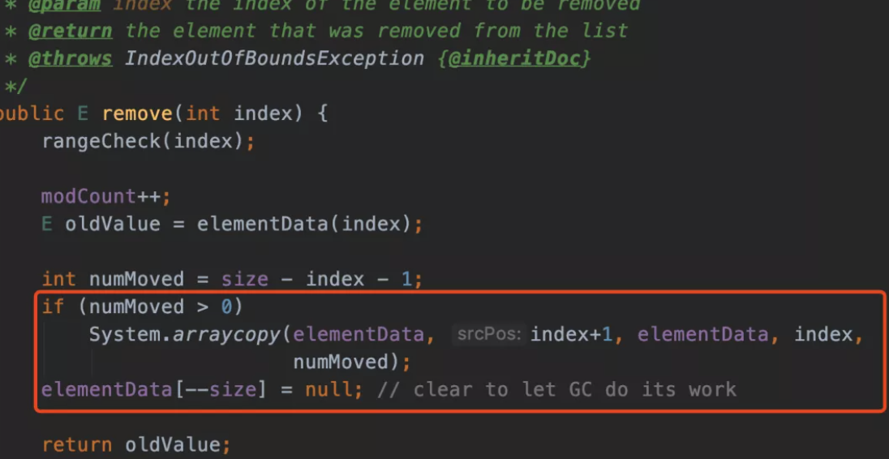
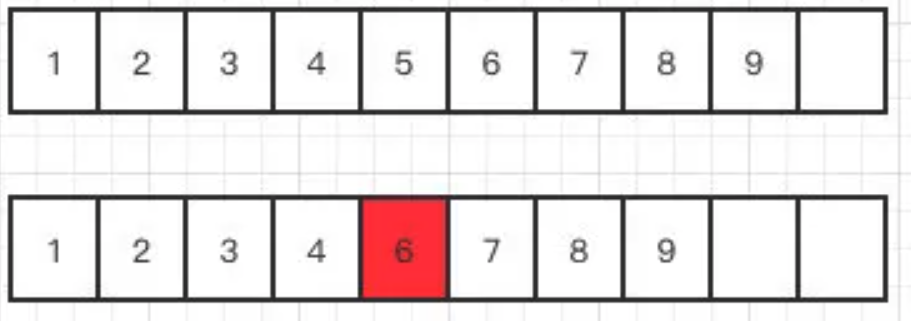

# Java

1. 为什么String定义为final。
2. 描述下java集合，项目中用到哪些。
3. StringBuilder和StringBuffer的区别。

## Collection

####  ArrayList

增删慢,查找快(因为可以随机访问,二分法),线程不安全

#### 默认容量

add 对象的时候给一个初始值 10

#### 扩容

重新创建一个列表 `int newCapacity = oldCapacity + (oldCapacity >> 1);`,原来 1.5 倍,然后进行拷贝

#### ArrayList插入删除一定慢么？

取决于你删除的元素离数组末端有多远，ArrayList拿来作为堆栈来用还是挺合适的，push和pop操作完全不涉及数据移动操作。

#### 删除怎么实现的呢？

不过叫是叫删除，但是在代码里面我们发现，他还是在copy一个数组

#### 

继续打个比方，我们现在要删除下面这个数组中的index5这个位置

那代码他就复制一个index5+1开始到最后的数组，然后把它放到index开始的位置

index5的位置就成功被”删除“了其实就是被覆盖了，给了你被删除的感觉。

同理他的效率也低，因为数组如果很大的话，一样需要复制和移动的位置就大了。

### 线程安全吗

不安全,线程安全版本的数组容器是Vector。

#### ArrayList用来做队列合适么？

不适合,因为队列是 FIFO, ArrayList不适合做队列。

新增和删除会涉及到数据的复制.效率低

#### ArrayList的遍历和LinkedList遍历性能比较如何？

ArrayList遍历最大的优势在于内存的连续性，CPU的内部缓存结构会缓存连续的内存片段，可以大幅降低读取内存的性能开销。

#### ArrayList 的迭代器

> 什么时候会抛出`ConcurrentModificationException`？

在迭代的时候，会校验`modCount`是否等于`expectedModCount`，不等于就会抛出著名的`ConcurrentModificationException`异常。

原因就是因为Itr的`remove()`方法，移除之后将`modCount`重新赋值给 `expectedModCount`。这就是源码，不管单线程还是多线程，只要违反了规则，就会抛异常。

> 快速失败

`iterator()`和`listIterator(int)`方法是`fail-fast`的，如果在迭代器创建之后，列表进行结构化修改，迭代器会抛出`ConcurrentModificationException`。

> 为什么`elementData`要被`transient`修饰

`elementData`之所以用`transient`修饰，是因为JDK不想将整个`elementData`都序列化或者反序列化，而只是将`size`和实际存储的元素序列化或反序列化，从而节省空间和时间。通过重写`readObject` 和  `writeObject `方法

> 为什么`elementData`没有被`private`修饰？难道正如注释所写的**non-private to simplify nested class access**

简化内部类的访问

### HashMap

>  [051-hashMap的底层原理.md](../04-java/02-collections/03-map/051-hashMap的底层原理.md) 

> HashMap 是我们经常使用的集合类
>
> - 是数组和链表的组合, 1.7 叫 Entry, 1.8叫Node
> - 根据 key 的值计算 Hash 插入 Node, 1.7是头插法,1.8 是尾插法
> - 扩容机制,负载因子 0.75f, 

##### HashMap的扩容机制

- 根据原来的容量 Node *2 
- 将原来的参数 rehash

插入的的时候多个线程容易出现环形链表,所以1.8 采用尾插法

##### 为什么线程不安全

get 和 put 没有加同步锁. 上一秒 put,下一秒不能保证拿到的是更新的值

##### 初始长度

16 , 2^4 , 建议 2的幂, 因为方便位运算,计算 key的时候使用到额是位运算,能够提高性能

##### HashMap中常用的方法有哪些，什么时候会触发树化，jdk1.7和1.8实现的差异，1.7的实现为什么会出现死锁，画图说明下。HashMap和TreeMap的区别。

## 多线程

### 轻量级锁加解锁过程详解

> https://zhuanlan.zhihu.com/p/141554048

从Java SE 1.6开始，为了减少获得锁和释放锁带来的性能消耗，就引入了轻量级锁。轻量级锁在对象内存布局中 MarkWord 锁标志位为 00，它可以由偏向锁对象因存在多个线程访问而升级成轻量级锁，当然，轻量级锁也可能因多个线程同时访问同步代码块升级成重量级锁。

 [02-synchronized的实现原理与应用.md](../04-java/03-concurrency/04-Java并发机制的底层实现原理/02-synchronized的实现原理与应用.md) 

1. 说下枚举类型，底层实现原理，项目中是如何使用的。
2. 详细描述Error和Exception(运行期和编译期)的区别。
3. 创建线程的方式，线程的生命周期。
4. ThrealLocal实现原理，为什么会出现内存泄漏。
5. volatile关键字原理，项目中是如何使用的。
6. synchronized和lock的区别，底层实现原理。AQS队列实现原理，用了哪些设计模式。公平锁和非公平锁、独占锁和共享锁、读写锁分别是如何实现的，为什么说非公平锁比公平锁性能高。
7. 序列化和反序列化。
8. 深拷贝和浅拷贝区别。
9. java内部类的区别(成员*内部类*、静态嵌套类、方法*内部类*、匿名*内部类* )。
10. java线程池参数描述，线程池工作原理，线程池如何调优。
11. 主线程到达一个条件，需要多个子线程去执行任务，等子任务都执行完后再往下走，如何编写代码(CountDownLatch)。
12. 写个程序，两个线程交叉打印1到100的数字，需要多种实现方式。

