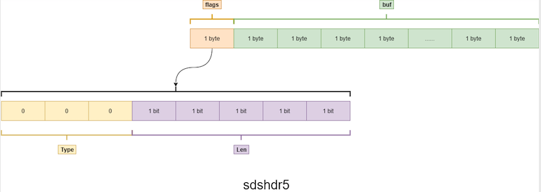

# Redis字符串是怎样存储的

SDS, 简单动态字符串

3.2 之前采用的是 一个 

- 一个 int len 存储长度,四个字节
- 一个 int free 存储没有使用字节的数量
- 一个 字符 数组 存储具体的字符串

但是这种设计比较浪费内存,通常情况下用不着四个字节存储长度和没有使用的字节数.所以

3.2 之后, 采用了 sdshdr5, sdshdr8 ,16 ,32 ,64 的结构存储 SDS, 目的是进一步节省内存

根据不同长度字符串可以使用不同大小的Header , 

sdshdr5 的时候, 拿出一个字节8 位 flag 专门来存储长度信息

- 前 3 位表示类型
- 后 5 位表示长度,所以是 sdshdr5

sdshdr8 的时候, 也是拿出一个字节8 位 flag 专门来存储长度信息,只不过只用前 3 位表示类型

然后拿出

- 一个字节8 位存储长度,
- 一个字节8 位存储分配空间

放到 flag 的前面

16 同理使用两个字节