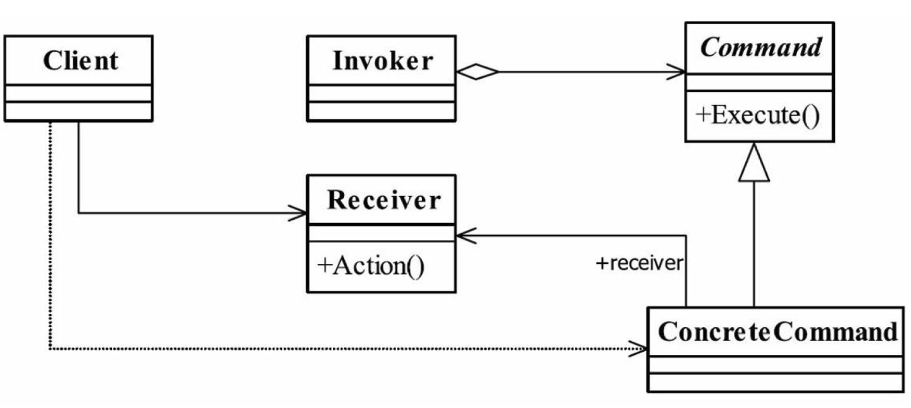

# 命令模式（Command Pattern）

将一个请求封装为一个对象，从而让你可以用不同的请求对客户进行参数化，对请求排队或者记录请求日志，以及支持可撤销的操作。


## UML



在该类图中，我们看到三个角色：

- Receiver接受者角色：该角色就是干活的角色，命令传递到这里是应该被执行的
- Command命令角色：需要执行的所有命令都在这里声明
- Invoker调用者角色：接收到命令，并执行命令

```java
//通用Receiver类
public abstract class Receiver {
    public abstract void doSomething();
}

//具体Receiver类
public class ConcreteReciver1 extends Receiver{ 
    //每个接收者都必须处理一定的业务逻辑 
    public void doSomething(){ } 
} 

public class ConcreteReciver2 extends Receiver{ 
    //每个接收者都必须处理一定的业务逻辑 
    public void doSomething(){ } 
}

//抽象Command类
public abstract class Command {
    public abstract void execute();
}

//具体的Command类
public class ConcreteCommand1 extends Command { 
    //对哪个Receiver类进行命令处理 
    private Receiver receiver; 
    //构造函数传递接收者 
    public ConcreteCommand1(Receiver _receiver){
        this.receiver = _receiver; 
    } 

    //必须实现一个命令 
    public void execute() { 
    //业务处理 
        this.receiver.doSomething(); 
    } 
} 

public class ConcreteCommand2 extends Command { 
    //哪个Receiver类进行命令处理 
    private Receiver receiver; 
    //构造函数传递接收者 
    public ConcreteCommand2(Receiver _receiver){
        this.receiver = _receiver; 
    } 
    //必须实现一个命令 
    public void execute() { 
        //业务处理 
        this.receiver.doSomething();
    } 
}

//调用者Invoker类
public class Invoker {
    private Command command;
    
    public void setCommand(Command _command){
        this.command = _command;
    }
    
    public void action() {
        this.command.execute();
    }
}

//场景类
public class Client {
    public static void main(String[] args){
        Invoker invoker = new Invoker();
        Receiver receiver = new ConcreteReceiver1();
        
        Command command = new ConcreteCommand1(receiver);
        invoker.setCommand(command);
        invoker.action();
    }
}
```

## 2.1 优点

- 类间解耦：调用者角色与接收者角色之间没有任何依赖关系，调用者实现功能时只需调用Command 抽象类的execute方法就可以，不需要了解到底是哪个接收者执行。
- 可扩展性：Command的子类可以非常容易地扩展，而调用者Invoker和高层次的模块Client不产生严 重的代码耦合。
- 命令模式结合其他模式会更优秀：命令模式可以结合责任链模式，实现命令族解析任务；结合模板方法模式，则可以减少 Command子类的膨胀问题。

## 2.2 缺点

命令模式也是有缺点的，请看Command的子类：如果有N个命令，问题就出来 了，Command的子类就可不是几个，而是N个，这个类膨胀得非常大，这个就需要读者在项 目中慎重考虑使用。