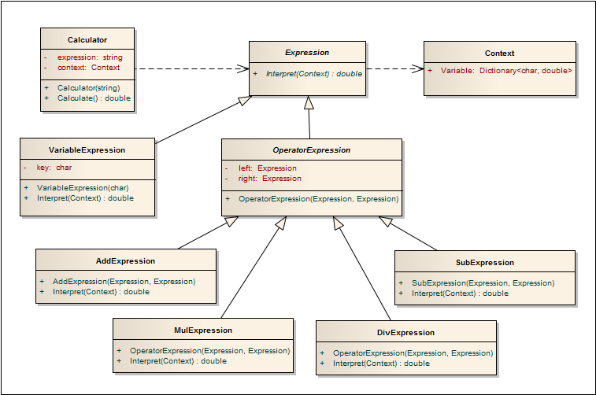

# 解释器模式（Interpreter Pattern）

给定一个语言，定义它的文法的一种表示，并定义一个解释器这个解释器使用该表示来解释语言中的句子。

## 优点

- 解释器模式易于改变和拓展文法，由于在解释器模式中使用类来表示语言的文法，因此可以通过继承等机制来改变和拓展文法
- 在解释器模式中，每一条文法规则都可以表示为一个类，因此可以方便的实现一个简单的语言
- 实现文法较为容易。在抽象语法树中每一个表达式节点类的实现方式都是相似的，这些类的代码都不会特别复杂，还可以通过一些工具自动生成节点类代码。
- 增加新的解释表达式较为方便，如果用户需要增加新的解释表达式，只需要对应增加一个新的终结符表达式或非终结符表达式，原有表达式类代码无需修改，符合开闭原则。

## 缺点

- 解释器对于复杂文法难以维护，在解释器模式中，每一条规则至少需要定义一个类，因此如果一个语言包含的文法规则，类的个数将会急剧增加，从而导致系统难以管理和维护，此时可以考虑使用语法分析程序等方式来取代解释器模式
- 执行效率低，使用了大量的循环和递归调用，因此在解释较为复杂的句子时速度较低

## 适用环境

- 可以将一个需要解释执行的语言中的句子表示为一颗抽象语法树。
- 一些重复出现的问题可以用一种简单的语言进行表达
- 一个语言的文法较为简单。
- 执行效率不是关键问题。