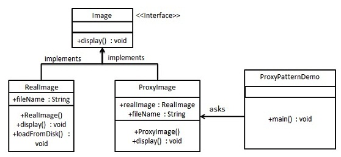

# 中介者模式（Mediator Pattern）

中介者模式：定义一个对象来封装一些列对象的交互。中介者模式使各对象之间，不需要显式的相互引用，从而使其耦合松散，而且让你可以独立地改变它们之间的交互。

## UML



- Mediator：抽象中介者角色，定义了同事对象到中介者对象的接口，一般以抽象类的方式实现。

- ConcreteMediator：具体中介者角色，继承于抽象中介者，实现了父类定义的方法，它从具体的同事对象接受消息，向具体同事对象发出命令。

- Colleague：抽象同事类角色，定义了中介者对象的接口，它只知道中介者而不知道其他的同事对象。

- ConcreteColleague1、ConcreteColleague2：具体同事类角色，继承于抽象同事类，每个具体同事类都知道本身在小范围的行为，而不知道在大范围内的目的。

抽象同事类： 
Colleague.class

```
public abstract class Colleague {
    protected Mediator mediator;
    public void setMediator(Mediator mediator) {
        this.mediator = mediator;
    }
    public abstract void operation();
}
```


具体同事类 
ConcreteColleagueA.class && ConcreteColleagueB.class

```java
public class ConcreteColleagueA extends Colleague{

    public void notifyColleagueB() {
        mediator.notifyColleagueB();
    }

    @Override
    public void operation() {
        System.out.print("this is ConcreteColleagueA's operation\n");
    }
}
```

```
public class ConcreteColleagueB extends Colleague{

    public void notifyColleagueA() {
        mediator.notifyColleagueA();
    }

    @Override
    public void operation() {
        System.out.print("this is ConcreteColleagueB's operation\n");
    }
}

```

抽象中介者角色： 
Mediator.class

```java
public abstract class Mediator {

    protected Colleague colleagueA;
    protected Colleague colleagueB;

    public Mediator(Colleague colleagueA, Colleague colleagueB) {
        this.colleagueA = colleagueA;
        this.colleagueB = colleagueB;
    }

    public abstract void notifyColleagueA();
    public abstract void notifyColleagueB();
}
```

ConcreteMediator.class

```
public class ConcreteMediator extends Mediator{

    public ConcreteMediator(Colleague colleagueA, Colleague colleagueB) {
        super(colleagueA, colleagueB);
    }

    @Override
    public void notifyColleagueA() {
        if (colleagueA != null) {
            colleagueA.operation();
        }
    }

    @Override
    public void notifyColleagueB() {
        if (colleagueB != null) {
            colleagueB.operation();
        }
    }
}
```

```java
public class Client {
    public static void main(String[] args) {
        Colleague colleagueA = new ConcreteColleagueA();
        Colleague colleagueB = new ConcreteColleagueB();

        Mediator mediator = new ConcreteMediator(colleagueA, colleagueB);
        colleagueA.setMediator(mediator);
        colleagueB.setMediator(mediator);

        ((ConcreteColleagueA)colleagueA).notifyColleagueB();
        ((ConcreteColleagueB)colleagueB).notifyColleagueA();
    }
}
```